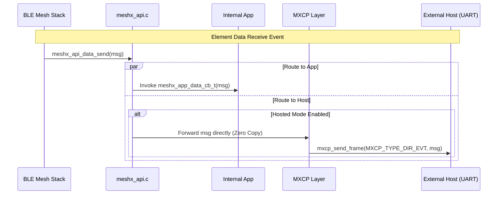
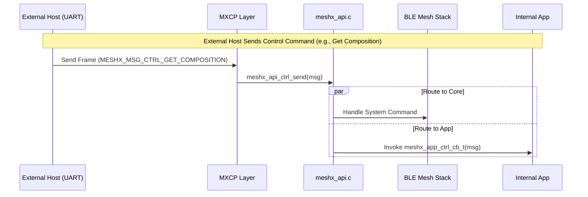

# Technical Design Document: Unify MXCP and App APIs

## 1. Introduction

### 1.1 Purpose
This document outlines the technical design for unifying the Data and Control API structures across the MeshX API (App layer) and the MXCP (External Host layer).

### 1.2 Scope
- Unification of event IDs and payload structures for data and control paths.
- Modifications to `meshx_api.h` and `meshx_mxcp.h`.
- Does not include modifying the low-level UART driver logic; it focuses strictly on the message generation/dispatch layer.

### 1.3 Definitions and Acronyms
| Term | Definition |
|------|------------|
| MXCP | MeshX Command Protocol (used by external Host MCU) |
| App API | The internal C API used by device-local applications to interface with the MeshX stack |

### 1.4 References
- Requirements: `.specs/143-unify-apis/requirements.md`

## 2. System Overview

### 2.1 System Context
Currently, internal apps and the external MXCP host use divergent structures to send and receive MeshX events. This creates a dual-maintenance burden. The new design establishes a **Single Source of Truth** in `meshx_api.h`.

### 2.2 Key Components
- **meshx_api.h**: The core header that will house all shared enums and packed structs.
- **meshx_api.c**: The internal distribution mechanism that routes these unified structs to registered app callbacks and to the MXCP layer.
- **meshx_mxcp.h/c**: The MXCP protocol layer that will drop redundant definitions and directly consume/produce the unified structs defined in `meshx_api.h`.

## 3. Design Considerations

### 3.1 Assumptions
- The external host over MXCP requires the structures to match byte-for-byte to avoid complex deserialization logic.

### 3.2 Constraints
- **Wire Efficiency:** The unified structures must be `#pragma pack(1)` so they can be sent directly over UART by MXCP without padding overhead.
- **Backward Compatibility:** Internal apps currently relying on the old fragmented unions will need to be updated.

### 3.3 Risks
| Risk | Impact | Mitigation |
|------|--------|------------|
| Unaligned Memory Access | Med | Ensure that any architectures using this codebase support unaligned access for packed structures, or handle payloads via memcpy internally. |

## 4. Architectural Strategies

### 4.1 Strategy Selection: Single Source of Truth
We selected the "Single Source of Truth" approach where `meshx_mxcp.h` drops its local struct definitions and uses `meshx_msg_data_t` directly.

### 4.2 Alternatives Considered
| Option | Pros | Cons | Decision |
|--------|------|------|----------|
| API Translation Layer | Keeps App structs un-packed. | High overhead, duplicates data, requires mapping functions. | Rejected |
| Single Source of Truth | Zero-copy routing to MXCP; single API schema. | Forces App API to use packed structs. | **Selected** |

## 5. System Architecture

### 5.1 Data Flow
1. Internal App or Host generates a `meshx_msg_data_t` structure.
2. Calls `meshx_api_data_send()`.
3. The stack processes and transmits the message over BLE Mesh.
4. On BLE RX, the stack populates a `meshx_msg_data_t` struct.
5. The stack invokes the internal App callback and/or MXCP `mxcp_send_event()` with the **exact same struct instance**.

### 5.2 API Design

#### 5.2.1 Unified Enums
```c
typedef enum {
    MESHX_MSG_DATA_SEND       = 0x10,
    MESHX_MSG_DATA_RX_NOTIFY  = 0x11,
    MESHX_MSG_DATA_TX_NOTIFY  = 0x12,
} meshx_msg_data_id_t;

typedef enum {
    MESHX_MSG_CTRL_PROV_COMP       = 0x01,
    MESHX_MSG_CTRL_PROV_FAILED     = 0x02,
    MESHX_MSG_CTRL_NODE_RESET      = 0x03,
    MESHX_MSG_CTRL_GET_COMPOSITION = 0x04,
    // ...
} meshx_msg_ctrl_id_t;
```

#### 5.2.2 Unified Structures
```c
#pragma pack(push, 1)

typedef struct {
    uint16_t msg_id;  // From meshx_msg_data_id_t
    uint16_t element_id;
    uint16_t element_type;
    uint16_t func_id;
    uint16_t msg_len;
    uint8_t  payload[]; // Flat buffer
} meshx_msg_data_t;

typedef struct {
    uint16_t msg_id;  // From meshx_msg_ctrl_id_t
    union {
        struct {
            uint16_t net_idx;
            uint16_t addr;
            uint8_t  device_uuid[16];
        } prov_comp;
        struct {
            uint8_t reason;
        } prov_failed;
    } payload;
} meshx_msg_ctrl_t;

#pragma pack(pop)
```

### 5.3 SDK Architecture

The SDK ecosystem provides unified APIs across three distinct operational environments:

#### 5.3.1 Internal Firmware SDK (MeshX Apps)
Used by internal tasks running directly on the MeshX module.
- **Structures:** Direct access to `meshx_msg_data_t` and `meshx_msg_ctrl_t` in `meshx_api.h`.
- **Send API:** `meshx_api_data_send()` and `meshx_api_ctrl_send()` route directly to the local BLE Mesh stack.
- **Callbacks:** Registered via `meshx_api_register_data_cb()` to receive events straight from the stack.

#### 5.3.2 Host MCU SDK (External C Applications)
Used by an external microcontroller communicating with the MeshX module. The SDK is abstract over the physical transport layer (UART, SPI, I2C).
- **Structures:** Shares the exact same `meshx_api.h` header to ensure 100% binary compatibility.
- **Porting Interface:** The host developer implements simple `meshx_port_tx(const uint8_t *data, size_t len)` and rx data push hooks to bridge the SDK with their specific hardware communication channel.
- **Send API:** The SDK provides high-level `meshx_api_data_send()` and `meshx_api_ctrl_send()` APIs which encode the structures into MXCP frames and pass them to the user's porting interface.
- **Decode Logic:** A platform-agnostic demuxer takes incoming bytes, parses MXCP frames, strips the framing, casts the payload back to `meshx_msg_data_t` or `meshx_msg_ctrl_t`, and fires the high-level callbacks.

#### 5.3.3 Python Host SDK (External UI/Testing)
The Python SDK (used by Web Console and Autotest framework) provides a 1:1 object-oriented map of the C API, handling all serial encoding/decoding internally.

- **Data Models:**
  ```python
  from dataclasses import dataclass

  @dataclass
  class MeshXDataMsg:
      msg_id: int          # MESHX_MSG_DATA_SEND, etc.
      element_id: int
      element_type: int
      func_id: int
      payload: bytes
      
      def pack(self) -> bytes: ...
      @classmethod
      def unpack(cls, data: bytes) -> 'MeshXDataMsg': ...

  @dataclass
  class MeshXCtrlMsg:
      msg_id: int          # MESHX_MSG_CTRL_PROV_COMP, etc.
      payload: bytes       # Mapped to specific payload dataclasses internally
      
      def pack(self) -> bytes: ...
      @classmethod
      def unpack(cls, data: bytes) -> 'MeshXCtrlMsg': ...
  ```

- **Client API:**
  ```python
  from typing import Callable

  class MeshXSDK:
      def __init__(self, serial_port):
          # Initializes connection and starts demuxer thread
          pass
      
      # Sending (encodes to MXCP frame and sends over UART)
      def data_send(self, msg: MeshXDataMsg) -> bool: ...
      def ctrl_send(self, msg: MeshXCtrlMsg) -> bool: ...
      
      # Receiving (SDK demuxer invokes these when MXCP EVT frame is received)
      def register_data_cb(self, cb: Callable[[MeshXDataMsg], None]): ...
      def register_ctrl_cb(self, cb: Callable[[MeshXCtrlMsg], None]): ...
  ```

## 6. Policies and Tactics

### 6.1 Production Environment (GPIO APIs)
GPIO testing APIs will be wrapped in `#ifdef CONFIG_MESHX_ENABLE_GPIO_TEST_API` (or equivalent kconfig macro) to ensure they are cleanly compiled out of the final production firmware, preventing unauthorized remote GPIO toggling.

## 7. Detailed Design

### 7.1 meshx_api.c Implementation
```c
meshx_err_t meshx_api_data_send(const meshx_msg_data_t *msg) {
    // 1. Process internally (send out to BLE Mesh network)
    // 2. If it's a local notification, route to App callbacks:
    //      if (app_data_cb) app_data_cb(msg);
    // 3. If hosted mode is active, route directly to host:
    //      mxcp_send_frame(MXCP_TYPE_DIR_EVT | msg->msg_id, (uint8_t*)msg, total_len);
    return MESHX_SUCCESS;
}
```

## 8. Appendix

### 8.1 Sequence Diagrams

#### Internal Event Distribution (Data Path)


#### External Command Injection (Control Path)


### 8.2 Requirement Traceability

### REQ-001 Implementation
**Requirement:** Unify MXCP and App API Structures
**Design:** Defined `meshx_msg_data_t` and `meshx_msg_ctrl_t` as the single packed structures used universally across both boundaries.

### REQ-002 Implementation
**Requirement:** Separate Data and Control Paths (Single Source of Truth)
**Design:** Established distinct enums `meshx_msg_data_id_t` and `meshx_msg_ctrl_id_t`, completely replacing MXCP-specific equivalents.

### REQ-003 Implementation
**Requirement:** Enhance `meshx_api.h` Structures
**Design:** The new packed structures are strictly typed by their embedded `msg_id`, replacing the messy outer unions.

### REQ-004 Implementation
**Requirement:** Manage GPIO APIs for Production
**Design:** Introduce compilation flags to physically exclude GPIO handlers from production builds.

### REQ-005 Implementation
**Requirement:** Host SDK for Unified APIs
**Design:** Introduced an SDK architecture for external UI/hosts (Python/JS) that provides serialization/deserialization methods which strictly mirror the unified packed structures.
