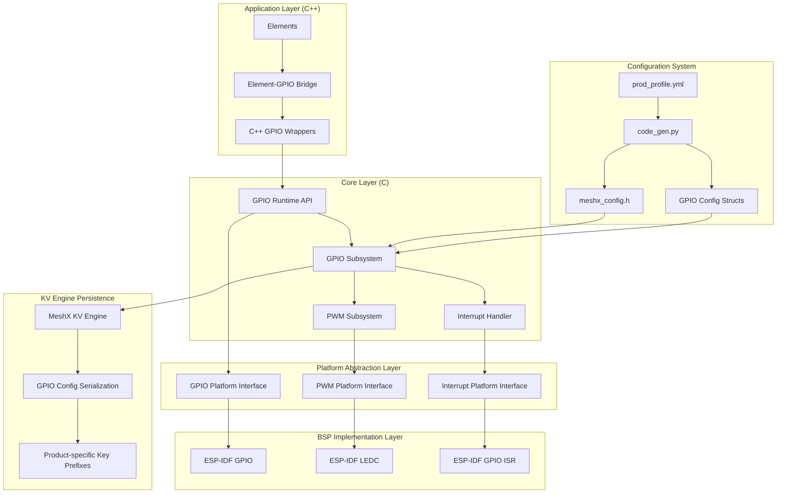
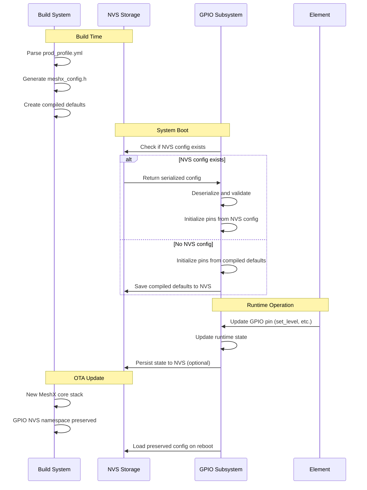
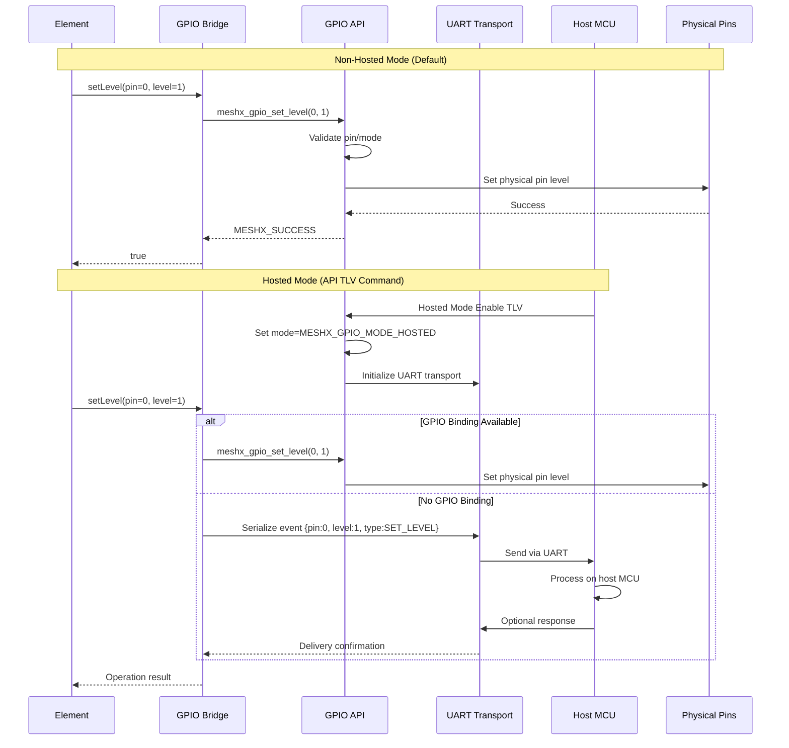

# Design Document: Configurable GPIO Support

## Overview

This document describes the design for configurable GPIO (General Purpose Input/Output) support in MeshX, a portable BLE Mesh node stack for embedded microcontrollers. The GPIO subsystem enables product developers to define GPIO pin assignments, modes, and behaviors through the existing `prod_profile.yml` configuration system, supporting both hosted and non-hosted deployment modes.

The system provides a unified, platform-abstracted API for digital I/O, interrupts, and PWM (Pulse Width Modulation) while maintaining MeshX's strict separation between hardware abstraction and application logic. GPIO configuration is defined in YAML, validated at build time, and compiled into firmware, ensuring runtime safety and determinism.

### Key Design Principles

1. **Follow Existing Patterns**: Leverage established MeshX architecture patterns (C/C++ boundary, interface/implementation separation, BSP abstraction)
2. **Configuration-Driven**: Extend existing `prod_profile.yml` and `code_gen.py` system for GPIO configuration
3. **Platform Abstraction**: Provide clean BSP abstraction layer for GPIO implementations
4. **Runtime Flexibility**: Support both hosted and non-hosted modes via dynamic API TLV command
5. **KV Engine Persistence**: Store GPIO configuration using MeshX KV Engine (`meshx_kv_engine.c`) with product-specific key prefixes for OTA compatibility

## Architecture

### High-Level Architecture Diagram



### Component Relationships

1. **Configuration System**: YAML → code generation → compile-time configuration
2. **Runtime System**: Initialization → validation → operation
3. **Platform Abstraction**: Interface → BSP implementation → hardware
4. **Element Integration**: C++ wrappers → C API → hardware
5. **Persistence**: Runtime state → serialization → KV Engine storage

## Components and Interfaces

### 1. GPIO Configuration System

#### YAML Schema Extension

The existing `prod_profile.yml` will be extended with GPIO configuration sections:

```yaml
prod:
  cid: 0x7908
  products:
    - name: relay_panel_with_gpio
      pid: 0x0008
      elements:
        - switch_relay_server: 2
      gpio:
        pins:
          - name: "RELAY_1"
            logical_pin: 0
            physical_pin: 4
            mode: "output"
            pull: "none"
            drive_strength: "medium"
            initial_level: 0
            signal_inversion: false

          - name: "BUTTON_1"
            logical_pin: 1
            physical_pin: 5
            mode: "input"
            pull: "pull_up"
            interrupt:
              trigger: "negative_edge"
              task_priority: 5
              task_stack_size: 2048

          - name: "LED_PWM"
            logical_pin: 2
            physical_pin: 6
            mode: "pwm_output"
            pwm:
              frequency: 1000
              resolution: 10
              duty_cycle: 50
              channel: 0
```

#### Configuration Validation Rules

1. **Logical Pin Range**: 0-255 (8-bit addressing)
2. **Physical Pin Validation**: BSP-specific valid pin numbers
3. **Mode Compatibility**: Validate mode with other settings (e.g., PWM requires output mode)
4. **Interrupt Constraints**: Validate interrupt settings with available hardware resources
5. **PWM Constraints**: Validate frequency, resolution, and channel allocation

#### Code Generation Output

`code_gen.py` will generate:
- `MESHX_GPIO_PIN_COUNT`: Number of configured GPIO pins
- `MESHX_GPIO_PIN_<NAME>_LOGICAL`: Logical pin definitions
- `MESHX_GPIO_CONFIG_DATA`: Static configuration data structure
- `MESHX_GPIO_INIT_TABLE`: Initialization table for runtime

### 2. GPIO Runtime API

#### Core Interface (`interface/gpio/meshx_gpio.h`)

```c
/**
 * @file meshx_gpio.h
 * @brief MeshX GPIO Interface
 */

#ifndef __MESHX_GPIO_H
#define __MESHX_GPIO_H

#include "meshx_err.h"
#include <stdint.h>
#include <stdbool.h>

/**
 * @brief GPIO Pin Modes
 */
typedef enum {
    MESHX_GPIO_MODE_INPUT = 0,
    MESHX_GPIO_MODE_OUTPUT,
    MESHX_GPIO_MODE_INPUT_OUTPUT,
    MESHX_GPIO_MODE_OPEN_DRAIN,
    MESHX_GPIO_MODE_OPEN_DRAIN_INPUT_OUTPUT,
    MESHX_GPIO_MODE_PWM_OUTPUT,
    MESHX_GPIO_MODE_MAX
} meshx_gpio_mode_t;

/**
 * @brief GPIO Pull Resistor Settings
 */
typedef enum {
    MESHX_GPIO_PULL_NONE = 0,
    MESHX_GPIO_PULL_UP,
    MESHX_GPIO_PULL_DOWN,
    MESHX_GPIO_PULL_UP_DOWN,
    MESHX_GPIO_PULL_MAX
} meshx_gpio_pull_t;

/**
 * @brief GPIO Drive Strength
 */
typedef enum {
    MESHX_GPIO_DRIVE_WEAK = 0,
    MESHX_GPIO_DRIVE_MEDIUM,
    MESHX_GPIO_DRIVE_STRONG,
    MESHX_GPIO_DRIVE_MAX_STRONG,
    MESHX_GPIO_DRIVE_MAX
} meshx_gpio_drive_t;

/**
 * @brief GPIO Interrupt Trigger Types
 */
typedef enum {
    MESHX_GPIO_INTR_DISABLED = 0,
    MESHX_GPIO_INTR_POSITIVE_EDGE,
    MESHX_GPIO_INTR_NEGATIVE_EDGE,
    MESHX_GPIO_INTR_ANY_EDGE,
    MESHX_GPIO_INTR_LOW_LEVEL,
    MESHX_GPIO_INTR_HIGH_LEVEL,
    MESHX_GPIO_INTR_MAX
} meshx_gpio_intr_type_t;

/**
 * @brief GPIO Interrupt Callback Function
 */
typedef void (*meshx_gpio_intr_cb_t)(uint8_t logical_pin, void *user_data);

/**
 * @brief Initialize GPIO subsystem
 * @return meshx_err_t
 */
meshx_err_t meshx_gpio_init(void);

/**
 * @brief Deinitialize GPIO subsystem
 * @return meshx_err_t
 */
meshx_err_t meshx_gpio_deinit(void);

/**
 * @brief Set GPIO pin level
 * @param logical_pin Logical pin number (0-255)
 * @param level Pin level (0 = low, 1 = high)
 * @return meshx_err_t
 */
meshx_err_t meshx_gpio_set_level(uint8_t logical_pin, uint8_t level);

/**
 * @brief Get GPIO pin level
 * @param logical_pin Logical pin number (0-255)
 * @param[out] level Pointer to store pin level
 * @return meshx_err_t
 */
meshx_err_t meshx_gpio_get_level(uint8_t logical_pin, uint8_t *level);

/**
 * @brief Toggle GPIO pin level
 * @param logical_pin Logical pin number (0-255)
 * @return meshx_err_t
 */
meshx_err_t meshx_gpio_toggle(uint8_t logical_pin);

/**
 * @brief Register GPIO interrupt handler
 * @param logical_pin Logical pin number (0-255)
 * @param intr_type Interrupt trigger type
 * @param callback Interrupt callback function
 * @param user_data User data passed to callback
 * @return meshx_err_t
 */
meshx_err_t meshx_gpio_register_intr(uint8_t logical_pin,
                                     meshx_gpio_intr_type_t intr_type,
                                     meshx_gpio_intr_cb_t callback,
                                     void *user_data);

/**
 * @brief Unregister GPIO interrupt handler
 * @param logical_pin Logical pin number (0-255)
 * @return meshx_err_t
 */
meshx_err_t meshx_gpio_unregister_intr(uint8_t logical_pin);

/**
 * @brief Enable/disable GPIO interrupt
 * @param logical_pin Logical pin number (0-255)
 * @param enable true to enable, false to disable
 * @return meshx_err_t
 */
meshx_err_t meshx_gpio_intr_enable(uint8_t logical_pin, bool enable);

#endif /* __MESHX_GPIO_H */
```

#### Error Codes

Add to `meshx_err.h`:
```c
#define MESHX_ERR_GPIO_BASE             0x5000
#define MESHX_ERR_GPIO_INVALID_PIN      (MESHX_ERR_GPIO_BASE + 0x01)
#define MESHX_ERR_GPIO_INVALID_MODE     (MESHX_ERR_GPIO_BASE + 0x02)
#define MESHX_ERR_GPIO_INVALID_LEVEL    (MESHX_ERR_GPIO_BASE + 0x03)
#define MESHX_ERR_GPIO_INTR_NOT_SUPPORTED (MESHX_ERR_GPIO_BASE + 0x04)
#define MESHX_ERR_GPIO_INTR_ALREADY_REGISTERED (MESHX_ERR_GPIO_BASE + 0x05)
#define MESHX_ERR_GPIO_PWM_NOT_SUPPORTED (MESHX_ERR_GPIO_BASE + 0x06)
#define MESHX_ERR_GPIO_PWM_INVALID_PARAM (MESHX_ERR_GPIO_BASE + 0x07)
#define MESHX_ERR_GPIO_NOT_INITIALIZED  (MESHX_ERR_GPIO_BASE + 0x08)
#define MESHX_ERR_GPIO_CONFIG_INVALID   (MESHX_ERR_GPIO_BASE + 0x09)
```

### 3. PWM Support Interface (`interface/gpio/meshx_pwm.h`)

```c
/**
 * @file meshx_pwm.h
 * @brief MeshX PWM Interface
 */

#ifndef __MESHX_PWM_H
#define __MESHX_PWM_H

#include "meshx_err.h"
#include <stdint.h>

/**
 * @brief Initialize PWM subsystem
 * @return meshx_err_t
 */
meshx_err_t meshx_pwm_init(void);

/**
 * @brief Deinitialize PWM subsystem
 * @return meshx_err_t
 */
meshx_err_t meshx_pwm_deinit(void);

/**
 * @brief Start PWM output on pin
 * @param logical_pin Logical pin number (0-255)
 * @return meshx_err_t
 */
meshx_err_t meshx_pwm_start(uint8_t logical_pin);

/**
 * @brief Stop PWM output on pin
 * @param logical_pin Logical pin number (0-255)
 * @return meshx_err_t
 */
meshx_err_t meshx_pwm_stop(uint8_t logical_pin);

/**
 * @brief Set PWM duty cycle
 * @param logical_pin Logical pin number (0-255)
 * @param duty_cycle Duty cycle (0-100%)
 * @return meshx_err_t
 */
meshx_err_t meshx_pwm_set_duty_cycle(uint8_t logical_pin, uint8_t duty_cycle);

/**
 * @brief Get PWM duty cycle
 * @param logical_pin Logical pin number (0-255)
 * @param[out] duty_cycle Pointer to store duty cycle
 * @return meshx_err_t
 */
meshx_err_t meshx_pwm_get_duty_cycle(uint8_t logical_pin, uint8_t *duty_cycle);

/**
 * @brief Set PWM frequency
 * @param logical_pin Logical pin number (0-255)
 * @param frequency Frequency in Hz
 * @return meshx_err_t
 */
meshx_err_t meshx_pwm_set_frequency(uint8_t logical_pin, uint32_t frequency);

/**
 * @brief Get PWM frequency
 * @param logical_pin Logical pin number (0-255)
 * @param[out] frequency Pointer to store frequency
 * @return meshx_err_t
 */
meshx_err_t meshx_pwm_get_frequency(uint8_t logical_pin, uint32_t *frequency);

#endif /* __MESHX_PWM_H */
```

### 4. BSP Abstraction Layer

#### Platform Interface (`interface/gpio/meshx_gpio_platform.h`)

```c
/**
 * @file meshx_gpio_platform.h
 * @brief MeshX GPIO Platform Interface
 */

#ifndef __MESHX_GPIO_PLATFORM_H
#define __MESHX_GPIO_PLATFORM_H

#include "meshx_gpio.h"
#include "meshx_pwm.h"

/**
 * @brief Platform-specific GPIO initialization
 * @return meshx_err_t
 */
meshx_err_t meshx_gpio_platform_init(void);

/**
 * @brief Platform-specific GPIO deinitialization
 * @return meshx_err_t
 */
meshx_err_t meshx_gpio_platform_deinit(void);

/**
 * @brief Platform-specific pin level set
 */
meshx_err_t meshx_gpio_platform_set_level(uint8_t physical_pin, uint8_t level);

/**
 * @brief Platform-specific pin level get
 */
meshx_err_t meshx_gpio_platform_get_level(uint8_t physical_pin, uint8_t *level);

/**
 * @brief Platform-specific interrupt registration
 */
meshx_err_t meshx_gpio_platform_register_intr(uint8_t physical_pin,
                                              meshx_gpio_intr_type_t intr_type,
                                              void (*isr_handler)(void*),
                                              void *arg);

/**
 * @brief Platform-specific PWM initialization
 */
meshx_err_t meshx_pwm_platform_init(void);

/**
 * @brief Platform-specific PWM deinitialization
 */
meshx_err_t meshx_pwm_platform_deinit(void);

/**
 * @brief Platform-specific PWM start
 */
meshx_err_t meshx_pwm_platform_start(uint8_t physical_pin, uint32_t frequency,
                                     uint8_t duty_cycle, uint8_t resolution);

#endif /* __MESHX_GPIO_PLATFORM_H */
```

#### BSP Implementation Structure

```
port/bsp/<board>/gpio/
├── meshx_gpio_bsp.c          # BSP-specific GPIO implementation
├── meshx_pwm_bsp.c           # BSP-specific PWM implementation
├── gpio_pin_map.h            # Logical to physical pin mapping
└── gpio_constraints.h        # Board-specific constraints
```

#### IO Layer File Structure

**Important**: IO abstraction layer is located in `meshx/io/` directory (not in `ble_mesh/`):

```
main/component/meshx/io/
├── inc/                          # Public IO headers
│   ├── meshx_io_interface.hpp    # Abstract IO interface
│   ├── meshx_io_factory.hpp      # IO factory for creating instances
│   └── meshx_io_types.hpp        # IO type definitions
├── src/                          # IO implementation
│   ├── meshx_io_interface.cpp    # Abstract interface implementation
│   ├── meshx_gpio_impl.cpp       # Concrete GPIO implementation
│   ├── meshx_pwm_impl.cpp        # Concrete PWM implementation
│   └── meshx_io_factory.cpp      # Factory implementation
└── interface/                    # Platform-facing interfaces
    ├── meshx_io_platform.h       # IO platform interface (C)
    └── meshx_io_bridge.h         # C/C++ bridge header
```

#### ESP-IDF Implementation Example (`port/platform/esp/esp_idf/gpio/meshx_gpio_esp.c`)

```c
#include "meshx_gpio_platform.h"
#include "driver/gpio.h"
#include "driver/ledc.h"

static const gpio_config_t mode_to_esp_config[] = {
    [MESHX_GPIO_MODE_INPUT] = {
        .pin_bit_mask = 0,
        .mode = GPIO_MODE_INPUT,
        .pull_up_en = GPIO_PULLUP_DISABLE,
        .pull_down_en = GPIO_PULLDOWN_DISABLE,
        .intr_type = GPIO_INTR_DISABLE
    },
    // ... other mode mappings
};

meshx_err_t meshx_gpio_platform_set_level(uint8_t physical_pin, uint8_t level)
{
    if (physical_pin >= GPIO_NUM_MAX) {
        return MESHX_ERR_GPIO_INVALID_PIN;
    }

    gpio_set_level(physical_pin, level);
    return MESHX_SUCCESS;
}

// ... other ESP-IDF specific implementations
```

### 5. Element-GPIO Integration

#### C++ Wrapper Classes (`elements/inc/variants/gpio_bridge.hpp`)

```cpp
/**
 * @file gpio_bridge.hpp
 * @brief Element-GPIO Bridge C++ Wrapper
 */

#ifndef __GPIO_BRIDGE_HPP
#define __GPIO_BRIDGE_HPP

#include <cstdint>
#include <functional>
#include "meshx_c_header.h"  // Follow C/C++ boundary pattern

class MeshXGpioPin {
public:
    MeshXGpioPin(uint8_t logical_pin);
    ~MeshXGpioPin();

    bool setLevel(uint8_t level);
    bool getLevel(uint8_t* level);
    bool toggle();

    bool registerInterrupt(std::function<void(uint8_t)> callback);
    bool unregisterInterrupt();

private:
    uint8_t logical_pin_;
    bool interrupt_registered_;
};

class MeshXPwmPin {
public:
    MeshXPwmPin(uint8_t logical_pin);
    ~MeshXPwmPin();

    bool start();
    bool stop();
    bool setDutyCycle(uint8_t duty_cycle);
    bool setFrequency(uint32_t frequency);

private:
    uint8_t logical_pin_;
    bool started_;
};

#endif /* __GPIO_BRIDGE_HPP */
```

#### Element Integration Example

```cpp
class RelayElement : public meshXElementServer {
public:
    RelayElement(uint8_t element_index, uint8_t gpio_pin)
        : meshXElementServer(element_index), gpio_pin_(gpio_pin, this) {}

    void onStateChange(uint8_t new_state) override {
        // Update GPIO when element state changes
        gpio_pin_.setLevel(new_state);

        // Persist state via NVS (existing pattern)
        persistState();
    }

private:
    MeshXGpioPin gpio_pin_;
};
```

### 6. Hosted/Non-Hosted Mode Support

#### Mode Detection and Switching

```c
/**
 * @brief Hosted mode state
 */
typedef enum {
    MESHX_GPIO_MODE_NON_HOSTED = 0,
    MESHX_GPIO_MODE_HOSTED,
    MESHX_GPIO_MODE_TRANSITIONING
} meshx_gpio_hosted_mode_t;

/**
 * @brief Set hosted mode
 * @param mode Hosted mode setting
 * @return meshx_err_t
 */
meshx_err_t meshx_gpio_set_hosted_mode(meshx_gpio_hosted_mode_t mode);

/**
 * @brief Get current hosted mode
 * @return Current hosted mode
 */
meshx_gpio_hosted_mode_t meshx_gpio_get_hosted_mode(void);
```

#### UART Transport for Hosted Mode

When in hosted mode without GPIO binding:
1. Elements serialize GPIO events
2. Events sent via UART transport to host MCU
3. Host MCU processes events and sends responses

```c
typedef struct {
    uint8_t event_type;
    uint8_t logical_pin;
    uint8_t value;
    uint32_t timestamp;
} meshx_gpio_hosted_event_t;
```

### 7. KV Engine Persistence for GPIO Configuration

**Important**: GPIO configuration persistence will use the existing MeshX KV Engine (`meshx_kv_engine.c`) instead of native ESP-IDF NVS APIs. The KV Engine provides:
- Log-structured storage with wear-leveling
- Power-fail safety
- Built-in CRC validation
- Transactional commits

#### Serialization Format

```c
#pragma pack(push, 1)
typedef struct {
    uint8_t version;           // Format version (1)
    uint8_t pin_count;         // Number of configured pins
    uint32_t crc32;            // CRC32 checksum (compatible with KV Engine's CRC16)
    uint8_t reserved[3];       // Reserved for future use
} meshx_gpio_config_header_t;

typedef struct {
    uint8_t logical_pin;
    uint8_t physical_pin;
    uint8_t mode;
    uint8_t pull;
    uint8_t drive_strength;
    uint8_t initial_level;
    uint8_t signal_inversion;
    uint8_t reserved;
} meshx_gpio_pin_config_t;

typedef struct {
    uint32_t frequency;
    uint8_t duty_cycle;
    uint8_t resolution;
    uint8_t channel;
    uint8_t reserved[1];
} meshx_gpio_pwm_config_t;

typedef struct {
    uint8_t trigger_type;
    uint8_t task_priority;
    uint16_t task_stack_size;
} meshx_gpio_intr_config_t;
#pragma pack(pop)
```

#### KV Engine Storage Layout

```
KV Engine Keys (using meshx_kv_engine_* API):
├── Key: "gpio_<product_name>_config" → meshx_gpio_config_header_t + pin configurations
├── Key: "gpio_<product_name>_state_<pin>" → Current pin state (for persistence across reboots)
└── Key: "gpio_<product_name>_pwm_<pin>" → Current PWM settings
```

#### Persistence API (Using KV Engine)

```c
/**
 * @brief Save GPIO configuration to KV Engine
 * @param product_name Product name for key prefix
 * @return meshx_err_t
 */
meshx_err_t meshx_gpio_save_config_to_kv(const char *product_name);

/**
 * @brief Load GPIO configuration from KV Engine
 * @param product_name Product name for key prefix
 * @return meshx_err_t
 */
meshx_err_t meshx_gpio_load_config_from_kv(const char *product_name);

/**
 * @brief Check if KV Engine configuration exists
 * @param product_name Product name for key prefix
 * @param[out] exists true if configuration exists
 * @return meshx_err_t
 */
meshx_err_t meshx_gpio_config_exists_in_kv(const char *product_name, bool *exists);

/**
 * @brief Save current pin state to KV Engine
 * @param product_name Product name for key prefix
 * @param logical_pin Logical pin number
 * @param state Current pin state
 * @return meshx_err_t
 */
meshx_err_t meshx_gpio_save_pin_state_to_kv(const char *product_name, uint8_t logical_pin, uint8_t state);

/**
 * @brief Load pin state from KV Engine
 * @param product_name Product name for key prefix
 * @param logical_pin Logical pin number
 * @param[out] state Pointer to store loaded state
 * @return meshx_err_t
 */
meshx_err_t meshx_gpio_load_pin_state_from_kv(const char *product_name, uint8_t logical_pin, uint8_t *state);
```

#### KV Engine Integration Example

```c
// GPIO subsystem initialization with KV Engine
meshx_err_t meshx_gpio_init_with_kv(const meshx_fal_partition_t *kv_partition)
{
    // Initialize KV Engine with provided partition
    meshx_err_t err = meshx_kv_engine_init(kv_partition);
    if (err != MESHX_SUCCESS) {
        MESHX_LOGE(MODULE_ID_COMPONENT_MESHX_GPIO, "Failed to initialize KV Engine: %d", err);
        return err;
    }

    // Load GPIO configuration from KV Engine
    return meshx_gpio_load_config_from_kv(CURRENT_PRODUCT_NAME);
}

// Example: Saving configuration to KV Engine
meshx_err_t meshx_gpio_save_config_to_kv(const char *product_name)
{
    char key[64];
    snprintf(key, sizeof(key), "gpio_%s_config", product_name);

    // Serialize configuration
    uint8_t buffer[512];
    uint16_t config_size = serialize_gpio_config(buffer, sizeof(buffer));

    // Save to KV Engine (buffered in RAM)
    meshx_err_t err = meshx_kv_engine_set(key, buffer, config_size);
    if (err != MESHX_SUCCESS) {
        return err;
    }

    // Commit to flash
    return meshx_kv_engine_commit();
}
```

## Data Models

### 1. GPIO Configuration Data Model

```c
typedef struct {
    uint8_t logical_pin;
    uint8_t physical_pin;
    meshx_gpio_mode_t mode;
    meshx_gpio_pull_t pull;
    meshx_gpio_drive_t drive_strength;
    uint8_t initial_level;
    bool signal_inversion;

    // Optional configurations (union based on mode)
    union {
        struct {
            meshx_gpio_intr_type_t trigger;
            uint8_t task_priority;
            uint16_t task_stack_size;
        } interrupt;

        struct {
            uint32_t frequency;
            uint8_t duty_cycle;
            uint8_t resolution;
            uint8_t channel;
        } pwm;
    } mode_config;
} meshx_gpio_pin_config_data_t;
```

### 2. Runtime State Data Model

```c
typedef struct {
    uint8_t current_level;
    bool interrupt_registered;
    meshx_gpio_intr_cb_t intr_callback;
    void *intr_user_data;

    // For PWM pins
    struct {
        bool started;
        uint32_t frequency;
        uint8_t duty_cycle;
    } pwm_state;
} meshx_gpio_pin_state_t;
```

### 3. Hosted Mode Data Model

```c
typedef struct {
    meshx_gpio_hosted_mode_t current_mode;
    bool gpio_bound;

    // UART transport state
    struct {
        bool initialized;
        uint32_t baud_rate;
        uint8_t tx_pin;
        uint8_t rx_pin;
    } uart;
} meshx_gpio_hosted_state_t;
```

## Correctness Properties

*A property is a characteristic or behavior that should hold true across all valid executions of a system—essentially, a formal statement about what the system should do. Properties serve as the bridge between human-readable specifications and machine-verifiable correctness guarantees.*

### Property 1: Comprehensive Configuration Validation and Generation

*For any* GPIO configuration defined in `prod_profile.yml` (including pin definitions, modes, pull settings, drive strengths, signal inversion, initial levels, interrupt configurations, and PWM settings), the code generation system SHALL:
1. Parse and validate the configuration at build time
2. Generate appropriate compile-time macros in `meshx_config.h`
3. Produce static initialization data structures for runtime use
4. Map logical pins (0-255) to correct physical BSP-specific pins
5. Fail with descriptive error messages for invalid configurations

**Validates: Requirements 1.1-1.10, 6.3, 7.5-7.6, 8.4**

### Property 2: Mode-Aware GPIO Operation Validity

*For any* GPIO pin configured in a specific mode (input, output, open-drain, input/output, PWM output), operations attempted on that pin SHALL:
1. Succeed only if valid for the pin's configured mode
2. Return appropriate standardized error codes for invalid operations
3. Not affect the state of other GPIO pins
4. Maintain consistent pin state tracking for runtime validation
5. Initialize and deinitialize pins correctly during system startup/shutdown

**Validates: Requirements 2.1-2.5, 2.8-2.10, 8.1-8.3, 8.9-8.10**

### Property 3: Complete Interrupt Lifecycle Management

*For any* GPIO pin configured with interrupt support (with any trigger type: disabled, positive/negative/any edge, low/high level), the interrupt subsystem SHALL:
1. Allow registration of callback functions with user context data
2. Enable and disable interrupts as requested
3. Invoke registered callbacks with correct pin number and context when triggers occur
4. Handle interrupt nesting and priority according to RTOS capabilities
5. Protect against reentrancy issues
6. Unregister handlers and clean up resources when no longer needed
7. Handle errors gracefully without system crashes

**Validates: Requirements 3.1-3.10, 8.7**

### Property 4: PWM Subsystem Correctness

*For any* GPIO pin configured for PWM output (with frequency, duty cycle, resolution, and channel specifications), the PWM subsystem SHALL:
1. Initialize based on YAML configuration
2. Start and stop PWM output as requested
3. Set and get duty cycle (0-100%) and frequency values accurately
4. Validate parameters against hardware limits
5. Handle hardware channel allocation and conflicts
6. Maintain PWM state for runtime control and monitoring
7. Deinitialize and free resources during shutdown

**Validates: Requirements 4.1-4.10**

### Property 5: Hosted/Non-Hosted Mode Transition Safety

*For any* valid hosted mode API TLV command received at any time, the GPIO subsystem SHALL:
1. Switch to the specified mode dynamically (not compile-time)
2. Make GPIO binding optional for elements in hosted mode
3. Serialize and send GPIO events via UART transport when in hosted mode without binding
4. Generally bind elements to GPIO pins for direct control in non-hosted mode
5. Detect current mode and adapt behavior accordingly
6. Handle pin state transitions safely during mode switches
7. Maintain backward compatibility with existing hosted mode implementations

**Validates: Requirements 5.1-5.10, 7.7**

### Property 6: Element-IO Integration Consistency

*For any* element with IO binding (using abstract IO interface in `meshx/io/` with logical pin references), the integration SHALL:
1. Update bound IO pins when element state changes using the abstract `execute()` method
2. Notify elements of IO events through registered callbacks via function-based API
3. Support all existing element types (relay, light, sensor) and future IO types
4. Follow MeshX's C/C++ boundary patterns with proper interface separation
5. Work correctly in both hosted and non-hosted modes
6. Support extensible function types through the `IoFunction` enum
7. Allow custom IO functions via `IoFunction::CUSTOM_FUNCTION`

**Validates: Requirements 7.1-7.4, 7.8-7.9, 12.8 (extensible schema)**

### Property 7: KV Engine Configuration Persistence and Integrity

*For any* GPIO configuration, the KV Engine persistence system SHALL:
1. Store configuration in serialized binary format with versioning using `meshx_kv_engine_set()`
2. Use dedicated product-specific key prefixes (e.g., "gpio_<product_name>_config")
3. Include all pin definitions, modes, pull settings, and initial states
4. Load from KV Engine on boot if available (using `meshx_kv_engine_read()`), otherwise use compiled defaults
5. Include CRC/checksum for data integrity validation (compatible with KV Engine's CRC16)
6. Fall back to defaults and log errors when data is corrupted
7. Support dynamic runtime updates while preserving in KV Engine (using `meshx_kv_engine_commit()`)
8. Be compatible with existing MeshX KV Engine abstraction layer (`meshx_kv_engine.c`)
9. Support export/import between devices via serialized format
10. Remain intact during OTA updates of core stack

**Validates: Requirements 13.1-13.15, 12.5**

### Property 8: BSP Abstraction and Platform Compatibility

*For any* BSP GPIO implementation (residing in `port/bsp/<board>/gpio/`), the implementation SHALL:
1. Correctly map logical pins to physical pins using generated configuration
2. Use the underlying SDK's GPIO APIs (ESP-IDF, etc.)
3. Handle board-specific constraints and limitations
4. Work correctly on all supported BSPs (xiao_c3, weact_c3, esp32_devkitC)
5. Be selectable at compile time by the platform abstraction layer
6. Support non-ESP32 platforms through the abstraction layer

**Validates: Requirements 6.1-6.8, 6.10, 12.9**

### Property 9: Configuration System Integration

*For any* YAML configuration involving GPIO, the integrated system SHALL:
1. Parse and generate code correctly (already covered in Property 1)
2. Validate element-GPIO bindings at build time
3. Test successfully on all supported BSPs through integration tests
4. Work correctly with other MeshX subsystems (BLE, NVS, logging)
5. Maintain backward compatibility across minor versions
6. Have an extensible schema for new pin modes and features

**Validates: Requirements 10.5-10.8, 12.1-12.4, 12.6-12.8, 12.10**

### Property 10: Round-Trip Configuration Serialization

*For any* valid GPIO configuration, serializing it to NVS format and then deserializing SHALL produce an identical configuration, and exporting the configuration and then importing it on another device SHALL result in equivalent GPIO behavior.

**Validates: Requirements 13.14 (export/import consistency)**

## Error Handling

### Error Categories

1. **Configuration Errors**: Invalid YAML, unsupported modes, pin conflicts
2. **Runtime Errors**: Invalid pin numbers, mode mismatches, hardware failures
3. **Interrupt Errors**: Handler registration failures, priority conflicts
4. **PWM Errors**: Frequency out of range, channel allocation failures
5. **NVS Errors**: Storage full, corruption, version mismatches
6. **Hosted Mode Errors**: UART communication failures, mode transition issues

### Error Recovery Strategies

1. **Configuration Errors**: Fail build with descriptive error messages
2. **Runtime Errors**: Return error codes, log warnings, continue operation
3. **Interrupt Errors**: Disable interrupt, log error, allow re-registration
4. **PWM Errors**: Stop PWM, return to safe state, report error
5. **NVS Errors**: Fall back to compiled defaults, log corruption warning
6. **Hosted Mode Errors**: Attempt retry, fall back to non-hosted mode if persistent

### Safety Considerations

1. **Electrical Safety**: Documentation for current limiting, ESD protection
2. **Interrupt Safety**: Appropriate RTOS priorities, debouncing
3. **PWM Safety**: Frequency limits, duty cycle bounds
4. **NVS Safety**: Wear-leveling, CRC validation, backup strategies
5. **Mode Switching Safety**: State preservation during transitions

## Testing Strategy

### Unit Testing

**Test Framework**: Extend existing `unit_test` harness in `main/component/unit_test/`

**Test Categories**:
1. **API Validation**: Test all GPIO API functions with valid/invalid inputs
2. **Mode Testing**: Test each GPIO mode with appropriate operations
3. **Interrupt Testing**: Test interrupt registration, triggering, handling
4. **PWM Testing**: Test frequency, duty cycle, start/stop operations
5. **Error Testing**: Test error conditions and recovery
6. **NVS Testing**: Test configuration save/load, corruption handling

**Mocking Strategy**:
- Hardware abstraction layer mocks for platform-independent testing
- KV Engine mock for persistence testing (mocking `meshx_kv_engine_*` APIs)
- UART mock for hosted mode testing

### Integration Testing

**Test Categories**:
1. **BSP Integration**: Test GPIO on all supported BSPs (xiao_c3, weact_c3, esp32_devkitC)
2. **Element Integration**: Test GPIO usage from existing elements (relay, light, sensor)
3. **Configuration Integration**: Test YAML parsing and code generation
4. **System Integration**: Test GPIO with other MeshX subsystems (BLE, NVS, logging)

**Test Automation**:
- Extend existing `autotest` framework in `tools/scripts/autotest/`
- Serial-based automated testing for hardware validation
- CI integration via GitHub Actions

### Hardware Testing

**Test Procedures**:
1. **Pin Validation**: Verify each configured pin behaves as expected
2. **Timing Measurements**: Measure performance metrics (response time, latency)
3. **Power Consumption**: Measure GPIO power usage in different modes
4. **Interrupt Latency**: Measure interrupt response time
5. **PWM Accuracy**: Measure frequency and duty cycle accuracy

**Test Equipment**:
- Oscilloscope for timing measurements
- Logic analyzer for signal validation
- Power supply for consumption measurements
- Test fixtures for automated hardware testing

### Property-Based Testing

**PBT Applicability Assessment**: The GPIO subsystem is HIGHLY suitable for property-based testing due to:

1. **Pure Functions**: Configuration parsing, pin mapping, serialization, and validation are pure functions with clear input/output behavior
2. **Universal Properties**: Clear universal properties exist across all valid configurations (e.g., "for any valid configuration, code generation succeeds")
3. **Large Input Space**: Combinatorial input space with pin numbers (0-255), modes (6 types), pull settings (4 types), drive strengths (4 types), etc.
4. **Data Transformations**: Testing parsers (YAML → internal), serializers (internal → NVS), and validators
5. **Cost-Effective**: Most operations are in-memory or mockable, making 100+ iterations practical

**PBT Library Selection**: Use ESP-IDF's test framework with property-based testing extensions or integrate with a C/C++ PBT library like:
- **QuickCheck** for C (via C++ bindings)
- **RapidCheck** for C++
- **Hypothesis** for Python (configuration generation tests)

**Property Test Configuration**:
- Minimum 100 iterations per property test (due to randomization)
- Each property test MUST reference its design document property
- Tag format: **Feature: configurable-gpio-support, Property {number}: {property_text}**
- Implement each correctness property with a SINGLE property-based test

**Property Test Implementation Examples**:

```c
// Property 1: Comprehensive Configuration Validation and Generation
TEST_CASE("Property 1: Configuration Validation", "[gpio][property]")
{
    rc::check("For any valid GPIO configuration, code generation succeeds",
        [](const GpioConfig& config) {
            // Generate random valid GPIO configuration
            // Run code generation
            // Verify: 1) Parsing succeeds, 2) Macros generated, 3) Data structures created
            REQUIRE(config_parsing_succeeds(config));
            REQUIRE(macros_generated_correctly(config));
            REQUIRE(data_structures_valid(config));
        });

    rc::check("For any invalid GPIO configuration, code generation fails with error",
        [](const InvalidGpioConfig& invalid_config) {
            // Generate random invalid configuration
            // Verify build fails with appropriate error message
            REQUIRE(build_fails_with_error(invalid_config, expected_error));
        });
}

// Property 2: Mode-Aware GPIO Operation Validity
TEST_CASE("Property 2: Mode-Specific Operations", "[gpio][property]")
{
    rc::check("Operations succeed only for appropriate pin modes",
        [](const PinWithMode& pin, const GpioOperation& operation) {
            // Generate random pin with mode and random operation
            bool should_succeed = is_operation_valid_for_mode(pin.mode, operation.type);
            bool did_succeed = attempt_operation(pin, operation);

            REQUIRE(did_succeed == should_succeed);
            if (!should_succeed) {
                REQUIRE(error_code_returned() == expected_error_for_mode_mismatch);
            }
        });
}

// Property 7: KV Engine Configuration Persistence and Integrity
TEST_CASE("Property 7: KV Engine Persistence Round-Trip", "[gpio][property]")
{
    rc::check("Configuration round-trip through KV Engine preserves data",
        [](const GpioConfig& original_config) {
            // Serialize to KV Engine format
            vector<uint8_t> serialized = serialize_to_kv_engine(original_config);

            // Store using KV Engine API (mock)
            kv_engine_store("gpio_config", serialized.data(), serialized.size());

            // Load and deserialize using KV Engine API
            vector<uint8_t> loaded_data = kv_engine_load("gpio_config");
            GpioConfig loaded_config = deserialize_from_kv_engine(loaded_data);

            // Verify equivalence
            REQUIRE(configs_equivalent(original_config, loaded_config));
        });

    rc::check("Corrupted KV Engine data triggers fallback to defaults",
        [](const CorruptedKvData& corrupted_data) {
            // Store corrupted data in KV Engine mock
            kv_engine_store_corrupted("gpio_config", corrupted_data);

            // Attempt to load
            GpioConfig loaded_config = attempt_kv_engine_load("gpio_config");

            // Should fall back to compiled defaults
            REQUIRE(loaded_config == compiled_defaults());
            REQUIRE(error_logged_for_corruption());
        });
}
```

**Property Test Generators**:

```python
# Python generators for configuration testing (used by code_gen.py tests)
@given(st.builds(ValidGpioConfig))
def test_configuration_generation(config):
    """Property 1: Valid configurations generate valid code"""
    result = code_gen.generate_gpio_config(config)
    assert result.success
    assert contains_all_required_macros(result.output)
    assert data_structures_consistent(config, result.data_structures)

@given(st.builds(PinWithMode), st.builds(GpioOperation))
def test_mode_specific_operations(pin, operation):
    """Property 2: Mode-specific operation validity"""
    api = GpioApi()
    try:
        result = api.execute_operation(pin, operation)
        # Operation should only succeed if valid for pin mode
        assert is_valid_for_mode(pin.mode, operation.type)
    except GpioError as e:
        # Operation should fail with appropriate error if invalid for mode
        assert not is_valid_for_mode(pin.mode, operation.type)
        assert e.code == expected_error_code(pin.mode, operation.type)
```

### Test Categorization Based on Prework Analysis

**Property Tests (PBT) - 65% of testable criteria**:
- Configuration validation and generation (Requirements 1.x)
- Mode-specific operation validity (2.x, 8.x)
- Interrupt lifecycle management (3.x)
- PWM subsystem correctness (4.x)
- Hosted/non-hosted mode transitions (5.x)
- Element-GPIO integration (7.x)
- NVS persistence and integrity (13.x)
- BSP abstraction compatibility (6.x)
- Configuration system integration (10.7)
- Round-trip serialization (13.14)

**Example Tests - 10% of testable criteria**:
- Interrupt logging behavior (3.9)
- Build system BSP selection (6.5)
- Performance measurements (9.x)
- Serialization efficiency measurements (13.9)

**Integration Tests - 20% of testable criteria**:
- Interrupt priority with RTOS (3.6, 8.7)
- System watchdog integration (8.8)
- Backward compatibility (5.9, 12.7)
- BSP testing on all platforms (6.8, 10.5)
- Element integration testing (10.6)
- Subsystem integration (BLE, NVS, logging) (10.8)
- NVS wear-leveling integration (13.5)
- OTA update compatibility (13.7)
- NVS abstraction compatibility (13.13)
- Hardware validation (10.9-10.10)

**Not Automatically Testable - 5%**:
- Documentation requirements (11.x, 12.10)
- Example code requirements (11.5-11.8)
- Architecture/extensibility requirements (12.1-12.4, 12.6, 12.8-12.9)
- Implementation structure requirements (6.1-6.2, 6.4, 6.6, 6.9, 7.1, 7.8, 7.10)
- Electrical safety documentation (8.5-8.6)
- Testing requirements themselves (10.1-10.4)

### Test Coverage Goals

1. **Code Coverage**: >90% for GPIO subsystem
2. **Requirement Coverage**: 100% of acceptance criteria
3. **Path Coverage**: All error paths and edge cases
4. **Integration Coverage**: All BSPs and element types
5. **Performance Coverage**: All timing and resource requirements
6. **Property Coverage**: All 10 correctness properties with PBT
7. **Combinatorial Coverage**: All mode/pin/configuration combinations via PBT generators

## Implementation Phases

### Phase 1: Core GPIO Infrastructure (2-3 weeks)
- GPIO interface design and YAML schema extension
- Code generation extensions for GPIO configuration
- Basic GPIO API implementation

### Phase 2: BSP GPIO Implementations (2-3 weeks)
- ESP-IDF GPIO implementation
- BSP-specific pin mapping and constraints
- Platform abstraction layer

### Phase 3: Runtime API and Element Integration (2-3 weeks)
- GPIO runtime subsystem implementation
- C++ wrapper classes for element integration
- System initialization integration

### Phase 4: Advanced Features (2-3 weeks)
- Interrupt support with RTOS integration
- PWM subsystem implementation
- Hosted/non-hosted mode support

### Phase 5: KV Engine Persistence Integration (1-2 weeks)
- KV Engine storage for GPIO configuration (using `meshx_kv_engine_*` APIs)
- Serialization format and versioning compatible with KV Engine CRC16
- Runtime configuration updates with transactional commits

### Phase 6: Testing and Validation (2-3 weeks)
- Unit tests for all components
- Integration tests across BSPs
- Hardware validation testing

### Phase 7: Documentation and Examples (1-2 weeks)
- API documentation and usage examples
- Configuration guides and troubleshooting
- Example product profiles

## Performance Requirements

### Timing Requirements
1. **GPIO Read/Write**: < 10 microseconds
2. **Interrupt Latency**: < 50 microseconds
3. **PWM Update**: < 100 microseconds
4. **GPIO Initialization**: < 5 milliseconds
5. **Mode Switching**: < 10 milliseconds

### Memory Requirements
1. **Static Configuration**: ~4 bytes per GPIO pin
2. **Runtime State**: ~8 bytes per GPIO pin
3. **Interrupt Handlers**: ~16 bytes per interrupt registration
4. **PWM Channels**: ~32 bytes per PWM channel
5. **Total Estimate**: ~1KB for typical configurations

### Resource Management
1. **PWM Channel Allocation**: Dynamic allocation with conflict detection
2. **Interrupt Priority Management**: RTOS-aware priority assignment
3. **NVS Storage Management**: Wear-leveling and efficient storage
4. **Power Management**: Configurable power states for unused pins

## Future Compatibility and Extensibility

### Planned Extensions
1. **ADC Support**: Analog-to-digital converter integration
2. **DAC Support**: Digital-to-analog converter integration
3. **Touch Sensor Support**: Capacitive touch sensing
4. **Dynamic Power Management**: Advanced power state control
5. **Remote Configuration**: BLE mesh-based configuration updates

### Architecture Considerations
1. **Interface Extensibility**: GPIO interface designed for new pin modes
2. **Configuration Schema**: YAML schema supports future features
3. **NVS Versioning**: Configuration format includes version for migration
4. **Platform Abstraction**: Clean separation for new platform support
5. **Element Integration**: Flexible binding for new element types

### Migration Path
1. **Version Compatibility**: API maintains backward compatibility
2. **Configuration Migration**: Tools for migrating between versions
3. **Documentation Updates**: Clear migration guides for each version
4. **Deprecation Strategy**: Graceful deprecation with alternatives

## Conclusion

This design provides a comprehensive, architecture-compliant solution for configurable GPIO support in MeshX. By following established patterns and leveraging existing infrastructure, the implementation will integrate seamlessly with the current codebase while providing the flexibility and robustness required for production use.

The phased implementation approach ensures manageable complexity, thorough testing, and incremental validation. The design addresses all 13 requirements with particular attention to the key considerations: hosted/non-hosted mode support, KV Engine persistence for OTA compatibility, and adherence to MeshX architecture patterns.

## PBT Implementation Strategy

### Phase 1: Core Property Tests (Weeks 1-4)
1. **Configuration Property Tests**: Implement Property 1 tests for YAML parsing and code generation
2. **Basic Operation Tests**: Implement Property 2 tests for mode-specific operations
3. **KV Engine Persistence Tests**: Implement Property 7 tests for serialization round-trip using KV Engine APIs

### Phase 2: Advanced Property Tests (Weeks 5-8)
1. **Interrupt Property Tests**: Implement Property 3 tests for interrupt lifecycle
2. **PWM Property Tests**: Implement Property 4 tests for PWM subsystem
3. **Mode Transition Tests**: Implement Property 5 tests for hosted/non-hosted modes

### Phase 3: Integration Property Tests (Weeks 9-12)
1. **Element Integration Tests**: Implement Property 6 tests for element-GPIO binding
2. **BSP Compatibility Tests**: Implement Property 8 tests for platform abstraction
3. **System Integration Tests**: Implement Property 9 tests for configuration system
4. **Round-Trip Tests**: Implement Property 10 tests for export/import

### PBT Generator Development

**C++ Generators** (for runtime testing):
```cpp
// Pin mode generator
auto pin_mode_gen = rc::gen::element<GpioMode>({
    GPIO_MODE_INPUT, GPIO_MODE_OUTPUT, GPIO_MODE_INPUT_OUTPUT,
    GPIO_MODE_OPEN_DRAIN, GPIO_MODE_OPEN_DRAIN_INPUT_OUTPUT,
    GPIO_MODE_PWM_OUTPUT
});

// GPIO configuration generator
auto gpio_config_gen = rc::gen::build<GpioConfig>(
    rc::gen::arbitrary<uint8_t>(),  // logical_pin
    rc::gen::inRange<uint8_t>(0, GPIO_NUM_MAX),  // physical_pin
    pin_mode_gen,
    rc::gen::element<PullSetting>{PULL_NONE, PULL_UP, PULL_DOWN, PULL_UP_DOWN},
    // ... other configuration fields
);
```

**Python Generators** (for build-time testing):
```python
import hypothesis.strategies as st

gpio_pin_strategy = st.builds(
    GpioPin,
    logical_pin=st.integers(min_value=0, max_value=255),
    physical_pin=st.integers(min_value=0, max_value=MAX_PHYSICAL_PIN),
    mode=st.sampled_from(['input', 'output', 'open_drain', 'pwm_output']),
    pull=st.sampled_from(['none', 'pull_up', 'pull_down']),
    # ... other fields
)

gpio_config_strategy = st.lists(
    gpio_pin_strategy,
    min_size=1, max_size=MAX_GPIO_PINS
).map(lambda pins: GpioConfig(pins=pins))
```

### PBT Configuration and Execution

**Test Configuration**:
```cmake
# CMake configuration for PBT tests
set(PBT_ITERATIONS 100 CACHE STRING "Number of PBT iterations")
set(PBT_SEED "time" CACHE STRING "PBT random seed (or 'time' for random)")

# Property test targets
add_test_target(gpio_property_tests
    SOURCES test_gpio_properties.cpp
    PROPERTIES
        PBT_ITERATIONS ${PBT_ITERATIONS}
        PBT_SEED ${PBT_SEED}
)
```

**CI Integration**:
```yaml
# GitHub Actions configuration
- name: Run Property-Based Tests
  run: |
    cmake --build build --target gpio_property_tests
    ./build/gpio_property_tests --pbt-iterations 100 --pbt-seed ${{ github.run_id }}

- name: Generate PBT Report
  run: |
    ./build/gpio_property_tests --pbt-report --pbt-report-file pbt_report.json
    # Upload report for analysis
```

### PBT Success Criteria

1. **Property Coverage**: All 10 correctness properties implemented as PBT tests
2. **Iteration Count**: Minimum 100 iterations per property test
3. **Failure Investigation**: Any PBT failure triggers bug investigation and fix
4. **Shrinking Support**: PBT library provides minimal failing examples
5. **Performance**: PBT test suite completes within 5 minutes in CI
6. **Integration**: PBT tests run as part of standard test suite

## Conclusion

This design provides a comprehensive, property-based approach to verifying the configurable GPIO subsystem. By leveraging PBT for the majority of testable requirements, we ensure thorough validation of the complex combinatorial space while maintaining efficient test execution. The 10 consolidated correctness properties cover all essential aspects of the GPIO system, from configuration parsing to runtime operation to persistence.

The PBT approach is particularly well-suited for this feature due to the clear universal properties, large input space, and pure function characteristics of many GPIO subsystem components. This testing strategy, combined with targeted example tests and integration tests, provides complete coverage of all 13 requirements while following MeshX's established architecture patterns.


## Detailed Implementation Sequences

### 1. KV Engine Strategy for GPIO Configuration - Detailed Sequence

**Objective**: Preserve product-specific GPIO configuration during OTA updates of core MeshX stack using MeshX KV Engine (`meshx_kv_engine.c`).

#### **KV Engine Storage Strategy**:

```
NVS Namespace: "gpio_<product_name>" (e.g., "gpio_relay_panel")
├── Key: "config" → Complete GPIO configuration (header + pin configs)
├── Key: "state_<logical_pin>" → Current pin state (for persistence across reboots)
└── Key: "pwm_<logical_pin>" → Current PWM settings (frequency, duty cycle)
```

#### **Sequence Diagram**:



#### **Detailed Sequence Steps**:

##### **Phase 1: Build Time (code_gen.py)**
1. **Parse YAML**: `code_gen.py` reads `prod_profile.yml` GPIO configuration
2. **Generate Defaults**: Create `MESHX_GPIO_CONFIG_DATA` with compiled defaults
3. **Create Serialization**: Generate serialization functions for NVS format

##### **Phase 2: System Boot (meshx_gpio_init)**
```
1. meshx_gpio_init() called
2. Check NVS namespace "gpio_<product_name>"
3. If "config" key exists:
   a. Read header (version, pin_count, CRC32)
   b. Validate CRC32 checksum
   c. If valid: deserialize pin configurations
   d. If corrupted: log error, fall back to compiled defaults
4. If "config" key doesn't exist:
   a. Use compiled defaults from meshx_config.h
   b. Serialize and save to NVS for future boots
5. Initialize pins according to loaded configuration
6. Restore pin states from "state_<pin>" keys if available
```

##### **Phase 3: Runtime Operation**
```
1. GPIO operations (set_level, get_level, etc.)
2. Runtime state tracking in memory
3. Optional: Persist state changes to NVS "state_<pin>" keys
   (Configurable per pin - critical states only)
```

##### **Phase 4: OTA Update**
```
1. OTA process updates MeshX core stack
2. NVS namespace "gpio_<product_name>" remains untouched
3. On reboot: GPIO subsystem loads preserved configuration
4. If new GPIO features require migration:
   a. Check version in NVS header
   b. Run migration function if needed
   c. Update to new format
```

##### **Phase 5: Dynamic Configuration Updates**
```
1. API command to update GPIO configuration
2. Validate new configuration
3. Update runtime state
4. Serialize and save to NVS "config" key
5. Reinitialize affected pins
```

#### **Key Design Decisions**:
1. **Product-Specific Namespaces**: Each product has its own NVS namespace
2. **CRC32 Validation**: Data integrity check on every load
3. **Versioned Format**: Support for future migration
4. **Compiled Defaults Fallback**: Always have working configuration
5. **Selective State Persistence**: Only critical states persisted to reduce flash wear

### 2. Hosted vs Non-Hosted Mode Commanding Sequence

**Objective**: Unified API with mode-aware behavior for both architectures.

#### **Architecture Overview**:

```
Non-Hosted Mode (Direct Control):
[Element] → [GPIO Bridge] → [GPIO API] → [BSP] → [Hardware Pins]

Hosted Mode (UART Transport):
[Element] → [GPIO Bridge] → [UART Serializer] → [UART] → [Host MCU]
                                  ↑
                           [GPIO API - Optional Binding]
```

#### **Sequence Diagram**:



#### **Detailed Command Sequences**:

##### **Mode Detection & Switching**:
```
1. System boots in non-hosted mode (default)
2. Host MCU sends "Hosted Mode Enable" API TLV command
3. GPIO subsystem:
   a. Validates TLV command
   b. Sets mode = MESHX_GPIO_MODE_HOSTED
   c. Initializes UART transport if not already
   d. Notifies elements of mode change
4. Elements adapt behavior based on mode
```

##### **Non-Hosted Mode Command Sequence**:
```
1. Element calls: gpio_pin.setLevel(1)
2. GPIO Bridge: meshx_gpio_set_level(logical_pin, 1)
3. GPIO API:
   a. Validates pin number (0-255)
   b. Checks pin mode (must be output)
   c. Maps logical→physical pin via BSP
   d. Calls platform-specific: gpio_platform_set_level()
4. BSP Implementation (ESP-IDF):
   a. Validates physical pin constraints
   b. Calls gpio_set_level(pin, level)
   c. Returns success/error
5. Error handling:
   - Invalid pin: MESHX_ERR_GPIO_INVALID_PIN
   - Wrong mode: MESHX_ERR_GPIO_INVALID_MODE
   - Hardware error: Platform-specific error
```

##### **Hosted Mode Command Sequence (with GPIO binding)**:
```
1. Element calls: gpio_pin.setLevel(1)
2. GPIO Bridge: meshx_gpio_set_level(logical_pin, 1)
3. GPIO API detects hosted mode but GPIO is bound:
   a. Proceeds with normal hardware operation
   b. Optional: Log event for debugging
   c. Returns result as normal
```

##### **Hosted Mode Command Sequence (without GPIO binding)**:
```
1. Element calls: gpio_pin.setLevel(1)
2. GPIO Bridge detects no hardware binding:
   a. Creates hosted_event_t:
      - event_type: GPIO_EVENT_SET_LEVEL
      - logical_pin: 0
      - value: 1
      - timestamp: current_time
   b. Serializes to UART format
   c. Sends via UART transport layer
3. UART Transport:
   a. Adds framing (start byte, length, checksum)
   b. Transmits via configured UART pins
   c. Waits for ACK/timeout
4. Host MCU:
   a. Receives and parses event
   b. Processes on host hardware
   c. Optional: Sends response back
```

#### **Data & Control Path API**:

**Control Path (Mode Management)**:
```c
// API TLV Command (existing MeshX API)
typedef struct {
    uint8_t cmd_type;      // HOSTED_MODE_ENABLE
    uint8_t mode;          // 0=disable, 1=enable
    uint32_t baud_rate;    // Optional: UART baud rate
    uint8_t tx_pin;        // Optional: UART TX pin
    uint8_t rx_pin;        // Optional: UART RX pin
} hosted_mode_tlv_t;

// GPIO Mode API
meshx_err_t meshx_gpio_set_hosted_mode(meshx_gpio_hosted_mode_t mode);
meshx_gpio_hosted_mode_t meshx_gpio_get_hosted_mode(void);
```

**Data Path (GPIO Operations)**:
```c
// Unified API (works in both modes)
meshx_err_t meshx_gpio_set_level(uint8_t logical_pin, uint8_t level);
meshx_err_t meshx_gpio_get_level(uint8_t logical_pin, uint8_t *level);
meshx_err_t meshx_gpio_toggle(uint8_t logical_pin);

// Hosted Mode Event Structure
typedef struct {
    uint8_t event_type;    // SET_LEVEL, GET_LEVEL, TOGGLE, INTERRUPT
    uint8_t logical_pin;
    uint8_t value;
    uint32_t timestamp;
    uint8_t seq_num;       // For response matching
} meshx_gpio_hosted_event_t;
```

**UART Transport Protocol**:
```
Frame Format:
[START_BYTE(0xAA)][LENGTH][SEQ][EVENT_DATA][CRC16][END_BYTE(0x55)]

Response Format (optional):
[START_BYTE(0xBB)][LENGTH][SEQ][RESULT][VALUE][CRC16][END_BYTE(0x66)]
```

#### **Preferred Plan of Sequence**:

##### **Phase 1: Core Implementation** (Weeks 1-4)
1. Implement unified GPIO API with mode detection
2. Add error codes for mode-specific failures
3. Create BSP implementations for non-hosted mode

##### **Phase 2: Hosted Mode Foundation** (Weeks 5-8)
1. Implement mode switching via API TLV
2. Create UART transport layer skeleton
3. Add event serialization/deserialization

##### **Phase 3: Element Integration** (Weeks 9-12)
1. Update elements to check mode before operations
2. Implement GPIO binding configuration in YAML
3. Add hosted mode examples to documentation

##### **Phase 4: Optimization & Testing** (Weeks 13-16)
1. Performance optimization for both modes
2. Comprehensive testing of mode transitions
3. UART reliability and error recovery

#### **Key Design Principles**:
1. **Unified API**: Same function calls work in both modes
2. **Transparent Mode Switching**: Elements don't need mode-specific code
3. **Graceful Degradation**: Hosted mode falls back gracefully if UART fails
4. **Backward Compatibility**: Existing hosted mode implementations continue working
5. **Performance**: Non-hosted mode maintains <10μs latency

#### **Error Handling Sequence**:
```
1. Invalid operation in current mode:
   - Return MESHX_ERR_GPIO_MODE_INVALID
   - Log warning with suggested action

2. UART communication failure:
   - Retry configurable number of times
   - Fall back to non-hosted mode if persistent
   - Log error with diagnostic information

3. Mode transition failure:
   - Maintain current mode
   - Return detailed error code
   - Allow retry after stabilization
```

This approach ensures a clean separation of concerns while maintaining a unified developer experience across both deployment architectures.
