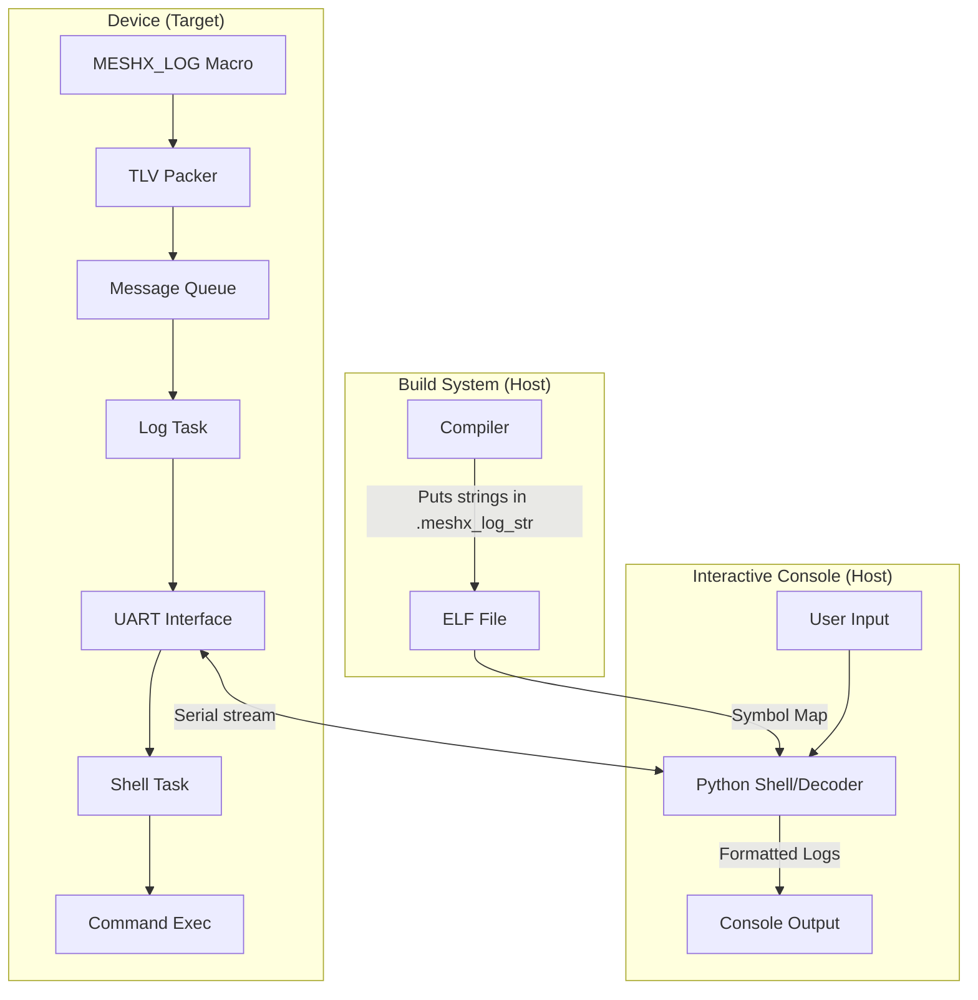
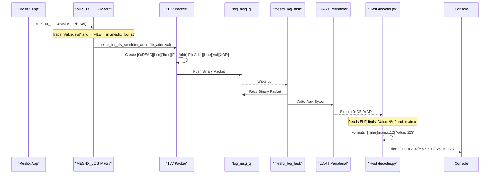
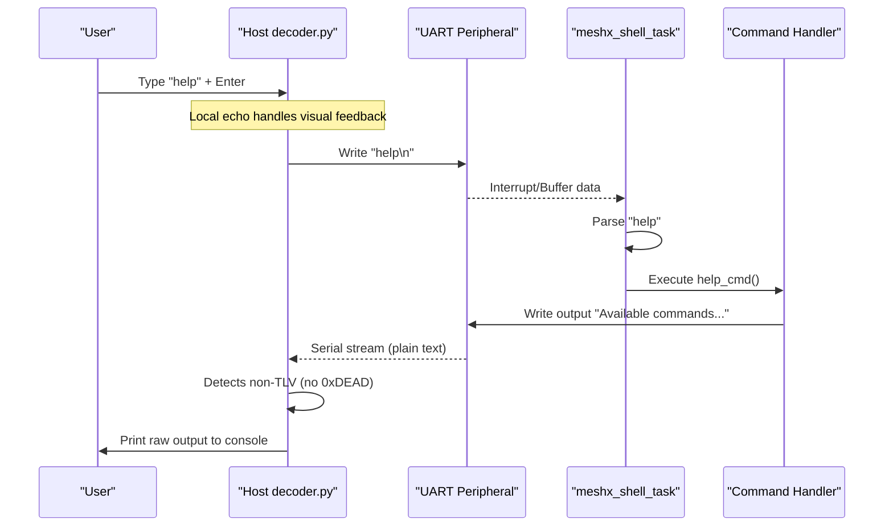

# Technical Design — ELF-based TLV Logging

This design implements a "Zero-Copy" (flash-wise) logging system where format strings reside only in the ELF file, and the device transmits only pointers and raw data.

## 1. System Architecture



## 2. Linker & Memory Map (REQ-001)

We will define a custom section in the linker script.

```ld
SECTIONS {
    /* ... other sections ... */
    .meshx_log_str (NOLOAD) :
    {
        *(.meshx_log_str)
    } > flash
}
```
*Note: Marking it `NOLOAD` ensures the strings are assigned addresses in the ELF but are NOT included in the binary image flashed to the device.*

## 3. Macro & TLV Implementation (REQ-002, REQ-006)

### Macro Structure
```c
#define MESHX_LOG(fmt, ...) \
    do { \
        /* Force strings into NOLOAD section */ \
        static const char __l_str[] __attribute__((section(".meshx_log_str"))) = fmt; \
        static const char __l_file[] __attribute__((section(".meshx_log_str"))) = __FILE__; \
        \
        meshx_log_tlv_send((uint32_t)__l_str, (uint32_t)__l_file, __LINE__, ##__VA_ARGS__); \
    } while(0)
```

### TLV Packet Format
| Field | Size | Description |
|-------|------|-------------|
| Sync Word | 2 | `0xDEAD` |
| Length | 1 | Total packet length |
| Timestamp | 4 | System ticks / ms |
| Format Addr | 4 | Pointer to string in `.meshx_log_str` |
| File Addr | 4 | Pointer to `__FILE__` in ELF |
| Line No | 2 | `__LINE__` |
| Args Data | Var | Packed binary arguments |
| XOR Parity | 1 | XOR sum of the packet for integrity |

## 4. Threaded Integration (Existing Framework)

The MeshX logging system is inherently threaded. The TLV implementation will leverage the existing message queue and task infrastructure:

1. **Binary Queue**: Instead of `meshx_log_msg_t` containing a `char` buffer, it will be updated to hold the raw binary TLV packet.
2. **Log Task**: The `meshx_log_task_handler` will be updated to write the raw binary buffer directly to the UART peripheral, bypassing `printf`.
3. **Queue Efficiency**: Since TLV packets are much smaller than formatted strings (typically 20-30 bytes vs 100+ bytes), the message queue will be able to buffer significantly more logs in the same memory footprint.

## 5. Argument Packing Logic

To support all `stdio` capabilities, the device needs to pack arguments in a way the host can understand.

1. **Fixed-size types**: `int`, `long`, `float`, `double` are sent as raw bytes.
2. **Dynamic Strings (`%s`)**: The host decoder will parse the format string. If it encounters `%s`, it expects the corresponding argument in the TLV to be a null-terminated string (copied from RAM by the device).
3. **Pointers (`%p`)**: Sent as 4-byte addresses.

## 6. Host-side Decoder (REQ-004)

The Python tool will use `pyelftools` to:
1. Load the ELF.
2. Extract the `.meshx_log_str` and `.rodata` (for file names) sections.
3. For each received TLV:
   - Extract the `Format Addr`.
   - Read the string from the ELF at that address.
   - Use `printf`-style parsing to extract values from `Args Data`.
   - Print: `[Timestamp] [File:Line] String formatted with Args`.

## 7. End-to-End Sequence Diagram



## 9. Downstream Command (Shell) Sequence



## 10. Trade-offs & Risks
- **CPU Overhead**: Calculating CRC and packing TLV is slightly more expensive than `printf` in terms of cycles, but much cheaper in terms of stack and code size.
- **Complexity**: Requires a host-side tool to see logs. Legacy `printf` will be maintained as a fallback.
- **Linker Sensitivity**: Any change in ELF addresses requires the host tool to use the exact matching ELF file.

## 11. Affected Files

| File Path | Description of Change |
|-----------|-----------------------|
| `main/component/meshx/interface/logging/meshx_log.h` | Define new TLV macros and data structures. |
| `main/component/meshx/interface/logging/meshx_log.c` | Implement binary packer and update threaded log task. |
| `port/platform/esp/esp_idf/esp.ld` | Add `.meshx_log_str (NOLOAD)` section to the ESP32-C3 linker script. |
| `tools/scripts/host_decoder.py` | (NEW) Implementation of the Python-based ELF log decoder. |
| `tools/scripts/meshx.py` | Integrate decoder into `-R` command for real-time monitoring. |
| `main/CMakeLists.txt` | Update build flags/sections if necessary. |
