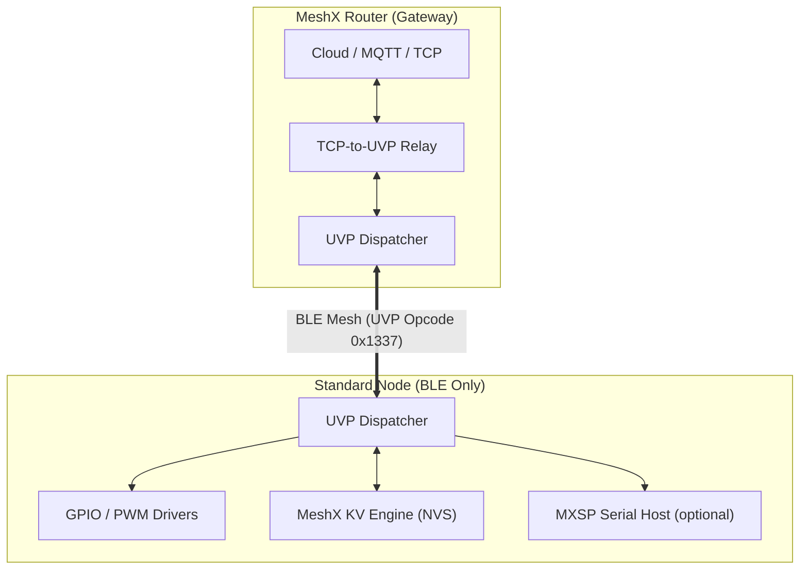

# MeshX Unified Vendor Protocol (UVP) — Technical Reference Manual

**Document Version:** 2.0  
**Platform:** ESP32-C3 · ESP-IDF v5.4 · ESP-BLE-MESH  
**Classification:** Internal Design Specification  
**Status:** Active  

---

## Overview

The **MeshX UVP** consolidates all application-level state control into a single BLE Mesh Vendor Model per element, replacing the full SIG model stack (Generic, Lighting, Sensor, Scene) to reclaim **≥170 KB Flash** and **≥23 KB RAM** on the ESP32-C3 target.

This document is organized as a multi-page Technical Reference. Each page covers a focused aspect of the system.

---

## Document Pages

| # | Page | Topics Covered |
|---|------|---------------|
| 1 | [System Overview & Layered Architecture](./design/01_system_overview.md) | Node roles, stack diagram, data flow sequences |
| 2 | [System Boot & Initialization Sequence](./design/02_boot_sequence.md) | `meshx_init()` phases, fresh vs. provisioned boot |
| 3 | [C++ Class Architecture](./design/03_cpp_architecture.md) | Flat dispatcher pattern, class hierarchy, IO factory |
| 4 | [Control Task — Central Message Bus](./design/04_control_task.md) | Pub-sub architecture, message codes, task config |
| 5 | [TXCM — Transmission Control Module](./design/05_txcm.md) | Reliability, retry state machine, key functions |
| 6 | [State Persistence Strategy](./design/06_state_persistence.md) | KV engine, NVS commit, key format, flash layout |
| 7 | [Hardware Abstraction Layer (HAL)](./design/07_hal.md) | GPIO/PWM abstraction, hosted mode, IO class hierarchy |
| 8 | [Protocol Design — TLV Engine](./design/08_tlv_protocol.md) | Frame format, tag namespace, TID mechanism, examples |
| 9 | [Composition & Element Discovery](./design/09_composition.md) | Builder API, product profiles, EL_TYPE_ID discovery |
| 10 | [Hosted Mode & MXSP Serial Protocol](./design/10_hosted_mode.md) | Co-processor mode, MXSP frame format, MSG_TYPEs |
| 11 | [Read-Only Persistent Configuration](./design/11_ro_config.md) | meshx_cfg partition, Nanopb layout, fallback flow |
| 12 | [Hardware Platform Reference](./design/12_hardware_platform.md) | ESP32-C3 specs, BSPs, memory budget, partition map |
| 13 | [Decommissioning & Flash Reclamation](./design/13_decommissioning.md) | SIG models removed, template elimination analysis |
| 14 | [Error Codes Reference](./design/14_error_codes.md) | All error codes by domain, error handling pattern |
| 15 | [Configuration Reference](./design/15_configuration.md) | Compile-time macros, runtime config struct, NFR traceability |

---

## Quick Reference

### System Architecture at a Glance

### TLV Tag Quick Reference

| Tag | Name | Type | Width |
|-----|------|------|-------|
| `0x01` | ONOFF | `uint8_t` | 1 B |
| `0x02` | LEVEL | `uint16_t` | 2 B |
| `0x03` | LIGHTNESS | `uint16_t` | 2 B |
| `0x04` | TEMPERATURE | `uint16_t` | 2 B |
| `0x06` | HUE | `uint16_t` | 2 B |
| `0x07` | SATURATION | `uint16_t` | 2 B |
| `0x10` | EL_TYPE_ID | `uint32_t` | 4 B |
| `0xFF` | STATUS | variable | — |

### Memory Savings Summary

| Region | Before | After | Saved |
|--------|--------|-------|-------|
| Flash | ~760 KB | ~590 KB | **≥170 KB** |
| SRAM | ~123 KB | ~100 KB | **≥23 KB** |

---

*Start reading: [Page 1 — System Overview →](./design/01_system_overview.md)*
