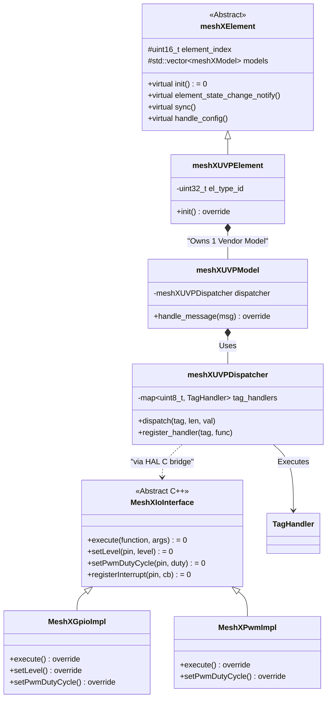

# Page 3 — C++ Class Architecture

> **[← Boot Sequence](./02_boot_sequence.md)** | **[← Index](../design.md)** | **[Next: Control Task →](./04_control_task.md)**

---

## 4. C++ Class Architecture

The C++ layer uses a **Flat Dispatcher Pattern** (replacing the legacy template-based multi-model hierarchy).

### 4.1 Class Diagram

### 4.2 Layer Responsibility Matrix

| Layer | Class | File | Responsibility |
|-------|-------|------|----------------|
| **Base** | `meshXElement` | `meshx_element_class.hpp` | Abstract foundation; manages `element_index` and model container; declares `sync()`, `handle_config()`, `element_state_change_notify()` |
| **Identity** | `meshXUVPElement` | variant `.cpp` files | Concrete element; carries `EL_TYPE_ID`; wires I/O to HAL |
| **Protocol** | `meshXUVPModel` | `meshx_model_class.hpp` | BLE Mesh Vendor Model wrapper; handles raw byte framing with the ESP stack |
| **Orchestration** | `meshXUVPDispatcher` | `meshx_uvp_dispatcher.c` | TLV stream parser; routes tag → registered `TagHandler` |
| **Logic** | `TagHandler` | per-element callbacks | Lightweight callbacks that call `MeshXIoInterface` (GPIO/PWM) |
| **I/O Abstract** | `MeshXIoInterface` | `meshx_io_interface.hpp` | Pure virtual C++ interface for all hardware I/O |
| **I/O Impl** | `MeshXGpioImpl` / `MeshXPwmImpl` | `meshx_gpio_impl.cpp` / `meshx_pwm_impl.cpp` | Concrete ESP32-C3 hardware implementations |

### 4.3 IO Factory Pattern

The `MeshXIoFactory` (singleton) provides type-registered runtime creation of `MeshXIoInterface` instances. This allows BSP-level GPIO/PWM implementations to be registered without changing element logic.

| Method | Purpose |
|--------|---------|
| `getInstance()` | Singleton accessor |
| `registerType(name, factory_fn)` | Register a concrete IO type (e.g., "gpio", "pwm") |
| `create(logical_pin, type)` | Create an IO object by type name |
| `createFromYaml(config)` | Deserialize GPIO bindings from product YAML profile |
| `isTypeSupported(type)` | Query capability at runtime |

### 4.4 Why Flat Dispatcher? (Rationale)

The legacy architecture used `meshXBaseServerModel<T>` and `meshXBaseClientModel<T>` C++ templates, one per SIG model type (OnOff, Level, CTL, HSL, etc.). This generated:

- **Duplicate vtable + RTTI** overhead for each instantiated template
- **Multiple model opcode tables** registered with the BLE stack
- **Bloated `.rodata`** from repeated string literals and dispatch tables

The flat `meshXUVPDispatcher` collapses all of this into a single runtime `map<uint8_t, TagHandler>` with **one opcode** and **zero templates**. See [Decommissioning](./08_decommissioning.md) for the quantified savings.

---

> **[← Boot Sequence](./02_boot_sequence.md)** | **[← Index](../design.md)** | **[Next: Control Task →](./04_control_task.md)**
