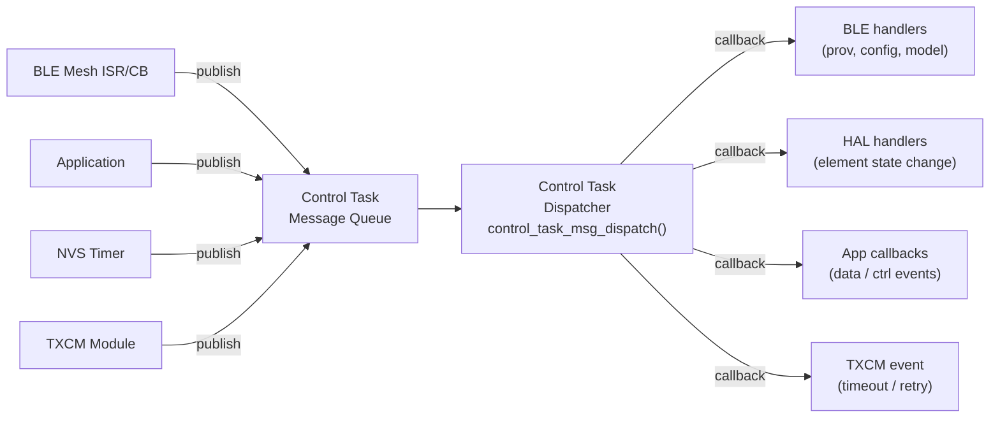
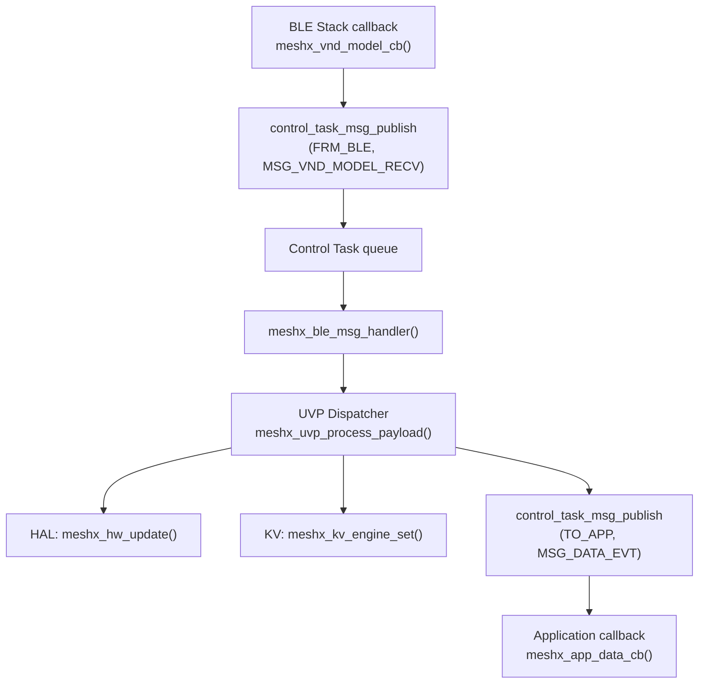

# Page 4 — Control Task: Central Message Bus

> **[← C++ Architecture](./03_cpp_architecture.md)** | **[← Index](../design.md)** | **[Next: TXCM →](./05_txcm.md)**

---

## 5. Control Task — Central Message Bus

The **Control Task** (`meshx_control_task.c`) is the central pub-sub message bus of the MeshX runtime. It runs as a dedicated FreeRTOS task at `configTIMER_TASK_PRIORITY + 2` and serializes all cross-module events through a single message queue of depth 10.

### 5.1 Architecture



### 5.2 Message Codes & Events

| Message Code | Enum | Purpose |
|---|---|---|
| `EL_STATE_CH` | `CONTROL_TASK_MSG_CODE_EL_STATE_CH` | Element state change → drives HAL |
| `SYSTEM` | `CONTROL_TASK_MSG_CODE_SYSTEM` | Timers (ARM/REARM/DISARM/FIRE), NVS commit, restart |
| `TO_BLE` | `CONTROL_TASK_MSG_CODE_TO_BLE` | Commands to BLE client models |
| `FRM_BLE` | `CONTROL_TASK_MSG_CODE_FRM_BLE` | Inbound events from BLE stack |
| `CONFIG` | `CONTROL_TASK_MSG_CODE_CONFIG` | App-key add/del, subscription/publication |
| `PROVISION` | `CONTROL_TASK_MSG_CODE_PROVISION` | Prov start/complete/fail, proxy connect/disconnect, fresh boot |
| `TO_APP` | `CONTROL_TASK_MSG_CODE_TO_APP` | Delivers DATA or CTRL events to the application layer |
| `TO_MESHX` | `CONTROL_TASK_MSG_CODE_TO_MESHX` | Commands from app → MeshX internal |
| `TXCM` | `CONTROL_TASK_MSG_CODE_TXCM` | TXCM timeout signal |

### 5.3 Pub/Sub API

```c
// Subscribe a handler for specific events on a message code
meshx_err_t control_task_msg_subscribe(
    control_task_msg_code_t msg_code,
    control_task_msg_evt_t  evt_bmap,     // bitmask of events
    control_task_msg_handle_t callback);

// Publish a message (any context, ISR-safe via queue)
meshx_err_t control_task_msg_publish(
    control_task_msg_code_t msg_code,
    control_task_msg_evt_t  msg_evt,
    const void             *msg_evt_params,
    size_t                  sizeof_msg_evt_params);
```

### 5.4 Task Configuration

| Parameter | Value |
|-----------|-------|
| Task Name | `meshx_control_task` |
| Priority | `configTIMER_TASK_PRIORITY + 2` |
| Stack Size | `8192` bytes |
| Queue Depth | `10` messages |
| Log Task Priority | `configTIMER_TASK_PRIORITY + 1` |

### 5.5 Event Flow: BLE Inbound to Application



---

> **[← C++ Architecture](./03_cpp_architecture.md)** | **[← Index](../design.md)** | **[Next: TXCM →](./05_txcm.md)**
