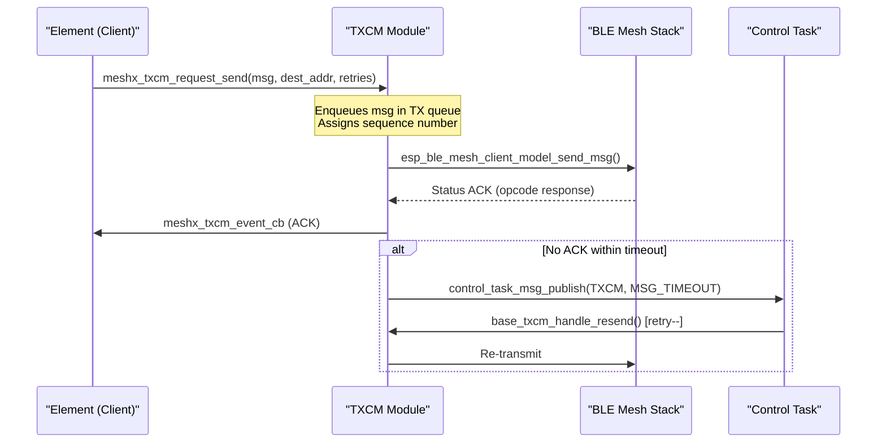
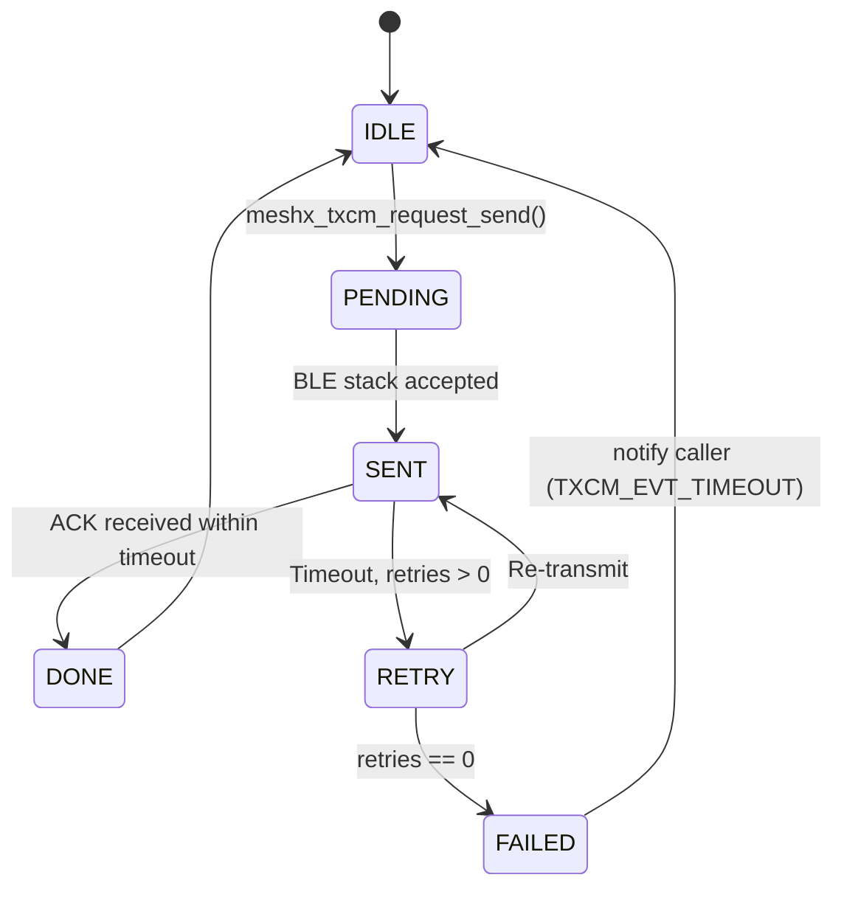

# Page 5 — TXCM: Transmission Control Module

> **[← Control Task](./04_control_task.md)** | **[← Index](../design.md)** | **[Next: State Persistence →](./06_state_persistence.md)**

---

## 6. TXCM — Transmission Control Module

The **Transmission Control Module** (`meshx_txcm.c`) ensures application-level reliability for all outbound BLE Mesh messages. It is conditionally compiled when any client element is enabled (`CONFIG_TXCM_ENABLE`).

### 6.1 Architecture



### 6.2 Key Functions

| Function | File | Role |
|----------|------|------|
| `meshx_txcm_init()` | `meshx_txcm.c:627` | Initialize queue and register control task subscriber |
| `meshx_txcm_request_send()` | `meshx_txcm.h:145` | Enqueue and transmit a request; returns after first TX |
| `meshx_txcm_event_cb_reg()` | `meshx_txcm.c:733` | Register per-model ACK/timeout callback |
| `meshx_txcm_proccess_request_msg()` | `meshx_txcm.c:408` | Internal: dequeue, build, and send to BLE stack |
| `meshx_tx_queue_search()` | `meshx_txcm.c:236` | Find pending request by sequence number for ACK matching |
| `base_txcm_handle_resend()` | `meshx_base_model_class.cpp:303` | Retry logic; decrements counter, re-enqueues |
| `base_txcm_handle_ack()` | `meshx_base_model_class.hpp:274` | Clears queue entry on successful ACK |

### 6.3 Conditional Compilation

```c
// TXCM is enabled when any client element is present:
#define CONFIG_TXCM_ENABLE \
    CONFIG_RELAY_CLIENT_COUNT    \
 || CONFIG_LIGHT_CWWW_CLIENT_COUNT \
 || CONFIG_SENSOR_SERVER_COUNT
```

### 6.4 Retry State Machine



---

> **[← Control Task](./04_control_task.md)** | **[← Index](../design.md)** | **[Next: State Persistence →](./06_state_persistence.md)**
