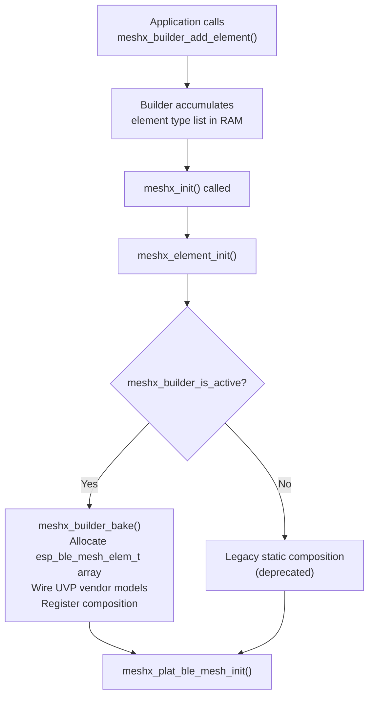
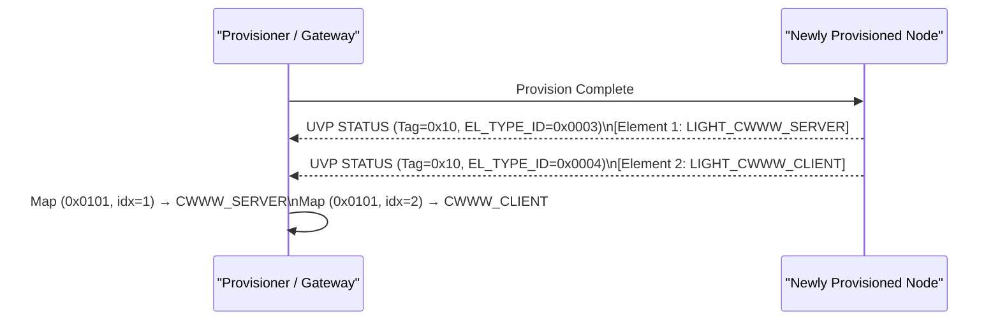

# Page 9 — Composition & Element Discovery

> **[← TLV Protocol](./08_tlv_protocol.md)** | **[← Index](../design.md)** | **[Next: Hosted Mode →](./10_hosted_mode.md)**

---

## 10. Composition & Element Discovery

### 10.1 Unified Composition Map

```
Index 0  (Root Element)
    ├── SIG Config Server
    └── SIG Health Server

Index 1  (First Application Element — EL_TYPE_ID = RELAY_SERVER)
    └── MeshX UVP Vendor Model (Opcode 0x1337)

Index 2  (Second Application Element — EL_TYPE_ID = RELAY_CLIENT)
    └── MeshX UVP Vendor Model (Opcode 0x1337)

Index N  (Nth Application Element)
    └── MeshX UVP Vendor Model (Opcode 0x1337)
```

Each element hosts **exactly one** MeshX UVP Vendor Model. Multi-element addressing via BLE Mesh Group / Virtual addresses is fully supported (REQ-F14, REQ-F15).

### 10.2 Dynamic Composition Builder

The **Composition Builder** (`meshx_builder_api.h`) provides a runtime API to build the element/model array before the BLE stack is registered:

```c
// Builder API — called before meshx_init()
meshx_builder_add_element(MESHX_ELEMENT_TYPE_RELAY_SERVER, 1);
meshx_builder_add_element(MESHX_ELEMENT_TYPE_LIGHT_CWWW_SERVER, 1);
// ...
meshx_init(&config);
// → meshx_element_init() detects builder_is_active() and calls meshx_builder_bake()
```

`meshx_builder_bake()` allocates, wires, and registers all element composition data structures and calls `meshx_plat_ble_mesh_init()`.

### 10.3 Builder Flow



### 10.4 Product Profiles

Product composition is driven by `prod_profile.yml` (BSP-specific), which is compiled into `meshx_config.h` by `tools/scripts/code_gen.py`:

| Product Name | PID | Element Composition |
|---|---|---|
| `4_relay_panel` | `0x0001` | 4× Relay Server |
| `4_relay_sw` | `0x0006` | 4× Relay Client |
| `4x4_Relay_Switch_Pannel` | `0x0002` | 4× Relay Client + 4× Relay Server |
| `CTL_light_strip` | `0x0003` | 1× CW/WW Server |
| `all_in_one` | `0x0004` | 1× Relay Client + 1× Relay Server + 1× CW/WW Server + 1× CW/WW Client |
| `sensor_node` | `0x0005` | 1× Sensor Server |
| `rgb_lamp` | `0x0007` | 1× HSL Server |

### 10.5 EL_TYPE_ID-Based Discovery

On first provision, each element broadcasts its `EL_TYPE_ID` via an unsolicited UVP STATUS frame. The provisioner/gateway maps `(unicast_addr, element_index) → EL_TYPE_ID` for type-safe client-server pairing (REQ-F22, REQ-F23).



---

> **[← TLV Protocol](./08_tlv_protocol.md)** | **[← Index](../design.md)** | **[Next: Hosted Mode →](./10_hosted_mode.md)**
