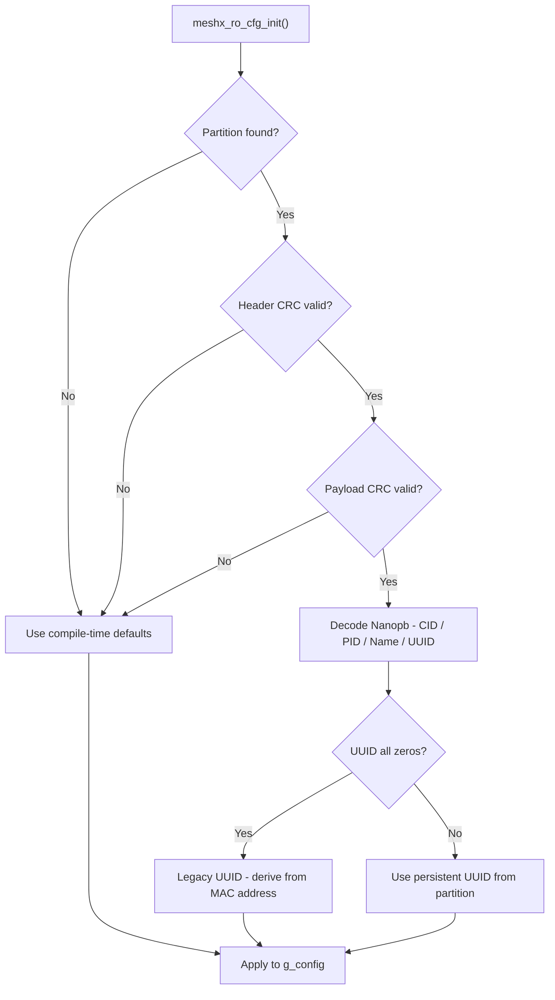

S# Page 11 — Read-Only Persistent Configuration

> **[← Hosted Mode](./10_hosted_mode.md)** | **[← Index](../design.md)** | **[Next: Hardware Platform →](./12_hardware_platform.md)**

---

## 12. Read-Only Persistent Configuration

### 12.1 Purpose

The `meshx_cfg` flash partition stores a CRC-validated Protobuf binary containing product identity, hardware configuration, and persistent device UUID. This enables field-programmable device identification without firmware reflashing.

### 12.2 Partition Layout

```
┌────────────────────────────────────────────────────────────┐
│  meshx_cfg partition (FAL-managed, 4 KB)                   │
├───────────────┬────────────────────────────────────────────┤
│  Header (8B)  │ Magic, Version, Payload Length, Header CRC │
├───────────────┼────────────────────────────────────────────┤
│  Payload (NB) │ Nanopb-encoded ProductInfo protobuf        │
│               │  - company_id (uint32)                     │
│               │  - product_id (uint32)                     │
│               │  - product_name (string)                   │
│               │  - uuid (bytes[16]) — optional             │
├───────────────┼────────────────────────────────────────────┤
│  CRC (2B)     │ CRC-16-CCITT of payload                    │
└───────────────┴────────────────────────────────────────────┘
```

### 12.3 Load Sequence & Fallback



### 12.4 API

```c
meshx_err_t meshx_ro_cfg_init(
    uint16_t *cid,          // out: Company ID
    uint16_t *pid,          // out: Product ID
    char     *product_name, // out: Product name string
    size_t    name_max_len, // in:  Buffer size
    uint8_t  *uuid          // out: 16-byte UUID (zeros if not set)
);
```

### 12.5 Code Generation

Product binaries for the `meshx_cfg` partition are generated by `tools/scripts/code_gen.py` from `prod_profile.yml`:

```bash
# Generate binary config for a product profile
python3 tools/scripts/code_gen.py \
    --profile port/bsp/weact_c3/prod_profile.yml \
    --product CTL_light_strip \
    --output build/meshx_cfg.bin
```

The binary is flashed separately using `esptool.py`:

```bash
esptool.py write_flash 0x3F0000 build/meshx_cfg.bin
```

---

> **[← Hosted Mode](./10_hosted_mode.md)** | **[← Index](../design.md)** | **[Next: Hardware Platform →](./12_hardware_platform.md)**
