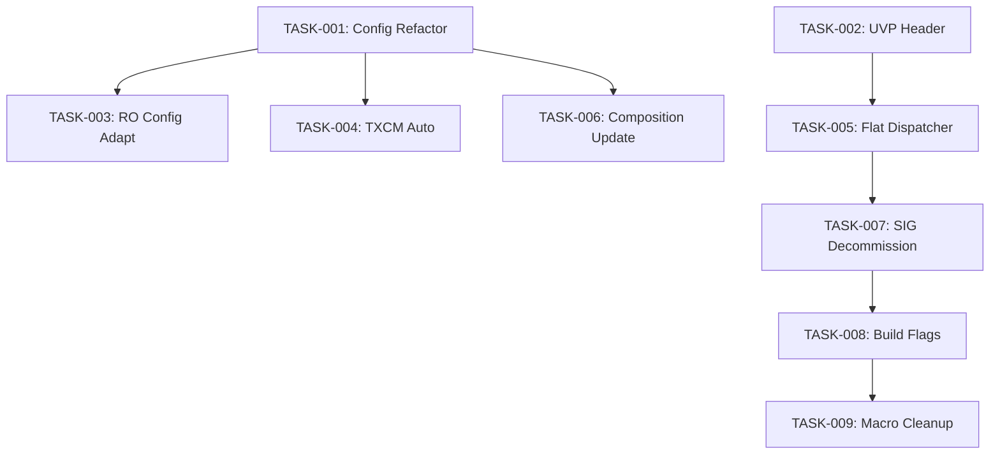

# Task Breakdown — MeshX UVP Implementation

Decomposition of the MeshX Unified Vendor Protocol design into implementation waves.

## Wave 1: Core Configuration & Protocol Skeleton
*Foundational changes to data structures and protocol definition — no shared files.*

| Task ID | Title | Description | Requirements | Design Ref | Complexity | Deps |
|---------|-------|-------------|--------------|------------|------------|------|
| **TASK-001** | Refactor `meshx_config_t` | Remove redundant fields (CID, PID, VID, product name, element array) from the runtime config struct in `meshx.h` and `meshx.c`. Remove the `CID_ESP`/`CONFIG_CID_ID` identity macro. | REQ-F11 | [§16.2](./design/15_configuration.md) | S | None |
| **TASK-002** | Implement UVP Header | Define `meshx_uvp_header_t` (4 bytes: TID, EL_IDX, EL_TYPE_ID) and integrate into the vendor model payload parsing logic. | REQ-F17, REQ-F22 | [§9.1](./design/08_tlv_protocol.md) | M | None |

## Wave 2: Composition & Dispatch Logic
*Dynamic element registration, RO config adaptation, and protocol dispatch. TASK-003 depends on TASK-001's struct changes and touches `meshx.c` — must follow Wave 1.*

| Task ID | Title | Description | Requirements | Design Ref | Complexity | Deps |
|---------|-------|-------------|--------------|------------|------------|------|
| **TASK-003** | Adapt RO Config Interface | **[COMPLETED]** `meshx_ro_cfg_init` already loads CID/PID/UUID from the NVS partition. Adapt `meshx_load_persistent_config` and internal globals to work without the removed `cid`/`pid`/`product_name` struct fields, making the RO partition the sole identity source at boot. | REQ-F11 | [§12.3](./design/11_ro_config.md) | S | TASK-001 |
| **TASK-004** | Dynamic TXCM Activation | **[COMPLETED]** Update Composition Builder to automatically enable TXCM if any client elements are registered via `meshx_builder_add_element`. | REQ-F18 | [§16.1](./design/15_configuration.md) | S | TASK-001 |
| **TASK-005** | Flat Dispatcher Implementation | **[COMPLETED]** Replace C++ template-based model dispatch with the new unified dispatcher that uses the UVP header's `EL_TYPE_ID`. | REQ-D04, REQ-F06 | [§3.1](./design/03_cpp_architecture.md) | L | TASK-002 |
| **TASK-006** | Element Composition Update | **[COMPLETED]** Update `meshx_init` to rely on the Composition Builder's "baked" registry instead of static compile-time counts. Remove legacy `element_comp_arr_len`/`element_comp_arr` usage from `meshx.c`. | REQ-F14, REQ-F15 | [§9.1](./design/09_composition.md) | M | TASK-001 |

## Wave 3: SIG Model Decommission & Build Flags
*Remove legacy SIG model code and disable corresponding build flags. TASK-007 and TASK-008 touch different file sets and can run in parallel.*

| Task ID | Title | Description | Requirements | Design Ref | Complexity | Deps |
|---------|-------|-------------|--------------|------------|------------|------|
| **TASK-007** | Strip SIG Model Code | **[COMPLETED]** Remove all legacy Generic, Lighting, and Sensor SIG model implementations from `elements_c/` and `base_model/`. **Do not remove** `meshx_config_server` or `meshx_prov_srv` (required by REQ-F07). | REQ-D01, REQ-D02, REQ-D03 | [§13](./design/13_decommissioning.md) | L | TASK-005 |
| **TASK-008** | Optimize Build Flags | **[COMPLETED]** Add explicit `CONFIG_BLE_MESH_GENERIC_*=n`, `CONFIG_BLE_MESH_LIGHTING_*=n`, `CONFIG_BLE_MESH_SENSOR_*=n` disable entries to `sdkconfig.defaults.ble_mesh`. Remove the orphaned `CONFIG_RELAY_*_COUNT`, `CONFIG_LIGHT_CWWW_*_COUNT`, `CONFIG_SENSOR_SERVER_COUNT`, `CONFIG_RGB_SERVER_COUNT` guard blocks from `meshx_composition_builder.cpp`. Verify ~170 KB flash reclamation. | REQ-NF01 | [§16.3](./design/15_configuration.md) | M | TASK-007 |

## Wave 4: Macro Cleanup
*Final removal of superseded identity and count macros — sequenced after TASK-008 to avoid file conflicts.*

| Task ID | Title | Description | Requirements | Design Ref | Complexity | Deps |
|---------|-------|-------------|--------------|------------|------------|------|
| **TASK-009** | Cleanup Config Macros | **[COMPLETED]** Delete all remaining superseded `CONFIG_RELAY_*_COUNT` and identity macros from the build system after TASK-008 confirms they are fully unused. | REQ-D05 | [§16.1](./design/15_configuration.md) | S | TASK-008 |

---

## Task Dependencies & Flow

