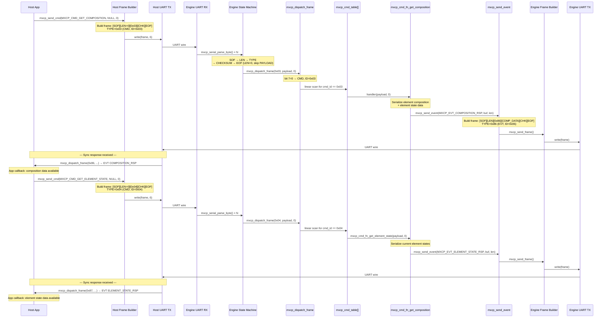
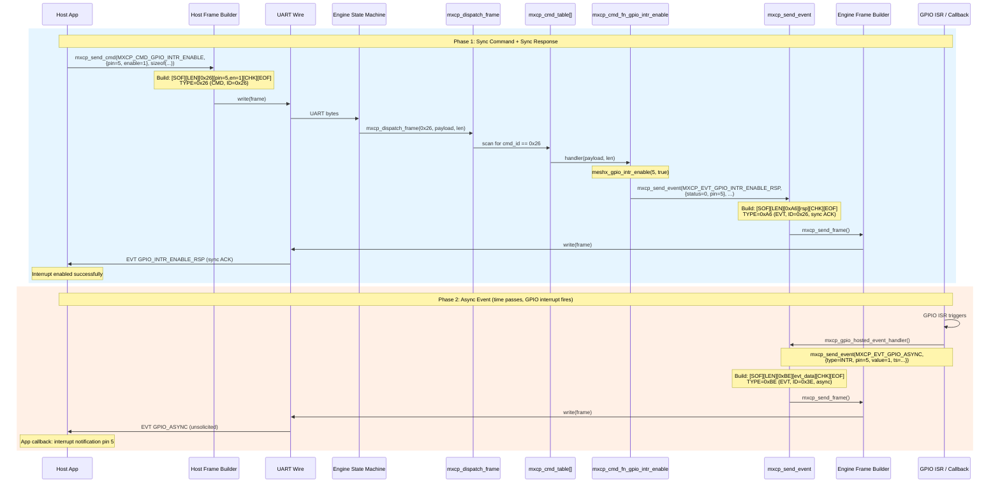
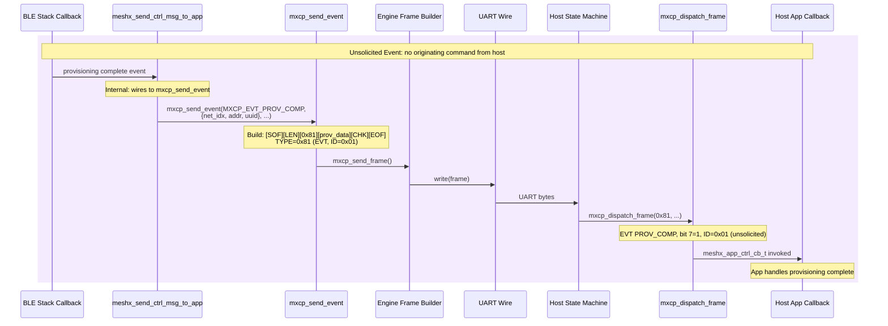
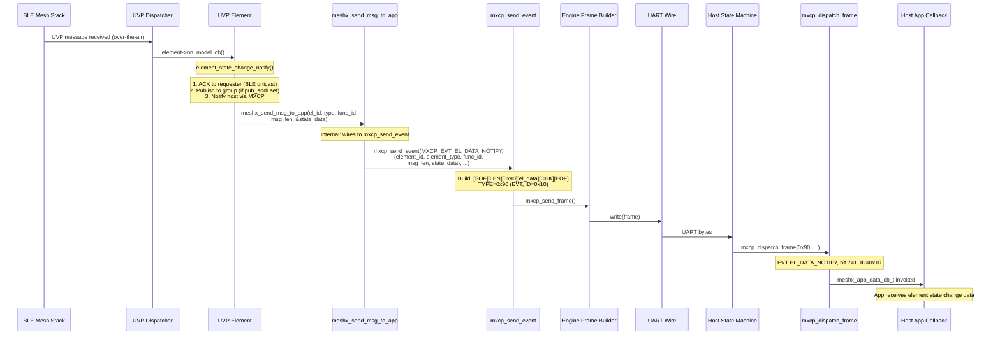
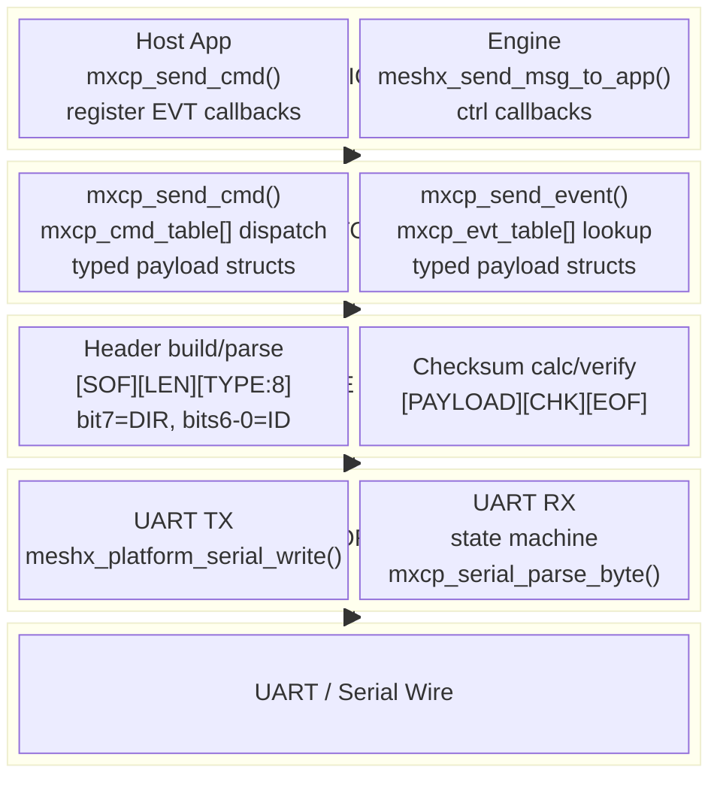

# TRD-09 — Sequence Diagrams

## 1. Sync Command / Response Flow (e.g. GET_COMPOSITION)

## 2. Async Command / Event Flow (e.g. GPIO_INTR_ENABLE)

## 3. Unsolicited Event Flow (e.g. PROV_COMP)

## 4. Element Data Flow (e.g. BLE state change → Host notification)

## 5. Layer-by-Layer Architecture

