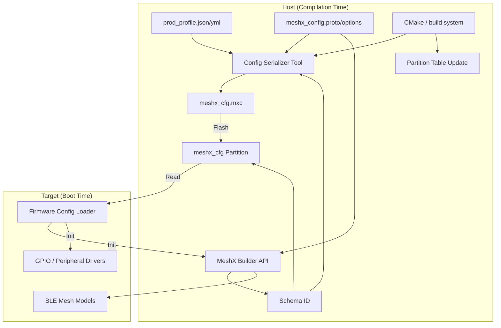
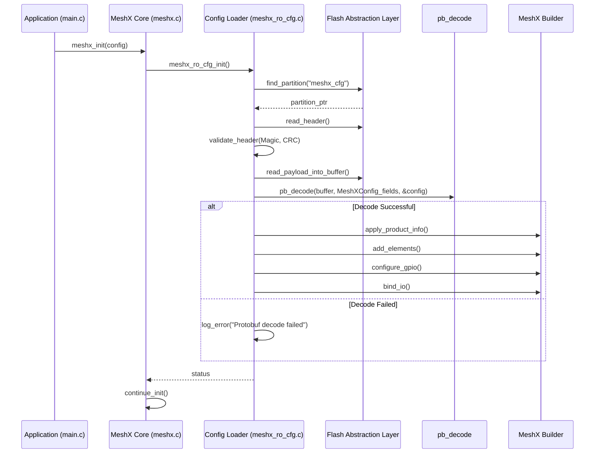
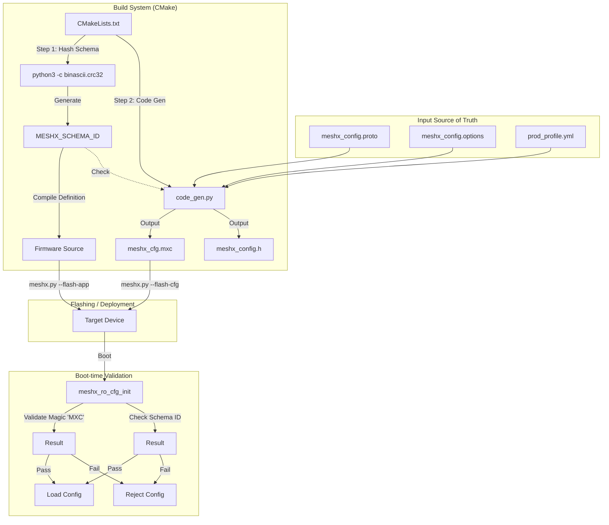
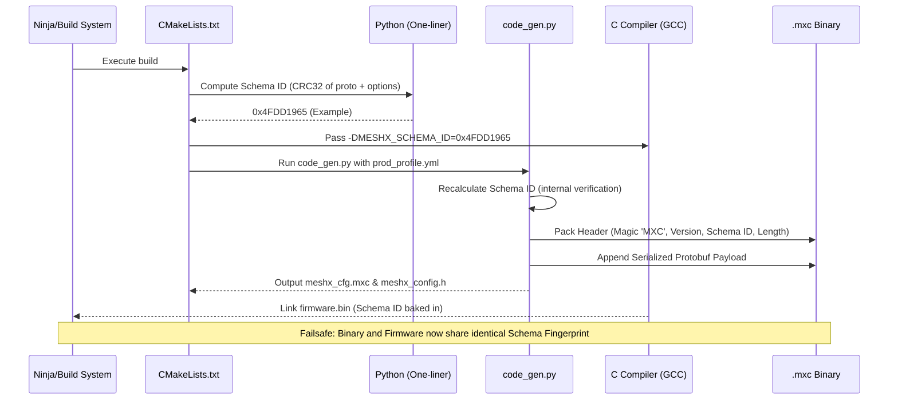

# Technical Design: Persistent Serialized Configuration

## 1. Introduction
This document outlines the technical design for the Persistent Serialized Configuration feature in MeshX. This feature allows product-specific configurations to be stored in a dedicated, read-only flash partition, enabling a unified firmware binary across multiple product variations and facilitating seamless OTA updates for OEMs.

## 2. System Architecture
The feature consists of a compilation-time serialization tool and a boot-time firmware loader.

### 2.1 Component Diagram


## 3. Detailed Design

### 3.1 Serialized Binary Format (v1)
Protocol Buffers (Protobuf) via the `nanopb` library will be used for serialization to ensure scalability, type safety, and maintainability across both Python tooling and C firmware.

**Header Structure (15 bytes):**
| Field        | Size    | Description                 |
| ------------ | ------- | --------------------------- |
| Magic        | 4 bytes | `0x0043584D` ('MXC\0')      |
| Version      | 1 byte  | `0x01`                      |
| Schema ID    | 4 bytes | CRC32 of proto/options files |
| Total Length | 2 bytes | Total size of the binary    |
| Header CRC   | 2 bytes | CRC-16 of the header fields |
| Payload CRC  | 2 bytes | CRC-16 of the protobuf payload |

**CRC Calculation Details:**
- **Algorithm**: CRC-16-CCITT (Polynomial `0x1021`)
- **Initial Value**: `0xFFFF`
- **Header CRC**: Calculated over the first 11 bytes of the header (`Magic`, `Version`, `Schema ID`, `Total Length`).
- **Payload CRC**: Calculated over the entire Protobuf payload.

**Schema ID Generation:**
The Schema ID is a CRC32 hash of the `meshx_config.proto` and `meshx_config.options` files (ignoring whitespace). This ID is embedded in both the `.mxc` binary and the firmware at compile-time to ensure binary-firmware compatibility.

**Protobuf Payload:**
The data payload following the 9-byte header will be a standard encoded Protocol Buffer message defined by a shared `meshx_config.proto` schema.

### 3.2 Flash Partitioning
A new partition named `meshx_cfg` will be added to the partition table.

- **Name**: `meshx_cfg`
- **Type**: `data` (ESP-IDF)
- **SubType**: `0x40` (Custom)
- **Size**: 4KB (Minimum sector size for most flash)
- **Flags**: None (Read-only behavior enforced by firmware logic)

#### 3.2.1 4MB Flash Layout Visualization
The following table illustrates how the partitions are organized within a typical 4MB flash layout, incorporating the new `meshx_cfg` partition:

| Offset     | Name                           | Type   | SubType | Size    | Description                                              |
| :--------- | :----------------------------- | :----- | :------ | :------ | :------------------------------------------------------- |
| `0x000000` | *Bootloader / Partition Table* | -      | -       | 32 KB   | System bootloader and partition table.                   |
| `0x008000` | `nvs`                          | `data` | `nvs`   | 24 KB   | Standard ESP-IDF NVS storage (WiFi credentials, etc.).   |
| `0x00E000` | `otadata`                      | `data` | `ota`   | 8 KB    | OTA selection data.                                      |
| `0x010000` | `phy_init`                     | `data` | `phy`   | 4 KB    | PHY initialization data.                                 |
| `0x011000` | `meshx_cfg`                    | `data` | `0x40`  | 4 KB    | **NEW**: Persistent Serialized Configuration (OTP-like). |
| `0x012000` | `meshx_nvs`                    | `data` | `nvs`   | 16 KB   | MeshX dynamic state (wear-leveled KV engine).            |
| `0x016000` | `ota_0`                        | `app`  | `ota_0` | 1536 KB | Factory / First OTA firmware image.                      |
| `0x196000` | `ota_1`                        | `app`  | `ota_1` | 1536 KB | Second OTA firmware image.                               |
| `0x316000` | *Unused Space*                 | -      | -       | ~936 KB | Available space in 4MB flash.                            |


### 3.3 Firmware Config Loader
A new module `meshx_ro_cfg` will be implemented.

**Initialization Flow:**
1. `meshx_init()` is called.
2. `meshx_ro_cfg_init()` is invoked early in the boot sequence.

### 3.3 Boot Initialization and Protobuf Processing
The firmware config loader performs a read of the `meshx_cfg` partition, decoding the payload using `nanopb`.

#### 3.3.1 Boot Sequence Diagram


#### 3.3.2 Parsing Logic
The processing logic leverages nanopb's generated C structures:

1.  **Read and Validate**: The loader reads the 9-byte header and validates CRCs.
2.  **Decode**: The payload is passed to `pb_decode` which populates the `MeshXConfig` C struct.
3.  **Application**:
    -   Updates the global `g_config` CID/PID.
    -   Iterates through the decoded elements array, calling `meshx_builder_add_element()`.
    -   Iterates through GPIO configurations and IO bindings, creating handles and attaching them to elements.
4.  **Graceful Degradation (Stubs)**: If an element type requested by the protobuf is not enabled in the current firmware build (e.g., `CONFIG_MESHX_MODEL_HSL` is off), the builder gracefully skips initializing that element and logs a warning.

### 3.4 Tooling Updates

#### 3.4.1 `code_gen.py` Extension
- Add a new mode to generate `meshx_cfg.mxc` from the YAML/JSON profile.
- Implement `generate_schema_id()` to create a unique fingerprint of the configuration schema.
- This will be triggered by CMake during the build process.

#### 3.4.2 `meshx.py` Enhancement
- Add `--flash-cfg` command: Flashes `meshx_cfg.mxc` to the specific partition.
- Add `--erase-cfg` command: Erases the `meshx_cfg` partition.

### 3.5 Concrete TLV Binary Example
Based on the `4x4_Relay_Switch_Pannel` product from `prod_profile.ci.yml`:
- **CID**: `0x7908`
- **PID**: `0x0002`
- **Elements**: `switch_relay_client` (x4), `switch_relay_server` (x4)

## 4. Requirements Traceability

| Requirement ID | Design Section | Notes                                               |
| -------------- | -------------- | --------------------------------------------------- |
| REQ-001        | 3.1            | Serialized Binary Format                            |
| REQ-002        | 3.2            | Dedicated Flash Partition                           |
| REQ-003        | 3.4.1          | Compilation-time generation via CMake/Python        |
| REQ-004        | 3.3            | Boot-time loader and initialization                 |
| REQ-005        | 3.3            | Graceful handling of unknown/missing features       |
| REQ-006        | 3.1            | Versioned Protobuf format supports forward compatibility |
| REQ-007        | 3.4.2          | `meshx.py` CLI updates                              |

## 5. Implementation Plan (Wave 1)
- Modify `partitions.csv` to add `meshx_cfg`.
- Create `meshx_ro_cfg.h/c` in `main/component/meshx`.
- Update `code_gen.py` to support binary serialization.
- Update `meshx.py` to support targeted flash/erase.

### 3.5 Concrete Protobuf Schema Example
Based on the `4x4_Relay_Switch_Pannel` product, the shared schema (`meshx_config.proto`) would look similar to:

```protobuf
syntax = "proto3";

message ProductInfo {
  uint32 cid = 1;
  uint32 pid = 2;
  string name = 3;
}

message ElementConfig {
  uint32 type = 1;
  uint32 count = 2;
}

message GpioConfig {
  uint32 logical_pin = 1;
  uint32 physical_pin = 2;
}

message IoBinding {
  uint32 element_id = 1;
  uint32 logical_pin = 2;
  uint32 usage = 3;
}

message MeshXConfig {
  ProductInfo product = 1;
  repeated ElementConfig elements = 2;
  repeated GpioConfig gpio = 3;
  repeated IoBinding bindings = 4;
}
```

### 3.6 Build System Flow
The following diagrams illustrate the automated generation and validation of the `.mxc` configuration binary during the firmware build process.

#### 3.6.1 Data Flow Diagram


#### 3.6.2 Execution Sequence

