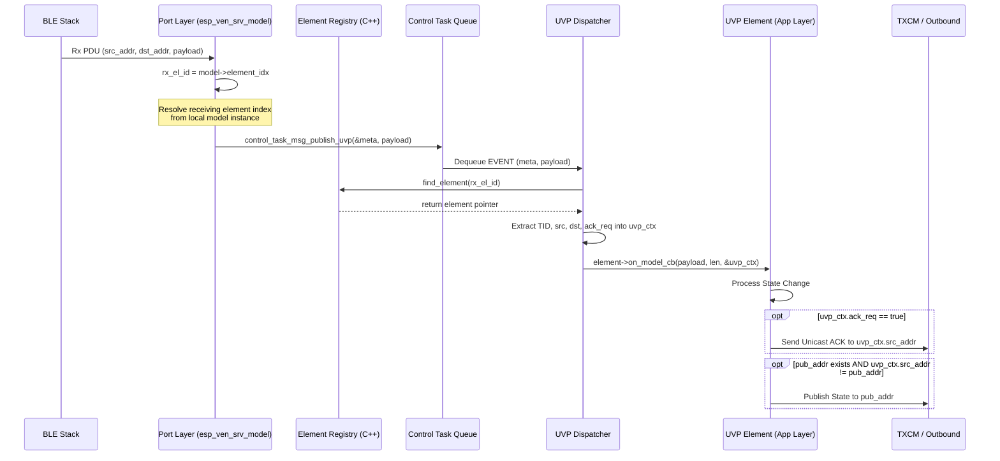

# Software Design Document: UVP Routing and ACK Fix

## 1. Introduction

### 1.1 Purpose
This document provides the technical design to rectify architectural gaps in the MeshX Unified Vendor Protocol (UVP) implementation. Specifically, it enables reliable ACK-based communication and source-address-aware response routing, fixing the current issue where the destination and source routing context is dropped before reaching the application layer.

### 1.2 Scope
- Extracting and propagating routing context (`src_addr`, `dst_addr`) from the ESP-IDF BLE Mesh callback all the way to the application layer element.
- Introducing an `ack_req` flag in the UVP fixed header.
- Establishing the logic inside elements to utilize this context for Dual-Routing responses (Unicast ACK + Group Publish).

### 1.3 Definitions and Acronyms
| Term | Definition |
|------|------------|
| UVP | Unified Vendor Protocol |
| ACK | Acknowledgment / Status Response |
| TID | Transaction Identifier |

---

## 2. System Overview

### 2.1 System Context
The MeshX UVP Dispatcher bridges the gap between the low-level Bluetooth Mesh stack and high-level C++ Application Elements. Currently, the routing context (Who sent the message? Was it addressed to me specifically or a group?) is lost at this boundary.

### 2.2 High-Level Architecture
1. **BLE Mesh Stack**: Receives packets, provides full `ctx` (source, destination, opcodes).
2. **Control Task Bridge**: Converts `ctx` to `control_task_uvp_meta_t` and publishes an async message.
3. **UVP Dispatcher**: Parses the async message, extracts headers, caches the TID, and invokes the `element`.
4. **Application Element**: Processes the payload and (now) responds intelligently based on the provided routing context.

---

## 3. Design Considerations

### 3.1 Assumptions
- There are sufficient unused bits in `meshx_uvp_header_t.element_idx` (currently uses 5 bits for 0-31), leaving 3 reserved bits for flags like `ack_req`.
- Elements know their own registered publish address via the `meshx_element_class`.

### 3.2 Constraints
- The `meshx_uvp_header_t` size must strictly remain 4 bytes to preserve the 377-byte max payload capacity.

---

## 4. Architectural Strategies

### 4.1 Key Architectural Decisions
- **Decision 1: Bitpacking the UVP Header**: Instead of expanding the header to add an `ack_req` byte, we will bit-pack the `element_idx` field (which only requires 5 bits for 32 elements). We will allocate 1 bit for `ack_req` and leave 2 bits as RFU.
- **Decision 2: Context Struct over Parameter Bloat**: Instead of adding `src_addr`, `dst_addr`, `tid`, and `ack_req` as individual parameters to `on_model_cb`, we introduce `meshx_uvp_ctx_t` to keep the interface clean and extensible.
- **Decision 3: Dual-Routing Logic in Application Elements**: The decision of *when* to send an ACK and *when* to publish is pushed to the element's logic (e.g., `meshx_uvp_element.cpp`), granting maximum flexibility rather than enforcing it in the dispatcher.

---

## 5. System Architecture

### 5.1 Data Models / Interface Definitions

**1. Updated `meshx_uvp_header_t` (Bitfield)**
*The over-the-air UVP header completely omits the element index, saving OTA overhead. The physical target element index is instead resolved locally at the BSP/Port layer.*
```c
typedef struct {
    uint8_t tid;           /**< Transaction ID (0-255) */
    uint8_t ack_req     : 1; /**< ACK Requested Flag (1 = true) */
    uint8_t rfu         : 7; /**< Reserved for Future Use */
    uint16_t type_id;      /**< Function/Type ID (0-65535) */
} __attribute__((packed)) meshx_uvp_header_t;
```

**2. Updated `control_task_uvp_meta_t`**
```c
typedef struct {
    uint16_t src_addr;             /**< Source address of the message */
    uint16_t dst_addr;             /**< Destination address of the message */
    uint8_t rx_el_id;              /**< Locally-resolved element index that received the message */
    meshx_uvp_header_t uvp_header; /**< Extracted UVP header */
} control_task_uvp_meta_t;
```

**3. New `meshx_uvp_ctx_t`**
```cpp
typedef struct {
    uint16_t src_addr;
    uint16_t dst_addr;
    uint8_t tid;
    bool ack_req;
} meshx_uvp_ctx_t;
```

### 5.2 API Interfaces
- **`control_task_msg_publish_uvp`**: Add `uint16_t dst_addr` parameter.
- **`meshXElementIF::on_model_cb`**: Add `const meshx_uvp_ctx_t* ctx` parameter.

---

## 6. Policies and Tactics

### 6.1 State Synchronization Policy
If `ctx->ack_req` is true:
1. Send a unicast Status response directly to `ctx->src_addr`.
2. Additionally, check the element's configured publish address. If it exists and `ctx->src_addr != pub_addr`, perform a standard `meshx_send_msg_to_element` publish to keep the network synchronized.

---

## 7. Detailed Design

### 7.1 Layer Definitions

#### 1. Port Layer (`esp_ven_srv_model.c`)
- Extracts `ctx->recv_dst` alongside `ctx->addr`.
- Passes both to `control_task_msg_publish_uvp()`.

#### 2. Control Task Layer (`meshx_control_task.c`)
- Allocates queue item.
- Populates `control_task_uvp_meta_t` with both `src_addr` and `dst_addr`.

#### 3. Dispatch Layer (`meshx_uvp_dispatcher.cpp`)
- Intercepts the control task event.
- Instantiates `meshx_uvp_ctx_t` on the stack.
- Populates it using the metadata.
- Calls `element->on_model_cb(payload, payload_len, &ctx)`.

#### 4. Element Layer (`meshx_uvp_element.cpp`)
- Replaces legacy state updates that default to "publish" with the new Dual-Routing logic defined in Section 6.1.

---

## 8. Appendix

### 8.1 Sequence Diagram: Inbound Routing & Dual Response



---

## Requirement Traceability

### REQ-001 Implementation
**Requirement:** Propagate Destination Address to Control Task
**Design:** Handled by modifying `control_task_uvp_meta_t` and `control_task_msg_publish_uvp` to accept `dst_addr` and populating it from `ctx->recv_dst` in `esp_ven_srv_model.c`.

### REQ-002 Implementation
**Requirement:** Element Callback Context Propagation
**Design:** Addressed by the creation of `meshx_uvp_ctx_t` and modifying the `on_model_cb` virtual method signature in C++.

### REQ-003 Implementation
**Requirement:** Unicast ACK Routing Capability
**Design:** Elements receive `meshx_uvp_ctx_t` allowing them to target `ctx->src_addr` for outbound responses.

### REQ-004 Implementation
**Requirement:** ACK Request Indicator in UVP Header
**Design:** Modified `meshx_uvp_header_t` to pack `ack_req` (1 bit) and `rfu` (7 bits) into the second byte of the 4-byte packed header structure, omitting the element index to preserve OTA payload space.

### REQ-005 Implementation
**Requirement:** Dual-Routing Response (Unicast ACK + Group Publish)
**Design:** Documented in the State Synchronization Policy (Section 6.1) and visually depicted in the Sequence Diagram (Section 8.1).
