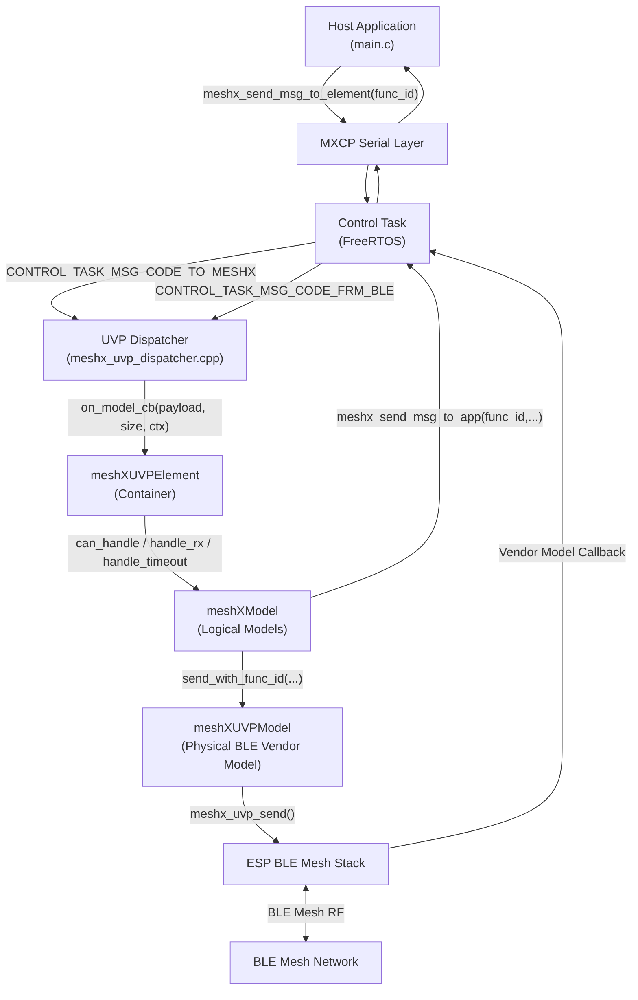
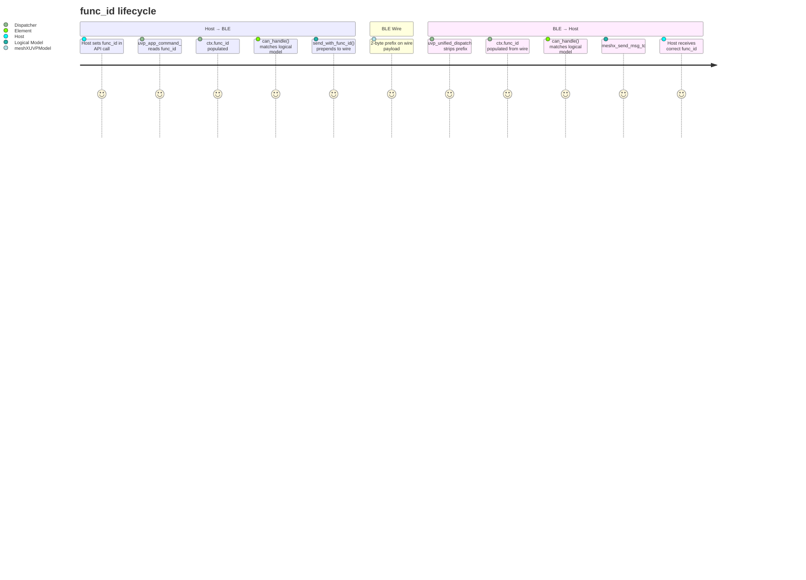

# TRD — UVP Model Refactor
## Page 1: System Overview & Architecture

**Document:** Technical Requirements Document (TRD)
**Spec:** `uvp_model_refactor`
**Revision:** 1.0
**Status:** Draft

---

## 1. Purpose

This document describes the technical requirements and design for refactoring the `meshXUVPElement` notification path from a monolithic, variant-keyed `if-else` handler into a modular, composition-based `meshXModel` architecture.

It is intended for firmware engineers implementing or reviewing the change.

---

## 2. Scope

| In Scope | Out of Scope |
|---|---|
| `meshXUVPElement::element_state_change_notify` refactor | BLE Mesh stack internals |
| `meshx_uvp_ctx_t` `func_id` field addition | TXCM retry algorithm changes |
| UVP wire payload `func_id` prefix (2 bytes) | NVS / persistence logic |
| New `meshXModel` base class and concrete subclasses | Host application code (`main.c`) |
| Dispatcher `func_id` propagation (all 3 paths) | SIG model layer |

---

## 3. System Context

---

## 4. Key Entities

| Entity | Role | File |
|---|---|---|
| `meshXUVPElement` | Container: composes logical models, routes events | `meshx_uvp_element.cpp` |
| `meshXModel` | Abstract base: `handle_rx`, `handle_timeout`, `can_handle` | `meshx_uvp_logical_model.hpp` *(new)* |
| `meshXRelayClientModel` | Client logic: fwd host cmd to BLE, report ACK to app | `meshx_uvp_logical_models.cpp` *(new)* |
| `meshXRelayServerModel` | Server logic: ACK sender + publish + app telemetry | `meshx_uvp_logical_models.cpp` *(new)* |
| `meshXLightCWWWClientModel` | Client logic for OnOff (F0) and CTL (F1) | `meshx_uvp_logical_models.cpp` *(new)* |
| `meshXLightCWWWServerModel` | Server logic for OnOff (F0) and CTL (F1) | `meshx_uvp_logical_models.cpp` *(new)* |
| `meshXUVPModel` | Physical transport: wraps `meshx_uvp_send()` | `meshx_uvp_model.hpp` |
| `meshx_uvp_ctx_t` | Routing context passed element → model | `meshx_uvp.h` |
| UVP Dispatcher | Three callbacks: BLE RX / Host CMD / TXCM Timeout | `meshx_uvp_dispatcher.cpp` |

---

## 5. `func_id` Lifecycle

The core insight of this refactor is that `func_id` must be an **explicit, first-class field** that travels from the host application to the receiving BLE node and back — end-to-end.

---

*Continued in Page 2: Interface Specifications*
