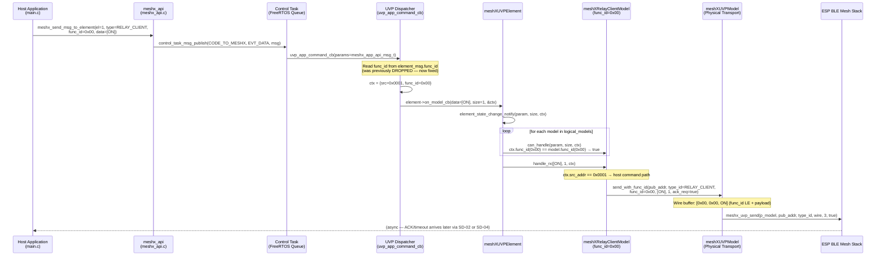
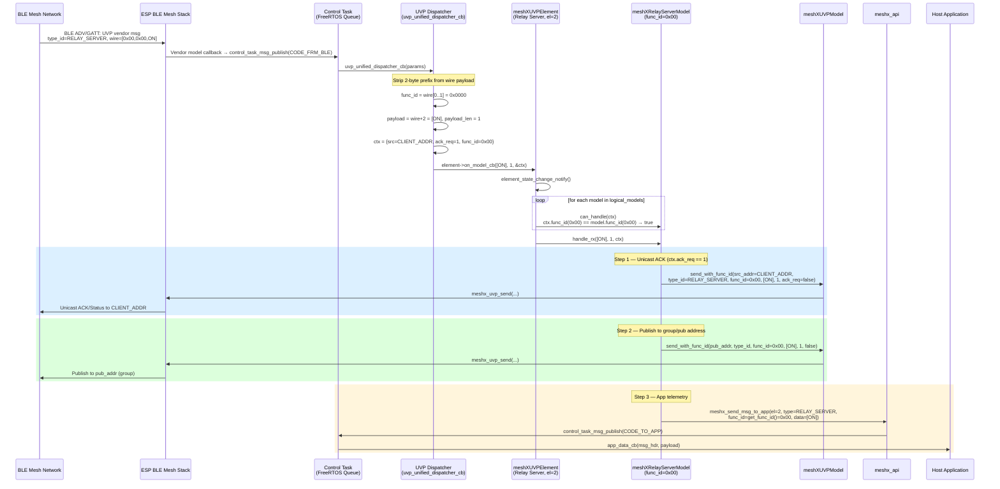
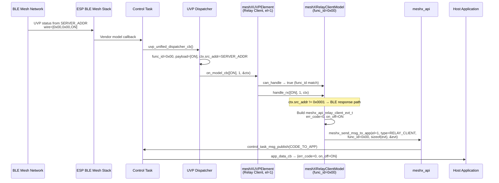
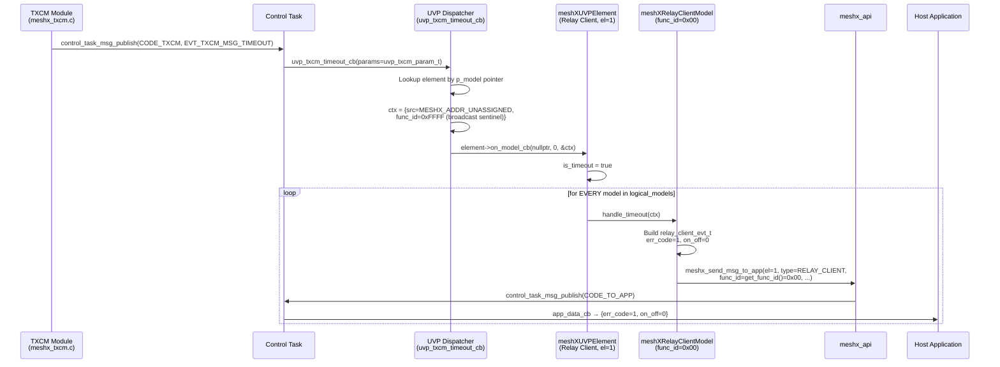
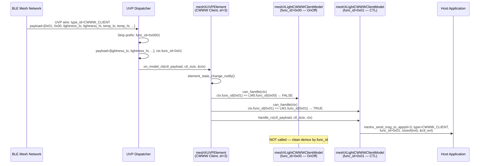

# TRD — UVP Model Refactor
## Page 3: Sequence Diagrams

---

## SD-01 — Host Command → Client Element → BLE Mesh TX

**Scenario:** Host application sends an ON/OFF command to Relay Client element (func_id=0x00).

---

## SD-02 — BLE Mesh RX → Server Element → ACK + Publish + App Telemetry

**Scenario:** Server element receives ON/OFF command from BLE mesh. It ACKs, publishes, and notifies the host.

---

## SD-03 — BLE Mesh RX → Client Element → App Telemetry (ACK Received)

**Scenario:** Relay Client receives status/ACK from the Relay Server. Reports success to host.

---

## SD-04 — TXCM Timeout → All Client Models → App Telemetry (Error)

**Scenario:** TXCM determines the server did not ACK within the retry window. Timeout fires.

---

## SD-05 — CWWW Client: Two Functions on One Element (func_id Demux)

**Scenario:** CWWW Server sends back a CTL status (func_id=0x01). The element must route it to the CTL model, not the OnOff model.

---

*Continued in Page 4: Wire Format & Concrete Model Implementations*
