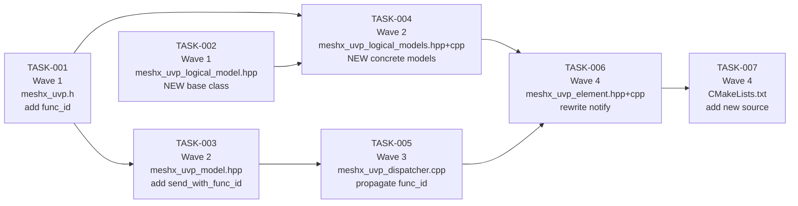

# TRD — UVP Model Refactor
## Page 5: Task Breakdown & File Change Matrix

---

## 1. File Change Matrix

| # | File | Change | REQ |
|---|------|--------|-----|
| 1 | `main/component/meshx/inc/meshx_uvp.h` | Add `func_id` + `MESHX_UVP_FUNC_ID_PREFIX_SZ` + `MESHX_UVP_MAX_APP_PAYLOAD` | REQ-003 |
| 2 | `main/component/meshx/ble_mesh/model/inc/meshx_uvp_model.hpp` | Add `send_with_func_id()` inline method | REQ-004 |
| 3 | `main/component/meshx/ble_mesh/model/inc/meshx_uvp_logical_model.hpp` | **NEW** — `meshXModel` abstract base class | REQ-001, REQ-002, REQ-005 |
| 4 | `main/component/meshx/ble_mesh/model/inc/meshx_uvp_logical_models.hpp` | **NEW** — Concrete model class declarations | REQ-006, REQ-007 |
| 5 | `main/component/meshx/ble_mesh/model/src/meshx_uvp_logical_models.cpp` | **NEW** — Concrete model implementations | REQ-006, REQ-007, REQ-008 |
| 6 | `main/component/meshx/ble_mesh/common/src/meshx_uvp_dispatcher.cpp` | Populate `ctx.func_id` in all 3 callbacks | REQ-003, REQ-004 |
| 7 | `main/component/meshx/ble_mesh/elements/inc/variants/meshx_uvp_element.hpp` | Add `logical_models` vector member | REQ-001 |
| 8 | `main/component/meshx/ble_mesh/elements/src/variants/meshx_uvp_element.cpp` | Rewrite `list_ven_models()` + `element_state_change_notify()` | REQ-001, REQ-008 |
| 9 | `main/CMakeLists.txt` | Add `meshx_uvp_logical_models.cpp` to `SRCS` | — |

**No changes to:**
- `meshx_api.h` (public types — REQ-009)
- `main.c` / application callbacks
- `meshx_txcm.c` / `meshx_txcm.h`
- `meshx_composition.cpp`
- `meshx_nvs.c`

---

## 2. Wave-Based Task Breakdown

Tasks are ordered by dependency. Tasks touching the same file are in different waves.



---

## 3. Task Definitions

### TASK-001 — Extend `meshx_uvp_ctx_t` with `func_id`
**Wave:** 1 | **Complexity:** S | **REQ:** REQ-003
**File:** `meshx_uvp.h`

- Add `uint16_t func_id` to `meshx_uvp_ctx_t`.
- Add `MESHX_UVP_FUNC_ID_PREFIX_SZ` and `MESHX_UVP_MAX_APP_PAYLOAD` macros.
- Document sentinel values: `0xFFFF` = timeout broadcast.

**Impact:** All callers that construct `meshx_uvp_ctx_t` must be updated to set `func_id`. Affected: `meshx_uvp_dispatcher.cpp` (handled in TASK-005).

---

### TASK-002 — Create `meshXModel` Abstract Base Class
**Wave:** 1 | **Complexity:** S | **REQ:** REQ-001, REQ-002, REQ-005
**File:** `meshx_uvp_logical_model.hpp` *(new)*

- Define `meshXModel` with `handle_rx()`, `handle_timeout()`, `can_handle()`.
- Default `can_handle()` returns `ctx->func_id == func_id`.
- Constructor: `meshXModel(parent, phys_model, func_id)`.

**Impact:** New file, no existing code touched.

---

### TASK-003 — Add `send_with_func_id()` to `meshXUVPModel`
**Wave:** 2 | **Complexity:** S | **REQ:** REQ-004
**File:** `meshx_uvp_model.hpp`
**Depends on:** TASK-001 (needs `MESHX_UVP_MAX_APP_PAYLOAD` macro)

- Add inline `send_with_func_id()` that prepends 2-byte LE `func_id` to payload.
- Use stack buffer for payloads ≤ 64 bytes; `malloc` for larger.
- Free heap buffer on exit.

**Impact:** Additive change. Existing `send()` is untouched. No callers to update here.

---

### TASK-004 — Implement Concrete Model Subclasses
**Wave:** 2 | **Complexity:** M | **REQ:** REQ-006, REQ-007, REQ-008
**Files:** `meshx_uvp_logical_models.hpp` *(new)*, `meshx_uvp_logical_models.cpp` *(new)*
**Depends on:** TASK-001, TASK-002

Implement:
- `meshXRelayClientModel` — host fwd + BLE ACK response + timeout err
- `meshXRelayServerModel` — ACK + pub + app telemetry; no-op timeout
- `meshXLightCWWWClientModel` — same as relay client but CWWW structs
- `meshXLightCWWWServerModel` — same as relay server but CWWW structs

**Impact:** New files, no existing code touched.

---

### TASK-005 — Update UVP Dispatcher: Propagate `func_id`
**Wave:** 3 | **Complexity:** M | **REQ:** REQ-003, REQ-004
**File:** `meshx_uvp_dispatcher.cpp`
**Depends on:** TASK-001, TASK-003

Three changes:
1. `uvp_unified_dispatcher_cb`: strip 2-byte prefix → `ctx.func_id`.
2. `uvp_app_command_cb`: read `p_msg->element_msg.func_id` → `ctx.func_id`.
3. `uvp_txcm_timeout_cb`: set `ctx.func_id = 0xFFFF`.

**Impact:** Only this file. Caller (`control_task`) is unchanged.

---

### TASK-006 — Refactor `meshXUVPElement`
**Wave:** 4 | **Complexity:** M | **REQ:** REQ-001, REQ-008
**Files:** `meshx_uvp_element.hpp`, `meshx_uvp_element.cpp`
**Depends on:** TASK-002, TASK-004, TASK-005

1. Add `#include <meshx_uvp_logical_models.hpp>` to `meshx_uvp_element.hpp`.
2. Add `std::vector<std::unique_ptr<meshXModel>> logical_models` private member.
3. Rewrite `list_ven_models()` to compose models by variant.
4. Replace `element_state_change_notify()` body with the routing loop.
5. Remove all `if (get_element_variant() == ...)` blocks.

**Impact:** `meshXUVPElement` is only instantiated in `meshx_composition.cpp` — interface unchanged.

---

### TASK-007 — Update `CMakeLists.txt`
**Wave:** 4 | **Complexity:** S | **REQ:** —
**File:** `main/CMakeLists.txt`
**Depends on:** TASK-004

Add `meshx_uvp_logical_models.cpp` to the `SRCS` list.

---

## 4. Build Command

```bash
. /run/media/pchanda/workspace/wsl/esp/v5.4/esp-idf/export.sh && \
python3 tools/scripts/meshx.py -B=xiao_c3 -N=all_in_one -b
```

*(Recorded in `.code_spec.json`)*

---

## 5. Requirements Traceability Matrix

| REQ | Description | Tasks | Test via |
|---|---|---|---|
| REQ-001 | `meshXModel` architecture, no variant switch | T002, T004, T006 | Code review |
| REQ-002 | Explicit `func_id` at construction | T002, T004 | Code review |
| REQ-003 | `func_id` in `meshx_uvp_ctx_t` | T001, T005 | Log inspection |
| REQ-004 | `func_id` wire prefix | T003, T005 | Wireshark / log |
| REQ-005 | `can_handle()` by `func_id` only | T002 | Code review |
| REQ-006 | Server 3-step pipeline | T004 | L0: Server RX test |
| REQ-007 | Client host fwd + BLE response | T004 | L0: Client TX test |
| REQ-008 | Timeout broadcasts to all models | T006 | L0: Timeout test |
| REQ-009 | App API unchanged | All | Build + app test |

---

*End of TRD*
