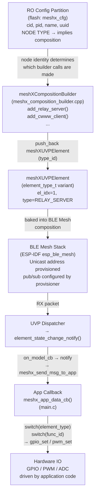
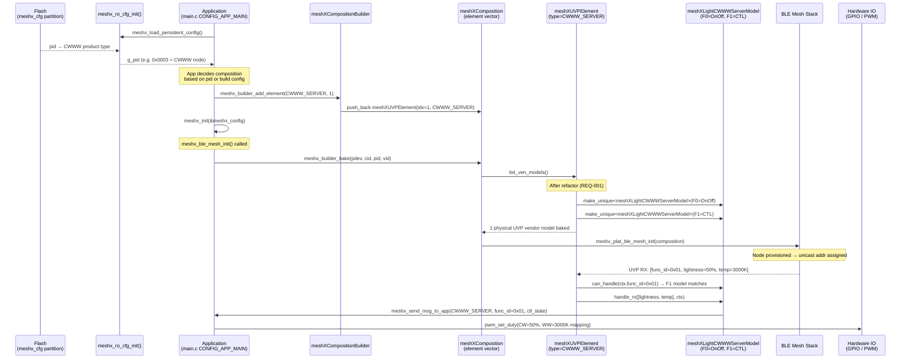
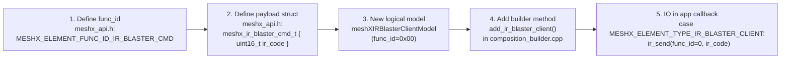

# TRD — UVP Model Refactor
## Page 6: Element-to-IO Binding Architecture

---

## 1. The Problem: Where Does Hardware Action Happen?

The current MeshX architecture has a **deliberate separation** between the BLE Mesh element layer and hardware IO. This page documents how an element type is bound to a physical IO action, where that binding currently lives, and what the `meshXModel` refactor implies for this layer.

### Current Binding Chain



**Key insight:** The `meshXUVPElement` does **not** directly drive any hardware IO. It is a BLE Mesh routing container. The hardware binding lives **above** — in the application callback (`meshx_app_data_cb`) registered by `main.c`.

---

## 2. Node Identity → Composition → IO Binding

The full chain from flash to hardware is three-layered:

### Layer 1 — Node Identity (RO Config Partition)
The `meshx_cfg` NVS partition stores the product identity:

```
meshx_cfg partition
├── cid      (Company ID)
├── pid      (Product ID — determines node TYPE: relay, cwww, sensor, ...)
├── name     (Product name string)
└── uuid     (BLE Mesh UUID)
```

`meshx_ro_cfg_init()` reads this at boot. The `pid` implicitly identifies the product type and therefore which element composition will be built.

### Layer 2 — Composition (Builder API)

The application calls `meshx_builder_add_element(type, count)` before `meshx_init()`:

```c
// Example: A CWWW dimmer node
meshx_builder_begin();
meshx_builder_add_element(MESHX_ELEMENT_TYPE_LIGHT_CWWW_SERVER, 1);
meshx_builder_commit();
meshx_init(&meshx_config);
```

This creates a `meshXUVPElement` with `variant = MESHX_ELEMENT_TYPE_LIGHT_CWWW_SERVER` at index 1. The physical UVP Vendor Model is registered on this element, and **after the refactor, the logical models (`meshXLightCWWWServerModel` for F0=OnOff and F1=CTL) are composed inside `list_ven_models()`**.

### Layer 3 — IO Action (App Callback)

When a BLE mesh command arrives, the element routes it to the logical model, which calls `meshx_send_msg_to_app()`. The host application callback drives actual hardware:

```c
// In main.c — the actual IO binding
static meshx_err_t meshx_app_data_cb(
    const meshx_app_element_msg_header_t *msg_hdr,
    const meshx_data_payload_t *data_payload_u)
{
    switch (msg_hdr->element_type) {
    case MESHX_ELEMENT_TYPE_LIGHT_CWWW_SERVER:
        switch (msg_hdr->func_id) {
        case MESHX_ELEMENT_FUNC_ID_LIGHT_CWWW_SERVER_ONN_OFF:
            // ← GPIO / relay drive happens HERE
            gpio_set_level(RELAY_GPIO_PIN,
                data_payload_u->light_cwww_server_evt.state_change.on_off.state);
            break;
        case MESHX_ELEMENT_FUNC_ID_LIGHT_CWWW_SERVER_CTL:
            // ← PWM drive happens HERE
            pwm_set_duty(CW_CHANNEL,
                data_payload_u->light_cwww_server_evt.state_change.ctl.lightness);
            pwm_set_duty(WW_CHANNEL,
                data_payload_u->light_cwww_server_evt.state_change.ctl.temperature);
            break;
        }
        break;
    case MESHX_ELEMENT_TYPE_RELAY_SERVER:
        // ← Relay control
        gpio_set_level(RELAY_GPIO_PIN,
            data_payload_u->relay_server_evt.on_off);
        break;
    }
    return MESHX_SUCCESS;
}
```

---

## 3. Binding Sequence Diagram: Boot to First IO



---

## 4. Post-Refactor: What Changes for IO Binding?

The refactor **does not change** where IO action happens — that remains in the app callback. What changes is the **reliability and correctness** of the data delivered to the callback:

| Aspect | Before Refactor | After Refactor |
|--------|----------------|----------------|
| `func_id` in app callback | Heuristic from `param_size` — unreliable for multi-byte F0 | Explicit from wire prefix — always correct |
| Routing to correct handler | Monolithic `if-else` on `element_type` in `element_state_change_notify` | Per-model `handle_rx()` — clean, extensible |
| Adding a new IO function | Requires modifying `element_state_change_notify` | Add a new `meshXModel` subclass + new `func_id` define |
| App callback contract | Unchanged (`meshx_app_element_msg_header_t`) | Unchanged (REQ-009) |

---

## 5. Adding a New Element Type with IO Binding — Example

To add a **new IR Blaster element** (client that sends IR codes) after the refactor, the steps are:



**No changes needed to:**
- `meshXUVPElement` (the routing loop is generic)
- `meshx_uvp_dispatcher.cpp`
- `meshx_uvp_model.hpp`

---

## 6. IO Binding Ownership Summary

| Layer | Owner | File | Scope |
|---|---|---|---|
| Node type identity | RO Config | `meshx_ro_cfg_init()` / flash | What kind of node this is |
| Element composition | Builder | `meshx_composition_builder.cpp` | Which BLE Mesh elements exist |
| Logical model composition | Element | `meshx_uvp_element.cpp::list_ven_models()` | Which `meshXModel`s handle which `func_id`s |
| Protocol routing | Dispatcher + Logical Model | `meshx_uvp_dispatcher.cpp` + `meshx_uvp_logical_models.cpp` | `func_id` propagation and handler dispatch |
| **Hardware IO action** | **Application** | **`main.c::meshx_app_data_cb()`** | **GPIO / PWM / sensor reads** |

---

*End of Page 6*
