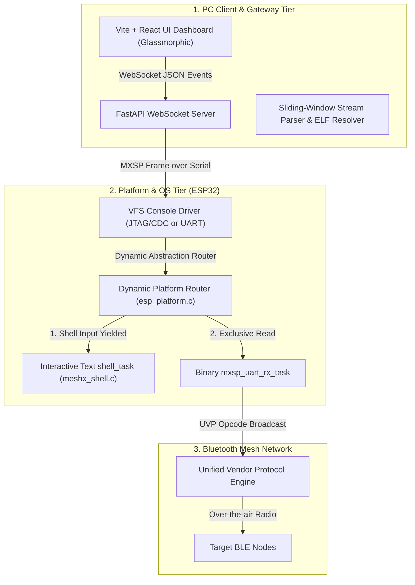
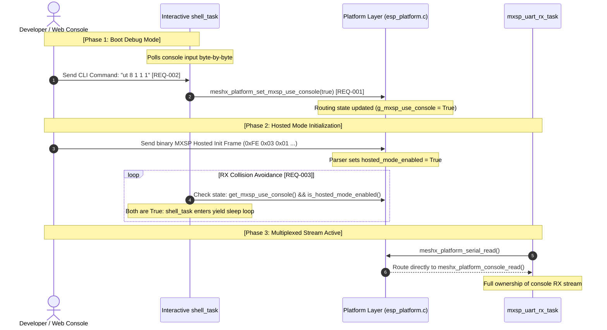

# Technical Reference Design: Dynamic USB CDC Multiplexing Index

This document serves as the master architectural reference and index for the **Dynamic USB CDC Multiplexing & Premium Web-Console** feature. The complete technical implementation spec is divided into five logical design pages to ensure comprehensive coverage of each tier.

---

## 1. System Architecture Diagram

The system comprises three physical tiers linked via a single unified serial stream over USB CDC or physical UART.

---

## 2. Dynamic Activation & Concurrency Sequence

The dynamic transition from interactive shell mode to Hosted multiplexed mode, avoiding read collisions on the unified console port, operates as follows:

---

## 3. Logical Design Pages Reference

To review the specific low-level implementations, APIs, and algorithms, navigate to the respective design pages:

| Logical Component | Design Sheet | Addressed Requirements |
| :--- | :--- | :--- |
| **Platform Routing Layer** | [01_platform_routing.md](./design/01_platform_routing.md) | REQ-001, REQ-002, REQ-007 |
| **Concurrency Coordination** | [02_shell_concurrency.md](./design/02_shell_concurrency.md) | REQ-003 |
| **Legacy Decommissioning** | [03_decommissioning.md](./design/03_decommissioning.md) | REQ-008 |
| **Host Stream Parser** | [04_host_demux.md](./design/04_host_demux.md) | REQ-004, REQ-005 |
| **Premium UI/UX Dashboard** | [05_web_console_ui.md](./design/05_web_console_ui.md) | REQ-006 |
