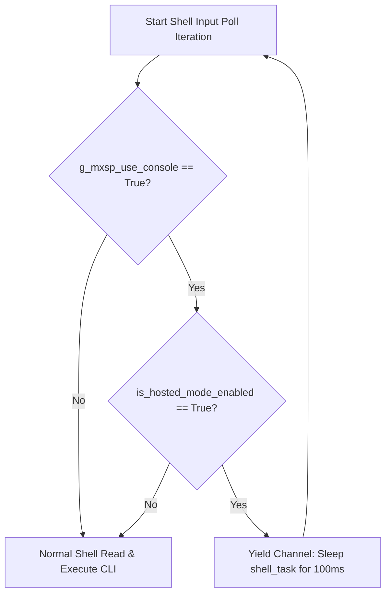

# Design Page 02: Concurrency Coordination & Collision Prevention

This page specifies the thread scheduling and synchronization strategy to prevent resource contention on the shared console channel.

---

## 1. Concurrency Bottleneck Analysis

When dynamic multiplexing routes `MXSP` binary packets over the console/CDC line, both the interactive CLI engine (`shell_task`) and the serial interface receiver (`mxsp_uart_rx_task`) compete to read from the console's dynamic read descriptor (`meshx_platform_console_read`). 
- If left uncoordinated, a race condition occurs where random bytes are swallowed by `shell_task` (treated as CLI input noise) or by `mxsp_uart_rx_task` (triggering CRC and sync signature check failures).

---

## 2. Dynamic Yielding Flow Control

To solve **REQ-003**, we introduce a coordinated check within the main input polling loop of the shell engine inside `meshx_shell.c` (or the respective shell driver wrapper):



---

## 3. Shell Task Coordination Implementation

The implementation inside the shell input task loop is structured as follows:

```c
#include "interface/meshx_platform.h"
#include "ble_mesh/common/inc/meshx_serial.h" // For hosted mode status

void shell_task(void *pvParameters) {
    uint8_t rx_char;
    
    while (1) {
        // Evaluate dynamic console routing and active connection state
        if (meshx_platform_get_mxsp_use_console() && meshx_serial_is_hosted_mode()) {
            // Yield CPU and serial descriptor control to the binary receiver task
            vTaskDelay(pdMS_TO_TICKS(100)); 
            continue;
        }

        // Normal console interactive character fetching (blocking read)
        int32_t bytes_read = meshx_platform_console_read(&rx_char, 1);
        if (bytes_read > 0) {
            // Standard CLI state machine processing
            shell_process_char(rx_char);
        } else {
            // Prevent busy spinning if read is non-blocking
            vTaskDelay(pdMS_TO_TICKS(10));
        }
    }
}
```

---

## 4. Immediate Fallback CLI Recovery

When the PC host dashboard disconnects or hosted mode is manually disabled:
1. `meshx_serial_is_hosted_mode()` reverts to `false`.
2. `shell_task` immediately bypasses the yield sleep and resumes normal blocking reads on the console channel.
3. Allows instant recovery and normal interactive terminal console support if the automated testing environment encounters an unhandled exception.
