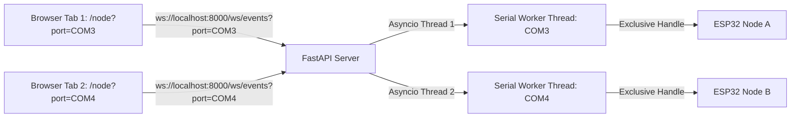

# Design Page 05: Premium Multi-Instance Web-Console UI/UX

This page details the implementation architecture for the high-aesthetic MeshX Web-Console UI and FastAPI multi-instance gateway middleware.

---

## 1. Web-Console Interface Design System [REQ-006]

The UI matches premium modern styling standards using vanilla CSS glassmorphism, responsive grids, and real-time state visualization.

### 1.1 Color Palette & Accent Mapping
*   **Main Canvas Background:** `#0B0F19` (Deep Obsidian Space)
*   **Glass Panel Base Fill:** `#161F30B3` (Semi-transparent Slate with `backdrop-filter: blur(12px)`)
*   **Accent Borders:** `rgba(255, 255, 255, 0.08)`
*   **Active Signal Accents:**
    *   *ON / Active Relay:* `#00E676` (Neon Emerald)
    *   *Color Temperature (CWWW):* `#FFB300` (Warm Solar Amber)
    *   *UVP Opcode Traffic:* `#8A2BE2` (Royal Purple Glow)
    *   *System Error / Checksum Failure:* `#FF1744` (Vibrant Crimson)

### 1.2 Interactive Micro-Animations
*   **Hover states:** Scale cards gently (`transform: translateY(-2px)`) with smooth transitions (`transition: all 0.3s cubic-bezier(0.4, 0, 0.2, 1)`).
*   **Real-time status changes:** Glow pulsing on neon indicators when toggle levels change.
*   **Log stream entry:** Fade-in slide transitions for new log entries.

---

## 2. Telemetry Dashboard Components

### 2.1 Virtualized Decoded Log Terminal
*   **Engine:** Utilizes a virtual scroll list to maintain 60 FPS performance even when receiving thousands of log packets per second.
*   **Formatting:** Colorizes lines based on severity tag:
    *   `[ERR]` -> Neon Red
    *   `[WRN]` -> Vibrant Orange
    *   `[DBG]` -> Teal
*   **Actions:** Integrated buttons to pause auto-scroll, clear log buffer, and export parsed logs to JSON.

### 2.2 Dynamic Node Grid Card
*   Renders card components for each node discovered on the BLE Mesh.
*   Shows node addresses (`0x0001`, `0x0002`, etc.) and element toggles/sliders.
*   Sliders dynamically publish state updates to `POST /api/node/{addr}/element/{el_idx}/{type}` to drive outgoing MXSP commands.

### 2.3 GPIO Live Signal Status
*   Displays the physical board configuration.
*   Shows digital lines (INPUT as standard toggle, OUTPUT as green active glow state).
*   Displays PWM channels with a dynamic percentage meter indicating duty cycle speed.

---

## 3. Host-Side FastAPI Multi-Port Architecture

To support **multi-instance concurrent testing** safely without resource contention or port lock collisions:



### 3.1 Parameterized WebSocket Endpoint
The middleware manages serial loop instantiation dynamically based on the port requested in the query parameter:

```python
import asyncio
from fastapi import FastAPI, WebSocket, Query
from server.serial_worker import AsyncSerialWorker

app = FastAPI()
active_workers = {}

@app.websocket("/ws/events")
async def websocket_endpoint(websocket: WebSocket, port: str = Query(...)):
    await websocket.accept()
    
    # Check if a serial loop is already running for this specific port
    if port not in active_workers:
        # Start a dedicated, isolated non-blocking serial worker loop for the port
        worker = AsyncSerialWorker(port)
        active_workers[port] = worker
        asyncio.create_task(worker.run_loop())
    
    worker = active_workers[port]
    # Hydrate current cached state instantly
    await websocket.send_json(worker.get_cached_state())
    
    # Stream real-time events to the tab
    try:
        async for event in worker.subscribe_events():
            await websocket.send_json(event)
    except asyncio.CancelledError:
        pass
    finally:
        worker.unsubscribe(websocket)
```

### 3.2 State Hydration Cache
The `AsyncSerialWorker` class acts as the persistent local state manager. It caches:
*   The discovered BLE Mesh topography list.
*   Current GPIO pins configurations and levels.
When a new browser tab/instance opens and targets an active port, it receives the complete state cache instantly without waiting for subsequent physical telemetry frames.
