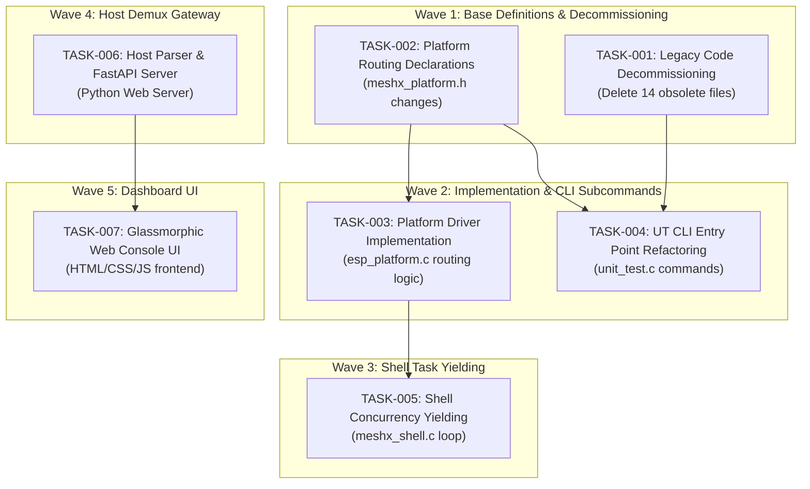

# Task Breakdown: Dynamic USB CDC Multiplexing & Premium Web-Console

This document decomposes the approved system design into independently implementable tasks structured across 5 waves of execution. Waves respect topological dependencies, and tasks within the same wave do not modify overlapping files, ensuring thread/concurrency safety during parallel execution.

---

## Task List & Dependency Matrix

| Task ID | Title | Linked REQs | Linked Design Sheet | Complexity | Dependencies | Wave |
| :--- | :--- | :--- | :--- | :--- | :--- | :--- |
| **TASK-001** | Legacy Code Decommissioning | REQ-008 | `03_decommissioning.md` | S | None | 1 |
| **TASK-002** | Platform Routing Declarations | REQ-001, REQ-007 | `01_platform_routing.md` | S | None | 1 |
| **TASK-003** | Platform Driver Implementation | REQ-001, REQ-007 | `01_platform_routing.md` | M | TASK-002 | 2 |
| **TASK-004** | Unit Test CLI Entry Point Refactoring | REQ-002, REQ-008 | `01_platform_routing.md`, `03_decommissioning.md` | M | TASK-001, TASK-002 | 2 |
| **TASK-005** | Shell RX Concurrency Coordination | REQ-003 | `02_shell_concurrency.md` | S | TASK-003 | 3 |
| **TASK-006** | Host-Side Stream Demultiplexer & Gateway Server | REQ-004, REQ-005, REQ-006 | `04_host_demux.md`, `05_web_console_ui.md` | L | None | 4 |
| **TASK-007** | Premium Glassmorphic Web Dashboard | REQ-006 | `05_web_console_ui.md` | L | TASK-006 | 5 |

### Wave Dependency Mapping Diagram

---

## Detailed Task Specifications

### Wave 1: Decommissioning & API Definitions

#### TASK-001: Legacy Code Decommissioning
*   **Description:** Purge obsolete peripheral unit testing files to reduce code size and compile-time footprint. Delete the following files from the repository:
    *   **Source files:**
        *   `main/component/unit_test/src/gpio_unit_test.c`
        *   `main/component/unit_test/src/gpio_property_test.c`
        *   `main/component/unit_test/src/gpio_integration_test.c`
        *   `main/component/unit_test/src/pwm_property_test.c`
        *   `main/component/unit_test/src/gpio_platform_property_test.c`
        *   `main/component/unit_test/src/gpio_integration_property_test.c`
        *   `main/component/unit_test/src/gpio_test_registry.c`
    *   **Header files:**
        *   `main/component/unit_test/inc/gpio_unit_test.h`
        *   `main/component/unit_test/inc/gpio_property_test.h`
        *   `main/component/unit_test/inc/gpio_integration_test.h`
        *   `main/component/unit_test/inc/pwm_property_test.h`
        *   `main/component/unit_test/inc/gpio_platform_property_test.h`
        *   `main/component/unit_test/inc/gpio_integration_property_test.h`
        *   `main/component/unit_test/inc/gpio_test_registry.h`
*   **Linked Requirements:** REQ-008
*   **Linked Design Section:** Page 03 (Decommissioning)
*   **Complexity:** S
*   **File Changes:** Deletion of 14 files under `unit_test/`
*   **Status:** Completed

#### TASK-002: Platform Routing Declarations
*   **Description:** Declare the console routing control structures and APIs in the platform header file `main/component/meshx/interface/meshx_platform.h`.
    *   Expose `meshx_platform_console_channel_t` enum.
    *   Declare `meshx_platform_get_console_channel(void)`.
    *   Declare `meshx_platform_get_mxsp_use_console(void)`.
    *   Declare `meshx_platform_set_mxsp_use_console(bool enable)`.
*   **Linked Requirements:** REQ-001, REQ-007
*   **Linked Design Section:** Page 01 (Platform Routing)
*   **Complexity:** S
*   **File Changes:** `main/component/meshx/interface/meshx_platform.h`
*   **Status:** Completed

---

### Wave 2: Drivers & Subcommand Entry Points

#### TASK-003: Platform Driver Implementation
*   **Description:** Implement the dynamic console routing abstraction layers in the ESP32 platform utility module `port/platform/esp/esp_idf/utils/esp_platform.c`.
    *   Define static state `g_mxsp_use_console` initialized to `false`.
    *   Implement query logic in `meshx_platform_get_console_channel` mapping config symbols to `UART` or `USB_CDC`.
    *   Implement `meshx_platform_get_mxsp_use_console` and `meshx_platform_set_mxsp_use_console`.
    *   Update `meshx_platform_serial_write` and `meshx_platform_serial_read` to route dynamically to console read/write interfaces when `g_mxsp_use_console` is active.
*   **Linked Requirements:** REQ-001, REQ-007
*   **Linked Design Section:** Page 01 (Platform Routing)
*   **Complexity:** M
*   **File Changes:** `port/platform/esp/esp_idf/utils/esp_platform.c`
*   **Status:** Completed

#### TASK-004: Unit Test CLI Entry Point Refactoring
*   **Description:** Refactor the core unit testing driver `main/component/unit_test/src/unit_test.c` to disconnect legacy subtests and register the Common Module subcommand.
    *   Prune `#include "gpio_test_registry.h"`.
    *   Remove call to `register_all_gpio_tests()`.
    *   Implement `common_ut_callback` to receive subcommand ID 1 and enable/disable `meshx_platform_set_mxsp_use_console`.
    *   Register routing callback: `register_unit_test(MODULE_ID_COMMON, common_ut_callback)` in `init_unit_test_console()`.
*   **Linked Requirements:** REQ-002, REQ-008
*   **Linked Design Section:** Page 01 (Platform Routing), Page 03 (Decommissioning)
*   **Complexity:** M
*   **File Changes:** `main/component/unit_test/src/unit_test.c`
*   **Status:** Completed

---

### Wave 3: Shell Coordination

#### TASK-005: Shell RX Concurrency Coordination
*   **Description:** Mitigate serial collision races by updating `shell_task` in `main/component/meshx/src/meshx_shell.c`.
    *   Check state `meshx_platform_get_mxsp_use_console() && meshx_serial_is_hosted_mode()`.
    *   If active, sleep/yield `shell_task` using `vTaskDelay` for 100ms per loop iteration, ensuring exclusive channel access to `mxsp_uart_rx_task`.
*   **Linked Requirements:** REQ-003
*   **Linked Design Section:** Page 02 (Concurrency Coordination)
*   **Complexity:** S
*   **File Changes:** `main/component/meshx/src/meshx_shell.c`
*   **Status:** Completed

---

### Wave 4: Gateway Stream demux

#### TASK-006: Host-Side Stream Demultiplexer & Gateway Server
*   **Description:** Implement the host PC stream parser and FastAPI gateway in Python under a new module directory `tools/web_console/server/`.
    *   Create a robust sliding-window `StreamDemultiplexer` that isolates `0xDEAD` logs, `0xFE` binary MXSP packets, and raw ASCII console text from the unified stream.
    *   Incorporate log decoding logic (RAM address lookup from ELF via `elftools`).
    *   Implement an asynchronous asyncio-based serial port worker handling non-blocking loop iterations.
    *   Create a FastAPI server mapping parameterized WebSocket connections: `/ws/events?port=<port_name>`.
    *   Support dynamic worker instantiation and state hydration caches to preserve telemetry for fresh browser instances.
*   **Linked Requirements:** REQ-004, REQ-005, REQ-006
*   **Linked Design Section:** Page 04 (Host Stream Parser), Page 05 (Web Console UI)
*   **Complexity:** L
*   **File Changes:** Create `tools/web_console/server/` directory, `server.py`, `demux.py`
*   **Status:** Completed

---

### Wave 5: High-Aesthetic Dashboard UI

#### TASK-007: Premium Glassmorphic Web Dashboard
*   **Description:** Build the responsive high-fidelity Web-Console HTML/CSS/JS frontend dashboard matching the glassmorphic dark-mode design system.
    *   **Theme:** Glassmorphic background `#0B0F19` and border accents with frosted semi-transparent slate card containers.
    *   **Dashboard Panels:**
        *   *BLE Mesh topography map* rendering nodes, types (Relay, CWWW, HSL), states with neon status indicators, and active bound control widgets (sliders, colors).
        *   *GPIO Live pipeline representation* displaying input toggles, active output neon colors, and PWM duty cycle progress bars.
        *   *Packet Dissector Timeline* streaming serialized MXSP frame parts (SOF, Length, Type, Payload, Checksum, EOF) in royal purple.
        *   *Virtualized Logs Terminal* streaming high-velocity ELF-decoded warnings/errors in performance virtual lists with tag colorization and export features.
*   **Linked Requirements:** REQ-006
*   **Linked Design Section:** Page 05 (Web Console UI)
*   **Complexity:** L
*   **File Changes:** Create `tools/web_console/frontend/` directory structure and assets
*   **Status:** Completed
