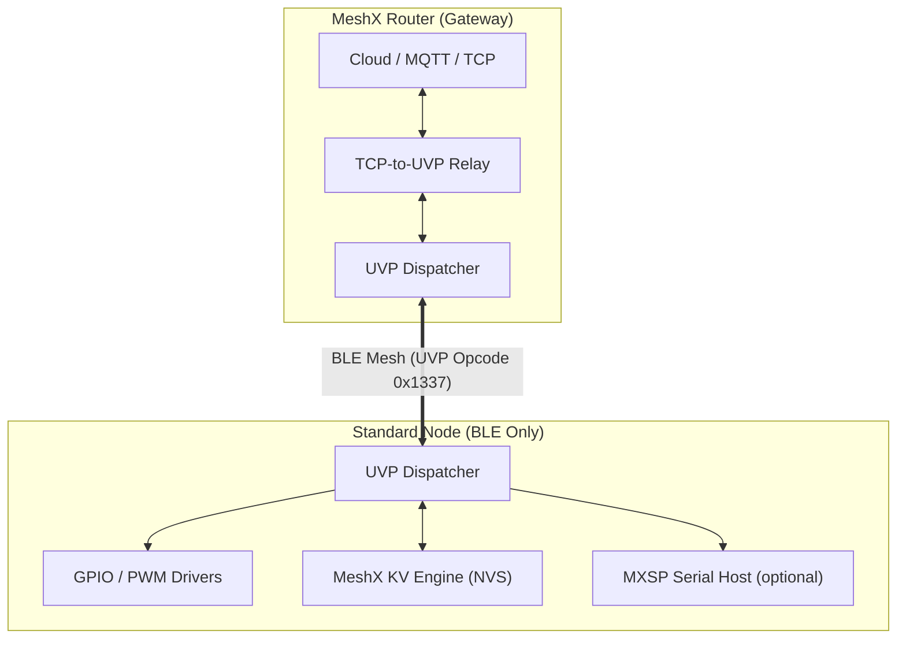
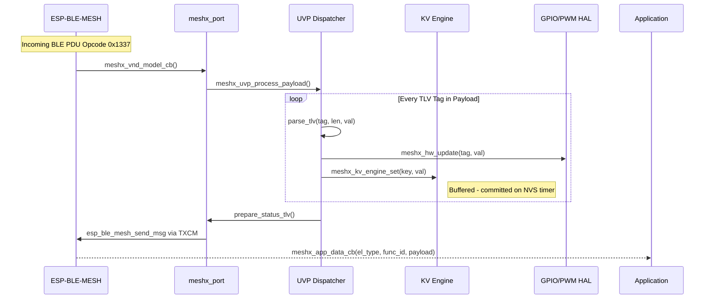
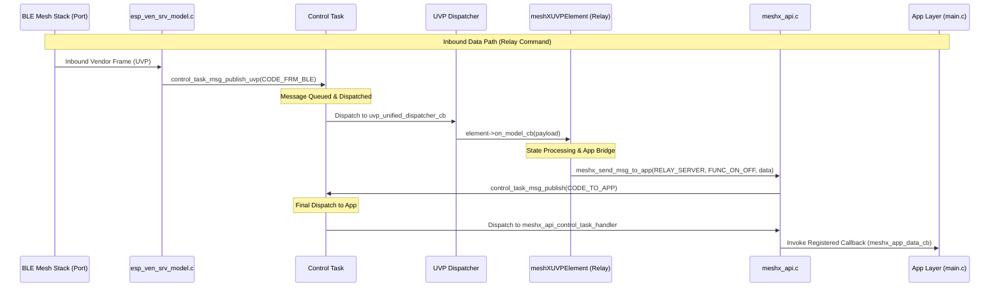
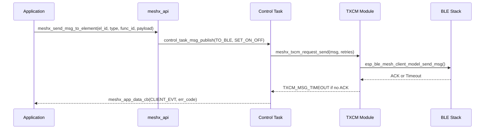
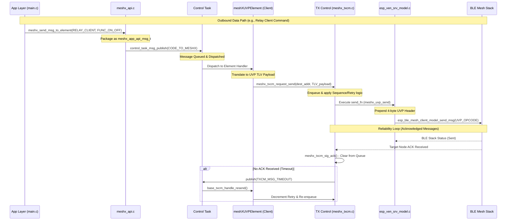

# Page 1 — System Overview & Layered Architecture

> **[← Index](../README.md)** | **[Next: Boot Sequence →](./02_boot_sequence.md)**

---

## 1. System Overview

The **MeshX Unified Vendor Protocol (UVP)** is a high-density, walled-garden communication architecture that consolidates all application-level state control into a single BLE Mesh Vendor Model per element. It replaces the entire SIG model stack (Generic, Lighting, Sensor, Scene) to reclaim ≥150 KB Flash and ≥23 KB RAM on the ESP32-C3 target.

The design distinguishes between two node roles:

| Role | Transport | Responsibilities |
|------|-----------|-----------------|
| **Standard Node** | BLE Mesh only | Receives UVP frames, drives GPIO/PWM, persists state to NVS |
| **Router Node** | BLE Mesh + Wi-Fi | Acts as TCP-to-UVP gateway; bridges Cloud/MQTT to mesh |

### 1.1 Architectural Stack

### 1.2 Key Design Principles

| Principle | Implementation |
|-----------|---------------|
| **Single Vendor Model per Element** | One model handles all functional states (REQ-F01) |
| **Atomic Multi-State Updates** | Single radio PDU carries multiple TLV tags (REQ-F03) |
| **Global Tag Namespace** | Each Tag ID has a fixed definition across the ecosystem (REQ-F24) |
| **Extensibility** | 1-byte Tag space → 256 unique tags (REQ-F05) |
| **Reliability** | All transmissions routed through TXCM (REQ-F18) |
| **Walled Garden** | Protocol is intentionally private to MeshX (REQ-NF05) |

---

## 2. Detailed Layered Architecture

### 2.1 Layer Definition

| Layer | Component | Responsibility |
|-------|-----------|----------------|
| **L7: Application** | `main.c` | Consumes `meshx_app_data_cb` / `meshx_app_ctrl_cb`; forwards to MXSP |
| **L6: MeshX API** | `meshx_api.c` | `meshx_send_msg_to_app()`, `meshx_send_ctrl_msg_to_app()` — bridge to Control Task |
| **L5: Dispatcher** | `meshx_uvp_dispatcher.c` | TLV parsing and element-specific TagHandler routing |
| **L4: Port** | `meshx_port_ble_mesh.c` | Translates `esp_ble_mesh_msg_t` ↔ MeshX UVP frames |
| **L3: Stack** | `esp_ble_mesh_core` | BLE Mesh Network / Transport layer (ESP-IDF managed) |
| **L2: HAL** | `meshx_gpio.c` / `meshx_pwm.c` | Platform-abstracted GPIO bit-bang and PWM duty control |
| **L1: Persistence** | `meshx_kv_engine.c` / `meshx_nvs.c` | Non-volatile element state storage via FAL interface |

### 2.2 Inbound Control & Persistence Sequence

#### 2.2.1 Inbound Control & Persistence Sequence (Detailed)

### 2.3 Outbound Command Sequence (Client → Server)

#### 2.3.1 Outbound Command Sequence (Detailed)

---

> **[← Index](../README.md)** | **[Next: Boot Sequence →](./02_boot_sequence.md)**
