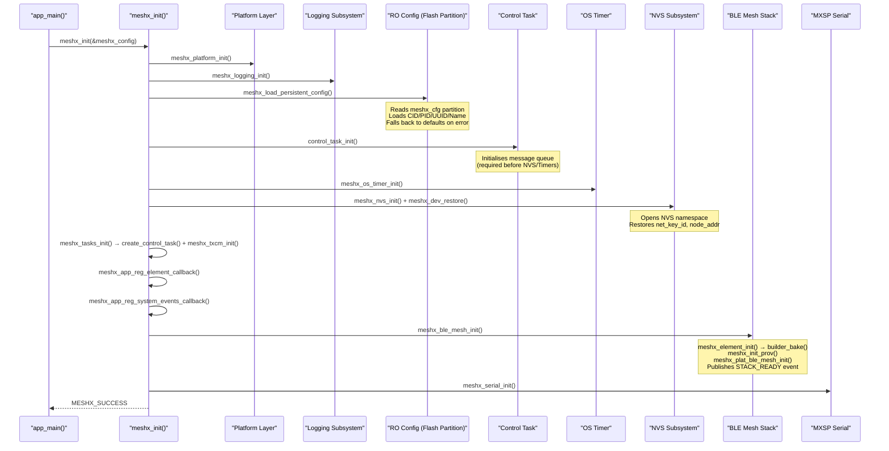
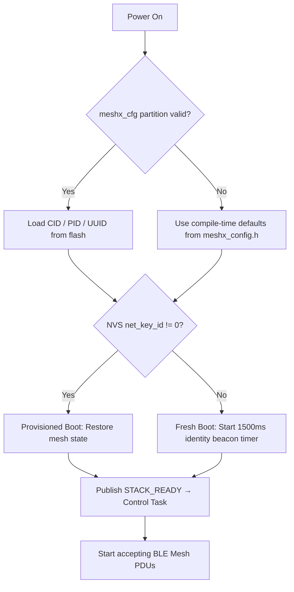

# Page 2 — System Boot & Initialization Sequence

> **[← System Overview](./01_system_overview.md)** | **[← Index](../README.md)** | **[Next: C++ Architecture →](./03_cpp_architecture.md)**

---

## 3. System Boot & Initialization Sequence

The `meshx_init()` function (in `main/component/meshx/src/meshx.c:304`) orchestrates the full boot sequence in strict dependency order:

### 3.1 Boot Phase Summary

| Phase | Function | Notes |
|-------|----------|-------|
| **P1** | `meshx_platform_init()` | Initializes ESP-IDF hardware peripherals |
| **P2** | `meshx_logging_init()` | Sets up threaded async log task |
| **P3** | `meshx_load_persistent_config()` | Loads CID/PID/UUID from `meshx_cfg` flash partition; falls back to compile-time defaults |
| **P4** | `control_task_init()` | Allocates FreeRTOS message queue (must precede NVS & timers) |
| **P5** | `meshx_os_timer_init()` | Initializes software timer subsystem |
| **P6** | `meshx_nvs_init()` + `meshx_dev_restore()` | Opens NVS namespace, restores `net_key_id` and `node_addr` |
| **P7** | `meshx_tasks_init()` | Creates Control Task + initializes TXCM |
| **P8** | `meshx_ble_mesh_init()` | Bakes element composition, initializes provisioning, starts BLE stack |
| **P9** | `meshx_serial_init()` | Starts MXSP serial host bridge (if enabled) |

### 3.2 Fresh Boot vs. Provisioned Boot

---

> **[← System Overview](./01_system_overview.md)** | **[← Index](../README.md)** | **[Next: C++ Architecture →](./03_cpp_architecture.md)**
