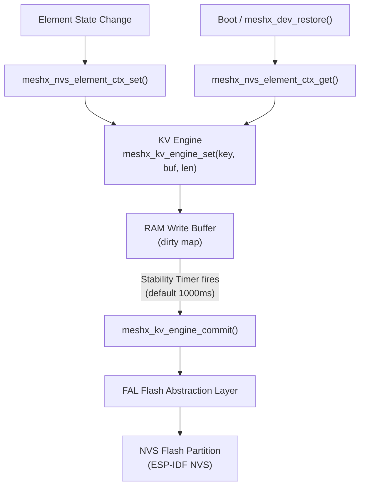

# Page 6 — State Persistence Strategy

> **[← TXCM](./05_txcm.md)** | **[← Index](../README.md)** | **[Next: HAL →](./07_hal.md)**

---

## 7. State Persistence Strategy

MeshX uses a **two-tier persistence model**: a fast write-buffer (KV Engine) on top of a platform NVS backend, with timer-coalesced commits to minimize flash wear.

### 7.1 Storage Architecture



### 7.2 KV Key Format

| Key Pattern | Example | Stores |
|-------------|---------|--------|
| `MX:E[id]:T[tag]` | `MX:E01:T02` | Tag `0x02` (Level) for Element `0x01` |
| `meshx_store` | `meshx_store` | Global `net_key_id` + `node_addr` |
| `MX:E[id]:[type]` | `MX:E01:0003` | Full element context blob by type ID |

### 7.3 NVS Commit Strategy

The NVS stability timer (`MESHX_NVS_TIMER_PERIOD`, default 1000 ms) re-arms on every `meshx_nvs_set()` call with `arm_timer=true`. This coalesces rapid successive writes (e.g., dimming slider) into a single flash commit, avoiding wear-out.

```c
// Timer-based deferred commit
meshx_nvs_set(key, blob, size, MESHX_NVS_AUTO_COMMIT);  // arms timer
// ...timer fires after 1000ms of inactivity...
meshx_nvs_commit();                                       // single flash write
```

### 7.4 KV Engine API

| Function | Signature | Purpose |
|----------|-----------|---------|
| `meshx_kv_engine_init()` | `(partition*)` | Bind engine to a FAL partition |
| `meshx_kv_engine_set()` | `(key, buf, len)` | Buffer a write in RAM |
| `meshx_kv_engine_read()` | `(key, buf, len)` | Read from flash |
| `meshx_kv_engine_commit()` | `()` | Flush RAM buffer → flash |
| `meshx_kv_engine_remove()` | `(key)` | Delete a key entry |
| `meshx_kv_engine_erase_all()` | `()` | Full partition erase (factory reset) |

### 7.5 Partition Layout

```
meshx_kv partition (64 KB, FAL-managed)
┌─────────────────────────────────────────┐
│  KV Header (8B)                         │
├─────────────────────────────────────────┤
│  Entry: "MX:E00:0001" → [blob, 8B]      │  Root element context
│  Entry: "MX:E01:T01"  → [0x01, 1B]      │  Element 1 OnOff state
│  Entry: "MX:E01:T02"  → [0xFFFF, 2B]    │  Element 1 Level state
│  Entry: "MX:E02:T03"  → [0x8000, 2B]    │  Element 2 Lightness
│  Entry: "meshx_store" → [struct, 16B]   │  net_key_id + node_addr
│  ...                                    │
└─────────────────────────────────────────┘
```

---

> **[← TXCM](./05_txcm.md)** | **[← Index](../README.md)** | **[Next: HAL →](./07_hal.md)**
