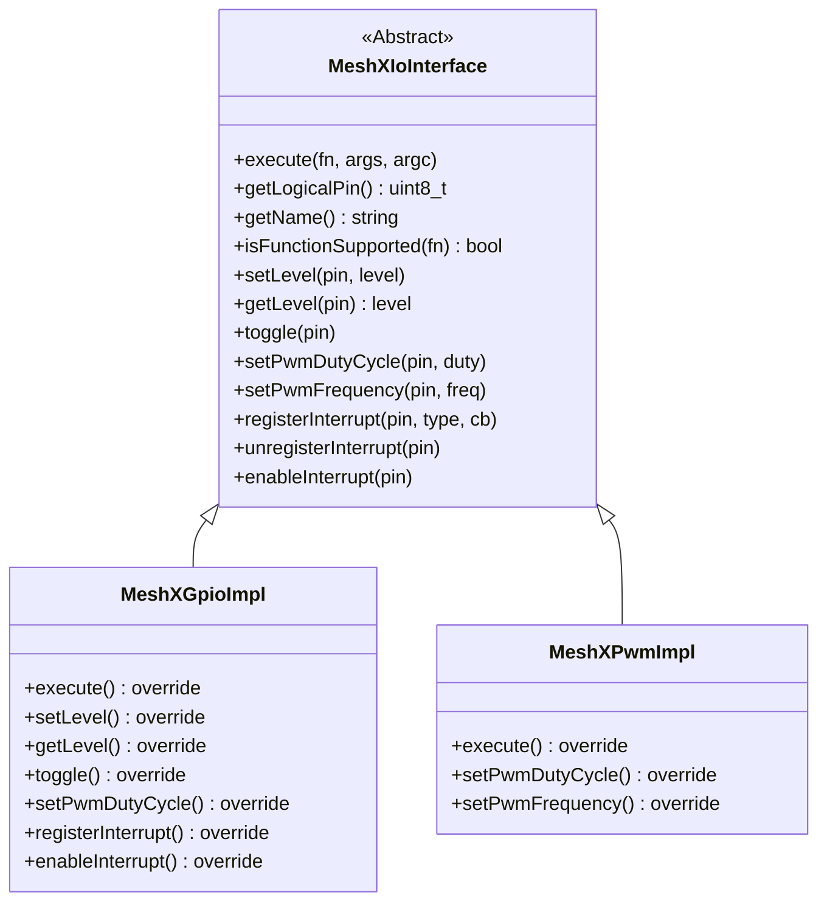

# Page 7 — Hardware Abstraction Layer (HAL)

> **[← State Persistence](./06_state_persistence.md)** | **[← Index](../README.md)** | **[Next: TLV Protocol →](./08_tlv_protocol.md)**

---

## 8. Hardware Abstraction Layer (HAL)

### 8.1 GPIO Abstraction

The HAL separates logical pin addressing from physical ESP32-C3 GPIO numbers via a two-layer abstraction:

```
Element (Tag Handler)
    │  meshx_gpio_set_level(logical_pin, level)
    ▼
meshx_gpio.c  ←─ C bridge API
    │  routes via MeshXIoFactory
    ▼
MeshXGpioImpl::setLevel()  ─── C++ concrete impl
    │  esp_rom_gpio_pad_select_gpio() / gpio_set_level()
    ▼
ESP32-C3 Silicon GPIO
```

### 8.2 GPIO Interface

| Function | Purpose |
|----------|---------|
| `meshx_gpio_init()` | Initialize subsystem; configure all pins from compiled profile |
| `meshx_gpio_set_level(pin, level)` | Set digital output HIGH/LOW |
| `meshx_gpio_get_level(pin, *level)` | Read digital input |
| `meshx_gpio_toggle(pin)` | Toggle output |
| `meshx_gpio_execute_function(pin, fn, args, argc)` | Generic function-vector dispatch |
| `meshx_gpio_register_intr(pin, type, cb, user_data)` | Register interrupt handler |
| `meshx_gpio_set_hosted_mode(mode)` | Switch between local and serial-hosted operation |

### 8.3 GPIO Pin Modes

| Mode Enum | Value | Description |
|-----------|-------|-------------|
| `MESHX_GPIO_MODE_INPUT` | 0 | Digital input |
| `MESHX_GPIO_MODE_OUTPUT` | 1 | Digital output |
| `MESHX_GPIO_MODE_INPUT_OUTPUT` | 2 | Bidirectional |
| `MESHX_GPIO_MODE_OPEN_DRAIN` | 3 | Open-drain output |
| `MESHX_GPIO_MODE_PWM_OUTPUT` | 5 | PWM via LEDC |

### 8.4 PWM (LEDC) Subsystem

PWM control is provided by `MeshXPwmImpl` (extends `MeshXIoInterface`) backed by the ESP32-C3 LEDC peripheral:

| Function | Purpose |
|----------|---------|
| `setPwmDutyCycle(pin, duty_percent)` | Set LEDC duty 0–100% |
| `setPwmFrequency(pin, freq_hz)` | Set LEDC timer frequency |
| `MESHX_IO_FUNCTION_SET_PWM_DUTY` | Via generic `execute_function()` vector |

### 8.5 Hosted Mode

In **Hosted Mode**, GPIO operations are serialized over UART to a host MCU (via MXSP). The GPIO subsystem checks `meshx_gpio_is_hosted_mode()` before each operation:

```c
// Hosted mode: serialize event to UART
meshx_gpio_set_hosted_mode(MESHX_GPIO_MODE_HOSTED);
// → all GPIO calls emit MXSP frames instead of driving hardware
```

### 8.6 IO Class Hierarchy



---

> **[← State Persistence](./06_state_persistence.md)** | **[← Index](../README.md)** | **[Next: TLV Protocol →](./08_tlv_protocol.md)**
