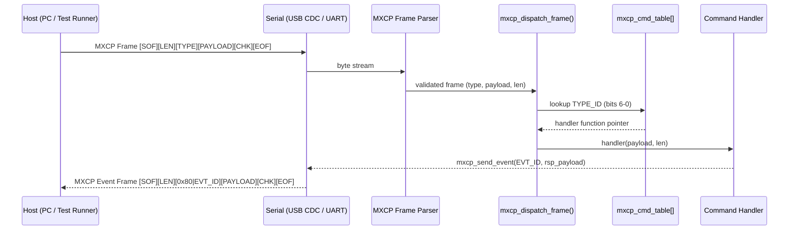

# Page 10 — MXCP: MeshX Command Protocol

> **[← Composition](./09_composition.md)** | **[← Index](./README.md)** | **[Next: RO Config →](./11_ro_config.md)**

---

## Overview

**MXCP (MeshX Command Protocol)** is the binary serial protocol used by the MeshX host tooling, test runners, and web console to communicate with a MeshX node over USB CDC or UART. It supersedes the legacy MXSP protocol with a unified, single-dispatch, table-driven architecture.

> **MXSP is deprecated.** All host-to-node communication should use MXCP frames.

---

## 1. Frame Format

```
 Byte 0:    SOF = 0xFE
 Byte 1:    LEN (payload length in bytes, 0–255)
 Byte 2:    TYPE
              Bit 7:    Direction (0 = CMD host→engine, 1 = EVT engine→host)
              Bits 6-0: Command/Event ID (0x00–0x7F)
 Byte 3..N: PAYLOAD (typed struct, up to 255 bytes)
 Byte N+1:  CHECKSUM = LEN ^ TYPE ^ (XOR of all payload bytes)
 Byte N+2:  EOF = 0xEF
```

### 1.1 Frame Type Bit-Field Macros

```c
#define MXCP_TYPE_DIR_CMD  0x00
#define MXCP_TYPE_DIR_EVT  0x80
#define MXCP_TYPE_ID_MASK  0x7F

#define MXCP_MAKE_TYPE(dir, id)   ((uint8_t)((dir) | ((id) & MXCP_TYPE_ID_MASK)))
#define MXCP_TYPE_IS_CMD(t)       (((t) & 0x80) == 0)
#define MXCP_TYPE_IS_EVT(t)       (((t) & 0x80) != 0)
#define MXCP_TYPE_ID(t)           ((t) & MXCP_TYPE_ID_MASK)
```

### 1.2 C Frame Structure

```c
#define MXCP_SOF              0xFE
#define MXCP_EOF              0xEF
#define MXCP_PAYLOAD_MAX_SIZE 255

typedef struct {
    uint8_t sof;
    uint8_t len;
    uint8_t type;                          /* DIR (bit 7) + ID (bits 6-0) */
    uint8_t payload[MXCP_PAYLOAD_MAX_SIZE];
    uint8_t checksum;
    uint8_t eof;
} mxcp_frame_t;
```

---

## 2. Command ID Namespace (Host → Engine)

All commands have bit 7 = 0 on the wire.

```c
typedef enum {
    /* System Commands (0x01–0x0F) */
    MXCP_CMD_HOSTED_MODE_ENABLE    = 0x01,
    MXCP_CMD_NODE_RESET            = 0x02,
    MXCP_CMD_GET_COMPOSITION       = 0x03,
    MXCP_CMD_GET_ELEMENT_STATE     = 0x04,
    MXCP_CMD_SET_CONSOLE_ROUTING   = 0x05,

    /* Element Commands (0x10–0x1F) */
    MXCP_CMD_EL_SEND               = 0x10,   /* Inject element payload */

    /* GPIO Commands (0x20–0x3F) */
    MXCP_CMD_GPIO_SET_LEVEL        = 0x21,
    MXCP_CMD_GPIO_GET_LEVEL        = 0x22,
    MXCP_CMD_GPIO_TOGGLE           = 0x23,
    MXCP_CMD_GPIO_SET_PWM_DUTY     = 0x24,
    MXCP_CMD_GPIO_SET_PWM_FREQ     = 0x25,
    MXCP_CMD_GPIO_INTR_ENABLE      = 0x26,
    MXCP_CMD_GPIO_INTR_DISABLE     = 0x27,
    MXCP_CMD_GPIO_GET_CONFIG       = 0x28,
    MXCP_CMD_GPIO_GET_STATE        = 0x29,
} mxcp_cmd_id_t;
```

---

## 3. Event ID Namespace (Engine → Host)

All events have bit 7 = 1 on the wire (i.e., TYPE = `0x80 | id`).

```c
typedef enum {
    /* System Events (0x01–0x0F) */
    MXCP_EVT_PROV_COMP             = 0x01,   /* wire: 0x81 */
    MXCP_EVT_PROV_FAILED           = 0x02,   /* wire: 0x82 */
    MXCP_EVT_PROV_START            = 0x03,   /* wire: 0x83 */
    MXCP_EVT_IDENTIFY_START        = 0x04,   /* wire: 0x84 */
    MXCP_EVT_IDENTIFY_STOP         = 0x05,   /* wire: 0x85 */
    MXCP_EVT_COMPOSITION_RSP       = 0x06,   /* wire: 0x86 */
    MXCP_EVT_ELEMENT_STATE_RSP     = 0x07,   /* wire: 0x87 */
    MXCP_EVT_NODE_RESET_IND        = 0x08,   /* wire: 0x88 */
    MXCP_EVT_HOSTED_MODE_RSP       = 0x09,   /* wire: 0x89 */
    MXCP_EVT_CONSOLE_ROUTING_RSP   = 0x0A,   /* wire: 0x8A */

    /* Element Data Events (0x10–0x1F) */
    MXCP_EVT_EL_DATA_NOTIFY        = 0x10,   /* wire: 0x90 — element telemetry */

    /* GPIO Events (0x20–0x3F) */
    MXCP_EVT_GPIO_SET_LEVEL_RSP    = 0x21,   /* wire: 0xA1 */
    MXCP_EVT_GPIO_GET_LEVEL_RSP    = 0x22,
    MXCP_EVT_GPIO_TOGGLE_RSP       = 0x23,
    MXCP_EVT_GPIO_SET_PWM_DUTY_RSP = 0x24,
    MXCP_EVT_GPIO_SET_PWM_FREQ_RSP = 0x25,
    MXCP_EVT_GPIO_INTR_ENABLE_RSP  = 0x26,
    MXCP_EVT_GPIO_INTR_DISABLE_RSP = 0x27,
    MXCP_EVT_GPIO_GET_CONFIG_RSP   = 0x28,
    MXCP_EVT_GPIO_GET_STATE_RSP    = 0x29,
    MXCP_EVT_GPIO_ASYNC            = 0x3E,   /* wire: 0xBE — async GPIO interrupt */
    MXCP_EVT_GPIO_ERROR            = 0x3F,   /* wire: 0xBF */
} mxcp_evt_id_t;
```

---

## 4. MXCP_CMD_EL_SEND — Element Payload Injection

This is the primary command for driving element state from the host. It consists of an 8-byte binary header (`mxcp_cmd_el_send_t`) followed by the element-specific payload.

### 4.1 Command Header

```c
typedef struct __attribute__((packed)) {
    uint8_t  element_id;     /* 0-based element index on the node */
    uint8_t  _pad;           /* alignment padding */
    uint16_t element_type;   /* meshx_element_type_t enum value */
    uint16_t func_id;        /* function within the element (e.g., 0x0000=OnOff) */
    uint16_t msg_len;        /* byte length of the payload that follows */
} mxcp_cmd_el_send_t;
```

### 4.2 Element Type → Wire ID Mapping

| Element Variant | `element_type` Wire Value |
|----------------|--------------------------|
| `RELAY_SERVER` | `0x0000` |
| `RELAY_CLIENT` | `0x0001` |
| `LIGHT_CWWW_SERVER` | `0x0002` |
| `LIGHT_CWWW_CLIENT` | `0x0003` |
| `LIGHT_HSL_SERVER` | `0x0004` |
| `LIGHT_HSL_CLIENT` | `0x0005` |
| `SENSOR_SERVER` | `0x0006` |
| `SENSOR_CLIENT` | `0x0007` |

### 4.3 func_id Values per Element

| Element | `func_id` | Meaning |
|---------|-----------|---------|
| Relay Server/Client | `0x0000` | OnOff |
| CWWW Server/Client | `0x0000` | OnOff |
| CWWW Server/Client | `0x0001` | CTL (lightness + temperature) |
| HSL Server/Client | `0x0000` | OnOff |
| HSL Server/Client | `0x0001` | HSL (lightness + hue + saturation) |
| Sensor Server | `0x0000` | Data (sensor value) |

---

## 5. MXCP_EVT_EL_DATA_NOTIFY — Element Telemetry (0x90)

When an element state changes, the engine emits this event. The host test framework waits for it to verify element state.

```c
typedef struct __attribute__((packed)) {
    uint8_t  element_id;     /* Element that changed */
    uint8_t  _pad;
    uint16_t element_type;
    uint16_t func_id;
    uint16_t msg_len;
    /* payload bytes follow */
} mxcp_evt_el_data_notify_t;
```

### 5.1 Example: Waiting for Relay ON Telemetry (Python)

```python
frame = node.wait_for_mxcp_frame(expected_type=0x90, timeout=2.0)
hdr_size = struct.calcsize('<BBHHH')
el_id, _, el_type, func_id, msg_len = struct.unpack('<BBHHH', frame[:hdr_size])
(state,) = struct.unpack('<B', frame[hdr_size:hdr_size + 1])
assert state == 1
```

---

## 6. Enabling Hosted Mode

Before sending MXCP frames, the node must be in hosted mode. This routes the binary MXCP stream over the USB CDC (or UART) console channel.

### 6.1 Via Text Shell (Manual / Boot)

```
ut 8 1 1 1    # Enable MXCP binary transport on console channel
ut 8 1 1 0    # Revert to UART1 physical port
```

### 6.2 Via `runner.py` (Automated)

The test runner automatically sends this command after detecting the `MeshX> ` prompt on connection:

```python
node.send_command("ut 8 1 1 1", wait_for_prompt=False)
```

---

## 7. Single-Layer Dispatch Architecture



Adding a new command requires only a new entry in `mxcp_cmd_table[]` — no changes to the dispatch function.

---

## 8. GPIO Hosted Mode

All GPIO commands are first-class entries in the MXCP command table with no special-case handling.

```c
/* Example: Set GPIO pin 3 HIGH */
mxcp_cmd_gpio_set_level_t cmd = {
    .logical_pin = 3,
    .level       = 1,
};
mxcp_send_cmd(MXCP_CMD_GPIO_SET_LEVEL, &cmd, sizeof(cmd));

/* Expected response event: MXCP_EVT_GPIO_SET_LEVEL_RSP (0xA1) */
```

---

## 9. Legacy MXSP vs. MXCP Comparison

| Aspect | Legacy MXSP | MXCP |
|--------|-------------|------|
| Dispatch layers | 2-level | 1-level flat table |
| Command ID | Split: MSG_TYPE + ctrl_evt_id | Single flat `mxcp_cmd_id_t` |
| Event API | 4 separate send functions | Single `mxcp_send_event(id, payload, len)` |
| GPIO | Separate switch-case | Integrated in command table |
| Frame structure | Same | Same (TYPE byte semantics changed) |
| Host Python tool | `demux.py` (MXSP) | `demux.py` updated for `0xFE` frames |

---

> **[← Composition](./09_composition.md)** | **[← Index](./README.md)** | **[Next: RO Config →](./11_ro_config.md)**
