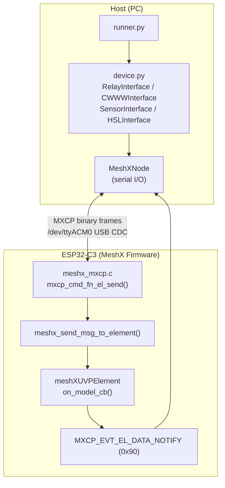

# Page 17 — Logical Models & MXCP-Based Testing

> **[← Memory Impact](./16_memory_impact.md)** | **[← Index](./README.md)** | **[Next: Web Console →](./18_web_console.md)**

---

## Overview

This page describes the Python-side **logical model interfaces** used in the MeshX L0 test framework, and how they map onto binary MXCP frames for automated hardware-in-the-loop testing. All testing is done exclusively via binary MXCP — no regex log parsing, no legacy `ut` shell commands.

---

## 1. Test Infrastructure Architecture



---

## 2. Activating Hosted Mode

The test runner sends `ut 8 1 1 1` immediately upon detecting the node prompt. This switches the USB CDC stream from interactive text shell to binary MXCP mode.

```python
# In runner.py — triggered after node connection
node.send_command("ut 8 1 1 1", wait_for_prompt=False)
time.sleep(0.5)   # Allow firmware to switch routing
```

---

## 3. MXCP Binary Frame Construction

Every element command is an `MXCP_CMD_EL_SEND` (type `0x10`) frame:

```
[0xFE][LEN][0x10][element_id][pad][el_type_lo][el_type_hi]
      [func_id_lo][func_id_hi][msg_len_lo][msg_len_hi]
      [payload bytes...]
[CHK][0xEF]
```

**Python encoding:**
```python
import struct

def _build_el_send_payload(element_id, element_type, func_id, msg):
    hdr = struct.pack('<BBHHH',
        element_id,    # uint8_t element_id
        0,             # uint8_t padding
        element_type,  # uint16_t element_type
        func_id,       # uint16_t func_id
        len(msg),      # uint16_t msg_len
    )
    return hdr + msg

node.send_mxcp_frame(0x10, _build_el_send_payload(...))
```

**Telemetry capture:**
```python
frame = node.wait_for_mxcp_frame(expected_type=0x90, timeout=2.0)
```

---

## 4. Element Interface Reference

### 4.1 All_in_One Element ID Map

| `element_id` | Variant | Interface class |
|-------------|---------|-----------------|
| `1` | RELAY_SERVER | `RelayInterface` |
| `2` | RELAY_CLIENT | `RelayInterface` |
| `3` | LIGHT_CWWW_SERVER | `CWWWInterface` |
| `4` | LIGHT_CWWW_CLIENT | `CWWWInterface` |
| `5` | SENSOR_SERVER | `SensorInterface` |
| `6` | SENSOR_CLIENT | `SensorInterface` |
| `7` | LIGHT_HSL_SERVER | `HSLInterface` |
| `8` | LIGHT_HSL_CLIENT | `HSLInterface` |

---

### 4.2 RelayInterface

**Element type:** `0x0000`  
**Payload:** `uint8_t state` (1 byte)

| Method | Description |
|--------|-------------|
| `set_onoff(element_id, state)` | Inject Relay ON (`1`) or OFF (`0`) command |
| `check_state(element_id, expected_state)` | Wait for `0x90` telemetry and verify state byte |

**Firmware payload struct (C):**
```c
typedef struct {
    uint8_t onoff;   /* 0 = Off, 1 = On */
} meshx_relay_data_t;
```

**Example test:**
```python
device.relay.set_onoff(element_id=1, state=1)
assert device.relay.check_state(element_id=1, expected_state=1)
```

---

### 4.3 CWWWInterface

**Element type:** `0x0002`  
**func_id=0x0000** → OnOff; **func_id=0x0001** → CTL

| Method | Description |
|--------|-------------|
| `set_onoff(element_id, state)` | OnOff command (func_id=0x0000) |
| `check_state_onoff(element_id, expected_state)` | Verify OnOff telemetry |
| `set_ctl(element_id, lightness, temp)` | CTL command (func_id=0x0001) |
| `check_state_ctl(element_id, expected_lightness, expected_temp)` | Verify CTL telemetry |

**Firmware payload structs (C):**
```c
typedef struct {
    uint8_t  onoff;
} meshx_cwww_onoff_data_t;      /* func_id = 0x0000 */

typedef struct {
    uint16_t lightness;
    uint16_t temperature;
} meshx_cwww_ctl_data_t;        /* func_id = 0x0001 */
```

**Example test:**
```python
device.cwww.set_ctl(element_id=3, lightness=10000, temp=4000)
assert device.cwww.check_state_ctl(element_id=3,
                                    expected_lightness=10000,
                                    expected_temp=4000)
```

---

### 4.4 SensorInterface

**Element type:** `0x0006`  
**func_id=0x0000** → Data

| Method | Description |
|--------|-------------|
| `set_data(element_id, value)` | Inject sensor reading (uint16_t) |
| `check_state(element_id, expected_value)` | Verify sensor telemetry |

**Firmware payload struct (C):**
```c
typedef struct {
    uint16_t value;   /* Sensor reading (units depend on product) */
} meshx_sensor_data_t;
```

**Example test:**
```python
device.sensor.set_data(element_id=5, value=1234)
assert device.sensor.check_state(element_id=5, expected_value=1234)
```

---

### 4.5 HSLInterface

**Element type:** `0x0004`  
**func_id=0x0000** → OnOff; **func_id=0x0001** → HSL

| Method | Description |
|--------|-------------|
| `set_onoff(element_id, state)` | OnOff command |
| `check_state_onoff(element_id, expected_state)` | Verify OnOff telemetry |
| `set_hsl(element_id, lightness, hue, saturation)` | HSL command |
| `check_state_hsl(element_id, expected_lightness, expected_hue, expected_saturation)` | Verify HSL telemetry |

**Firmware payload structs (C):**
```c
typedef struct {
    uint8_t onoff;
} meshx_hsl_onoff_data_t;        /* func_id = 0x0000 */

typedef struct {
    uint16_t lightness;
    uint16_t hue;
    uint16_t saturation;
} meshx_hsl_data_t;              /* func_id = 0x0001 */
```

**Example test:**
```python
device.hsl.set_hsl(element_id=7, lightness=32000, hue=15000, saturation=50000)
assert device.hsl.check_state_hsl(element_id=7,
                                   expected_lightness=32000,
                                   expected_hue=15000,
                                   expected_saturation=50000)
```

---

## 5. Running the L0 Test Suite

```bash
# Ensure IDF is in PATH first
source /path/to/esp-idf/export.sh

# Run all tests against /dev/ttyACM0 (skip flashing)
python3 tools/scripts/autotest/runner.py \
    -b xiao_c3:/dev/ttyACM0 \
    --skip-flash

# Run a specific test file only
python3 tools/scripts/autotest/runner.py \
    -b xiao_c3:/dev/ttyACM0 \
    --skip-flash \
    --test cases/test_relay.py
```

### 5.1 Available Test Cases

| File | Test Name | What It Validates |
|------|-----------|-------------------|
| `cases/test_relay.py` | `Relay_MXCP` | Relay ON/OFF via binary frame + telemetry ACK |
| `cases/test_cwww.py` | `CWWW_MXCP` | CWWW OnOff + CTL (lightness/temp) |
| `cases/test_sensor.py` | `Sensor_MXCP` | Sensor data injection and readback |
| `cases/test_hsl.py` | `HSL_MXCP` | HSL OnOff + Hue/Saturation/Lightness |

### 5.2 Example Pass Output

```
[INFO] root: Discovered 4 tests
[INFO] Relay_MXCP: Triggering Relay ON...
[INFO] Relay_MXCP: Waiting for telemetry for ON state...
[INFO] Relay_MXCP: Relay ON passed
[INFO] Relay_MXCP: Triggering Relay OFF...
[INFO] Relay_MXCP: Relay OFF passed

Results: 4 passed, 0 failed out of 4 total
```

---

## 6. Adding a New Logical Model

1. Define the new element type in `port/bsp/<bsp>/meshx_config.h`.
2. Add the element to `port/bsp/<bsp>/prod_profile.yml`.
3. In `device.py`, create a new `XxxInterface` class with `set_*` and `check_state_*` methods using `struct.pack`.
4. Add it to the `MeshXDevice` class constructor.
5. Create `cases/test_xxx.py` following the pattern of existing tests.

---

> **[← Memory Impact](./16_memory_impact.md)** | **[← Index](./README.md)** | **[Next: Web Console →](./18_web_console.md)**
