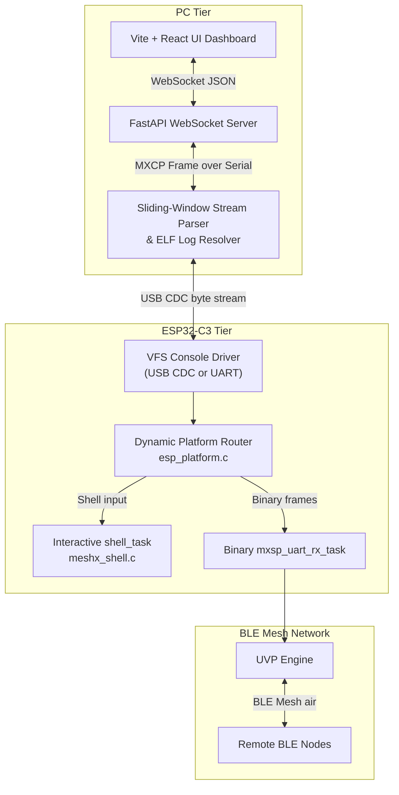
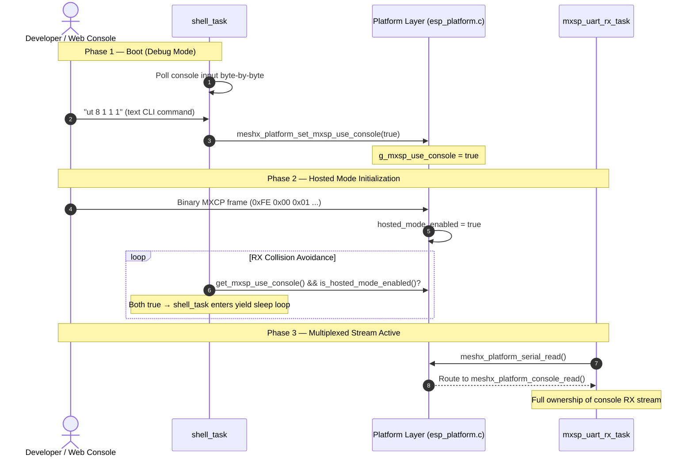
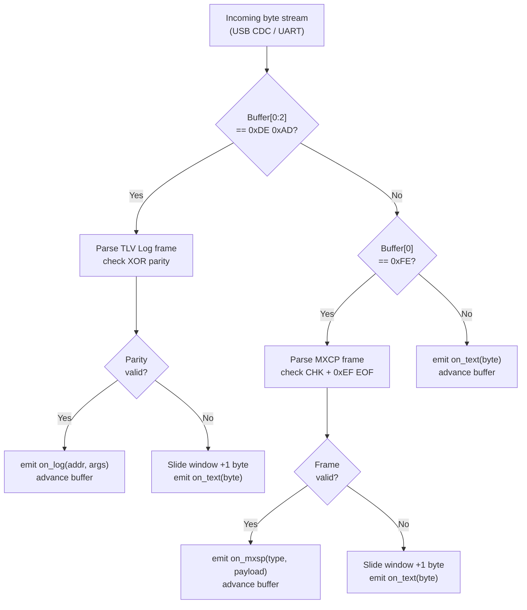
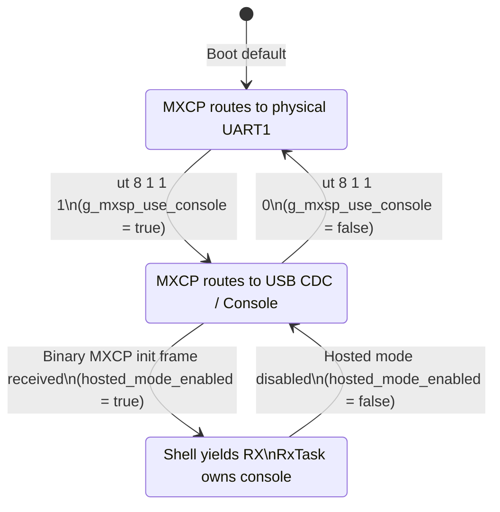
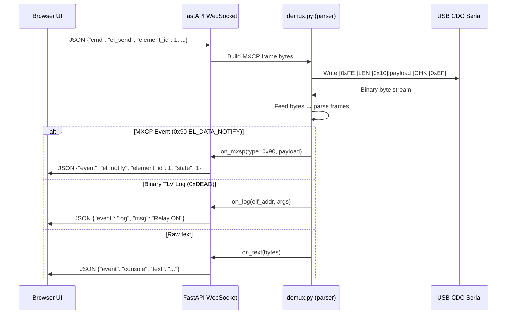

# Page 18 — Web Console & USB CDC Multiplexing

> **[← Logical Models](./17_logical_models_testing.md)** | **[← Index](./README.md)** | **[Next: ELF Logging →](./19_elf_logging.md)**

---

## Overview

The MeshX Web Console provides a browser-based dashboard for monitoring, controlling, and testing MeshX nodes. It operates over the same USB CDC serial channel as the MXCP binary protocol by using a **dynamic stream multiplexer** that separates binary log packets, MXCP frames, and raw console text — all flowing over a single byte stream.

---

## 1. System Architecture



---

## 2. Dynamic Activation & Concurrency

When the host activates hosted mode, the shell task yields console ownership to the binary MXCP RX task. This prevents read collisions on the shared USB CDC port.



---

## 3. Stream Demultiplexer (Host Side)

The PC-side `demux.py` parser handles three interleaved data types on the unified byte stream:



### 3.1 Packet Signatures

| Data Type | SOF Signature | Verification |
|-----------|--------------|--------------|
| Binary TLV Log | `0xDE 0xAD` | XOR parity byte at end |
| MXCP Frame | `0xFE` | XOR checksum + `0xEF` EOF |
| Raw console text | (any other byte) | — (emitted directly) |

---

## 4. Serial Routing State Machine (Firmware)



---

## 5. Console Channel Detection

The platform layer auto-detects whether USB CDC or physical UART is active:

```c
typedef enum {
    MESHX_PLATFORM_CONSOLE_CHANNEL_UART,
    MESHX_PLATFORM_CONSOLE_CHANNEL_USB_CDC,
} meshx_platform_console_channel_t;

meshx_platform_console_channel_t meshx_platform_get_console_channel(void);
```

This is used during startup to log which physical channel MXCP multiplexing is running over, and informs the web console which serial port to connect to.

---

## 6. Web Console UI Data Flow



---

> **[← Logical Models](./17_logical_models_testing.md)** | **[← Index](./README.md)** | **[Next: ELF Logging →](./19_elf_logging.md)**
