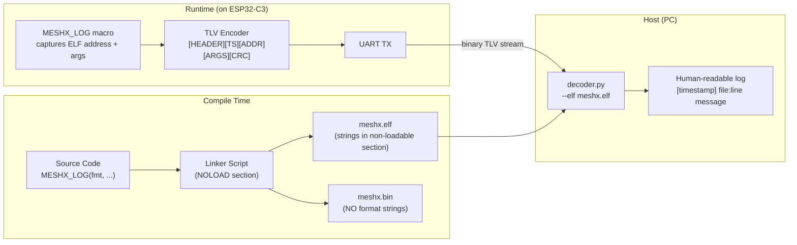
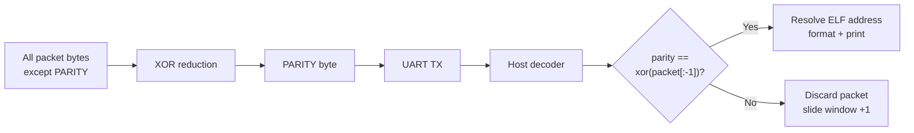
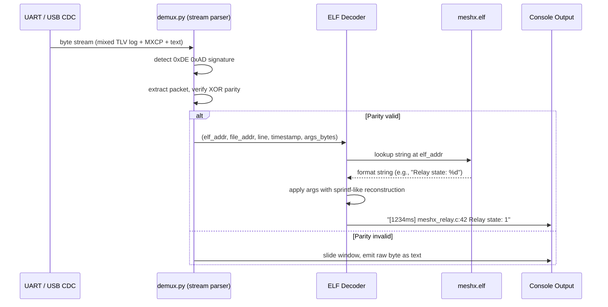

# Page 19 — ELF-Based Binary Logging

> **[← Web Console](./18_web_console.md)** | **[← Index](./README.md)** | **[Next: UVP Routing →](./20_uvp_routing.md)**

---

## Overview

MeshX uses an **ELF-based binary logging system** that removes all format strings from the firmware binary (`.bin` / `.hex`) while keeping them available in the debug ELF file. At runtime, only a compact TLV packet is emitted over UART: an ELF address + raw arguments. The host-side Python decoder resolves the address back to the format string and produces human-readable output.

This reclaims **significant Flash** (format strings are frequently the largest `.rodata` component) with zero loss of debug information.

---

## 1. System Architecture



---

## 2. TLV Packet Format

Every log emission sends one TLV packet over UART:

```
[0xDE][0xAD]                   SOF signature (2 bytes)
[LEN_H][LEN_L]                 Total packet length, big-endian (2 bytes)
[TS_3][TS_2][TS_1][TS_0]       Timestamp (4 bytes, ms since boot)
[ADDR_3][ADDR_2][ADDR_1][ADDR_0]  ELF address of format string (4 bytes)
[FILE_3][FILE_2][FILE_1][FILE_0]  ELF address of __FILE__ string (4 bytes)
[LINE_H][LINE_L]               Source line number (2 bytes)
[ARGS_LEN]                     Length of raw argument data (1 byte)
[ARGS_DATA...]                 Variadic argument bytes (ARGS_LEN bytes)
[PARITY]                       XOR of all preceding bytes (1 byte)
```

### 2.1 Packet Integrity



---

## 3. Compile-Time Setup

Format strings are placed in a **non-loadable ELF section** via the linker script. They exist in the ELF symbol table but are **not included in the flash binary**:

```ld
/* In meshx_linker.ld */
.meshx_log_strings (NOLOAD) :
{
    KEEP(*(.meshx_log_strings*))
} > FLASH
```

The `MESHX_LOG` macro:

```c
#define MESHX_LOG(level, fmt, ...) \
    do { \
        static const __attribute__((section(".meshx_log_strings"))) \
        char _meshx_fmt[] = fmt; \
        meshx_log_emit(level, _meshx_fmt, __FILE__, __LINE__, ##__VA_ARGS__); \
    } while(0)
```

`_meshx_fmt` is in the non-loadable section — its **address** in ELF memory space is what gets sent over UART, not the string content itself.

---

## 4. Host-Side Decoding Flow



---

## 5. Supported Format Specifiers

| Specifier | Argument Type | Notes |
|-----------|--------------|-------|
| `%d` / `%i` | `int32_t` | 4 bytes in ARGS_DATA |
| `%u` | `uint32_t` | 4 bytes |
| `%x` / `%X` | `uint32_t` | 4 bytes, hex output |
| `%s` | ELF address (`uint32_t`) | Host resolves the pointer in ELF |
| `%f` | `double` (8 bytes) | IEEE 754 |
| `%p` | `uint32_t` | Pointer as hex |
| `%c` | `uint8_t` | 1 byte |

---

## 6. Compile-Time Toggle (Fallback)

If ELF-based logging is disabled (e.g., for production release or when ELF is unavailable), the system falls back to standard `printf` logging:

```cmake
# CMakeLists.txt
option(MESHX_ELF_LOGGING "Enable ELF-based binary logging" ON)

if(NOT MESHX_ELF_LOGGING)
    add_compile_definitions(MESHX_LOG_PRINTF_FALLBACK=1)
endif()
```

```c
#ifdef MESHX_LOG_PRINTF_FALLBACK
    #define MESHX_LOG(level, fmt, ...) printf("[%s] " fmt "\n", #level, ##__VA_ARGS__)
#endif
```

---

## 7. Memory Impact

| What | Before | After |
|------|--------|-------|
| `.rodata` (format strings) | In `.bin` (loaded to Flash) | In ELF only (not in `.bin`) |
| UART log output | ASCII text | Binary TLV (8–20 bytes typical) |
| Host dependency | None | `decoder.py --elf meshx.elf` |
| Debug info quality | Same | Same (full format strings via ELF) |

---

> **[← Web Console](./18_web_console.md)** | **[← Index](./README.md)** | **[Next: UVP Routing →](./20_uvp_routing.md)**
