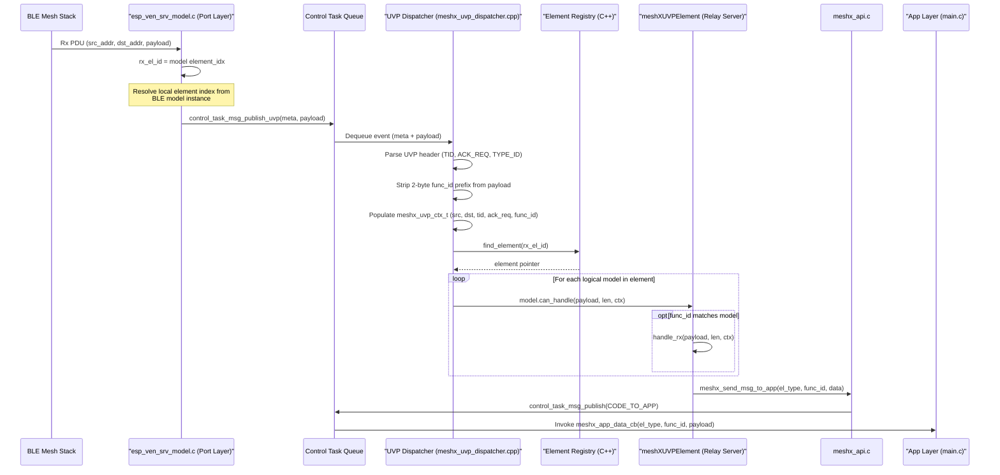
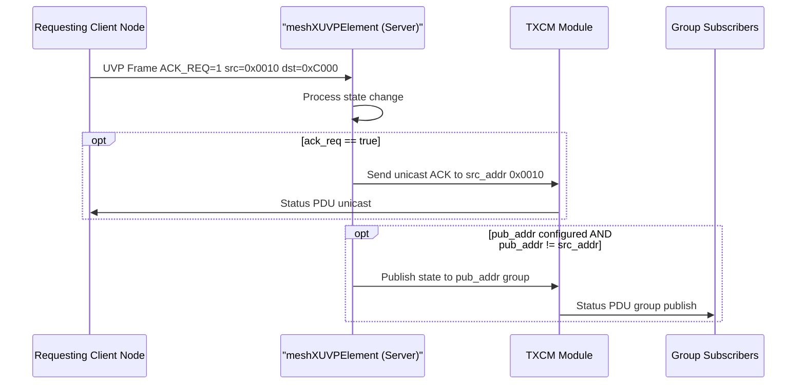
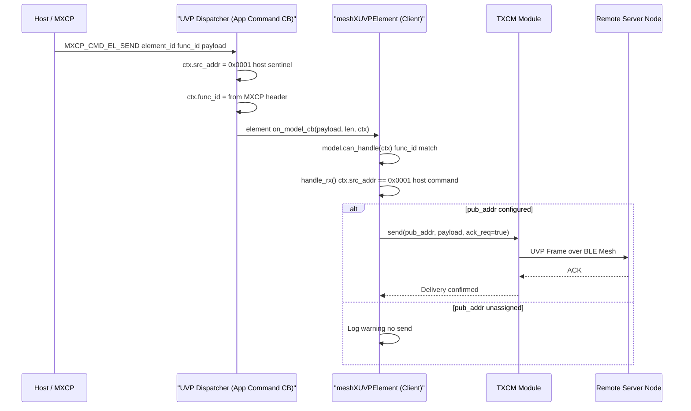
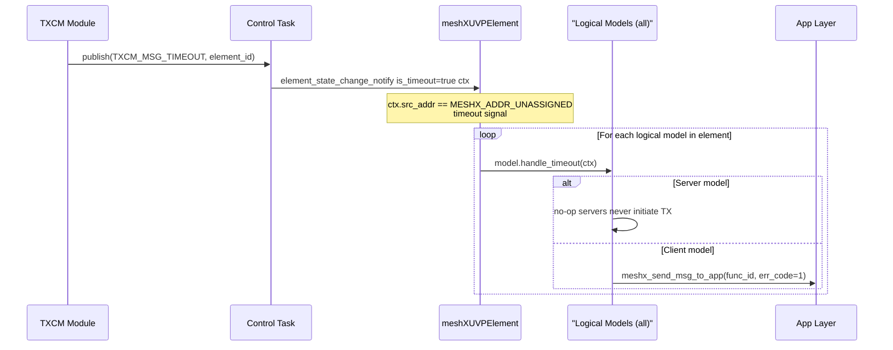
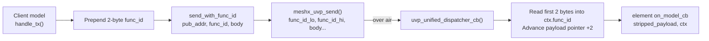

# Page 20 — UVP Routing & ACK Architecture

> **[← ELF Logging](./19_elf_logging.md)** | **[← Index](./README.md)**

---

## Overview

This page describes how the UVP (Unified Vendor Protocol) layer propagates routing context from the BLE Mesh stack all the way to the application-level element callback. It also covers the **dual-routing response pattern**: when a client sends an acknowledged request, the server responds with both a unicast ACK and a group publish to keep the mesh state synchronized.

---

## 1. Routing Context: `meshx_uvp_ctx_t`

Every element callback receives a populated context struct:

```c
typedef struct {
    uint16_t src_addr;   /* BLE Mesh source address of the incoming message */
    uint16_t dst_addr;   /* BLE Mesh destination address (unicast or group) */
    uint8_t  tid;        /* Transaction ID for duplicate suppression */
    bool     ack_req;    /* Client set ACK_REQ bit in UVP header */
    uint16_t func_id;    /* Function within the element (e.g., 0x0000 = OnOff) */
} meshx_uvp_ctx_t;
```

> **Internal type only.** `meshx_uvp_ctx_t` is firmware-internal. The public app API (`meshx_api.h`) remains binary-compatible and unchanged.

---

## 2. Inbound Routing Flow



---

## 3. Dual-Routing Response Pattern

When a client requests an acknowledgment (`ack_req == true`), the server performs two independent sends:



### 3.1 Dual-Routing Policy (Code Level)

```c
// Inside meshXRelayServerModel::handle_rx()
if (ctx->ack_req) {
    // Step 1: Unicast ACK directly to requesting client
    physical_model->send(ctx->src_addr, status_payload, len, /*ack=*/false);
}

uint16_t pub_addr = parent_element->get_pub_addr();
if (pub_addr != MESHX_ADDR_UNASSIGNED && pub_addr != ctx->src_addr) {
    // Step 2: Group publish to keep network state synchronized
    physical_model->send(pub_addr, status_payload, len, /*ack=*/false);
}

// Step 3: App telemetry
meshx_send_msg_to_app(el_type, get_func_id(), &data, sizeof(data));
```

---

## 4. Client-Originating Command Flow

When the **host** sends a command to a client element, `src_addr == 0x0001` (host sentinel):



---

## 5. Timeout Broadcast (TXCM Expiry)

When a TXCM timeout fires for an element, **all** registered logical models are notified:



---

## 6. `func_id` Wire Encoding

For BLE mesh RX, the dispatcher has no per-function identifier in the UVP header beyond `TYPE_ID`. The **sender** (client model) prepends a 2-byte `func_id` prefix to every UVP payload:



> **Payload budget:** The 2-byte `func_id` prefix is counted against `MESHX_UVP_MAX_PAYLOAD`. Effective application payload = 377 − 2 = **375 bytes** maximum.

---

## 7. Key Requirements Summary

| REQ | Title | Status |
|-----|-------|--------|
| REQ-001 | Propagate `dst_addr` to Control Task | ✅ Implemented |
| REQ-002 | `meshx_uvp_ctx_t` passed to element callback | ✅ Implemented |
| REQ-003 | Unicast ACK routing via `ctx->src_addr` | ✅ Implemented |
| REQ-004 | `ack_req` flag in UVP header | ✅ Implemented |
| REQ-005 | Dual-Routing: unicast ACK + group publish | ✅ Implemented |
| REQ-006 (model refactor) | `func_id` in `meshx_uvp_ctx_t` | ✅ Implemented |
| REQ-007 (model refactor) | `can_handle()` uses `func_id` match only | ✅ Implemented |
| REQ-009 (model refactor) | Public app API (`meshx_api.h`) unchanged | ✅ Verified |

---

> **[← ELF Logging](./19_elf_logging.md)** | **[← Index](./README.md)**
