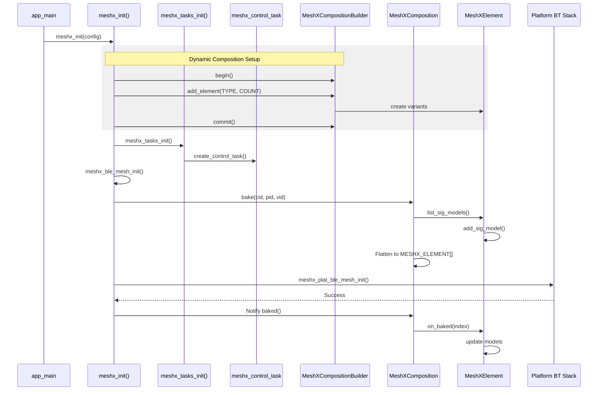
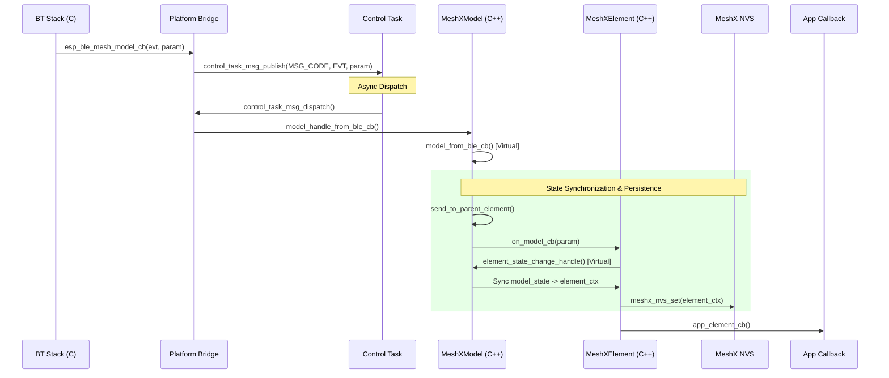
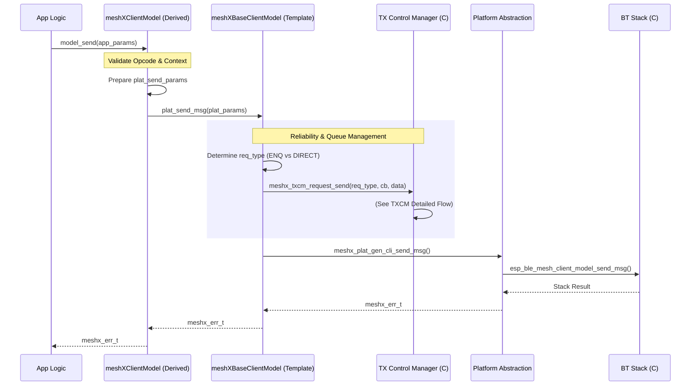
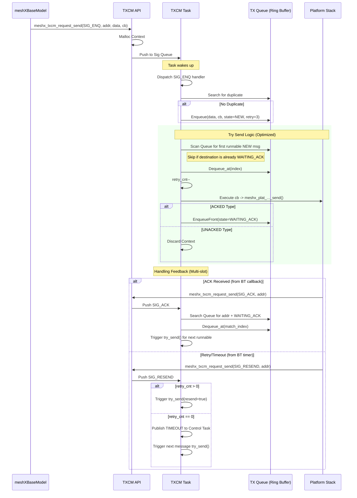

# MeshX Call Flow Diagrams

## System Initialization Flow

This diagram shows the sequence of calls during the MeshX stack initialization.



## Runtime Event Flow (Downstream)

This diagram shows how a message from the BLE Mesh network is routed to the application and synchronized with the element's persistent state.



## Runtime Command Flow (Upstream - Client)

This diagram illustrates how a Client Model sends a command, utilizing the **Transmission Control Manager (TXCM)** for reliability and queue management.



## TXCM Detailed Algorithm Flow

This diagram details the internal logic of the Transmission Control Manager, including queuing, retries, and ACK handling.



## Best Practices & Deadlock Prevention

### 1. Preventing Circular Deadlocks in Control Task
The `meshx_control_task` is a single-threaded sequencer. A common deadlock occurs when the application logic blocks the task while waiting for a response that the task itself must dispatch.

> [!CAUTION]
> **NEVER** use blocking primitives (semaphores, mutexes, or busy-loops) inside a model callback or element callback to wait for a network response.

**Recommended Strategy: Asynchronous State Machine**
Instead of:
```cpp
// DEADLOCK PRONE
model.send(cmd);
xSemaphoreTake(response_sem, portMAX_DELAY); 
```

Use the event-driven pattern:
1.  **Initiate**: Call `model_send()`.
2.  **Yield**: Return control to the `meshx_control_task` loop.
3.  **Handle**: Process the response in the next `on_model_cb` or `on_ble_evt` trigger.

### 2. TXCM Queue Management
With the updated non-Head-of-Line blocking logic, multiple nodes can be communicated with in parallel.
-   **Transaction Isolation**: TXCM now isolates transactions by destination address.
-   **Concurrency**: The `meshx_txcm_request_send` API is now thread-safe and can be called from multiple application tasks.
-   **Binary Payloads**: TXCM uses full memory comparison (`memcmp`); ensure `msg_param_len` is accurately provided to avoid false duplicate detection.
