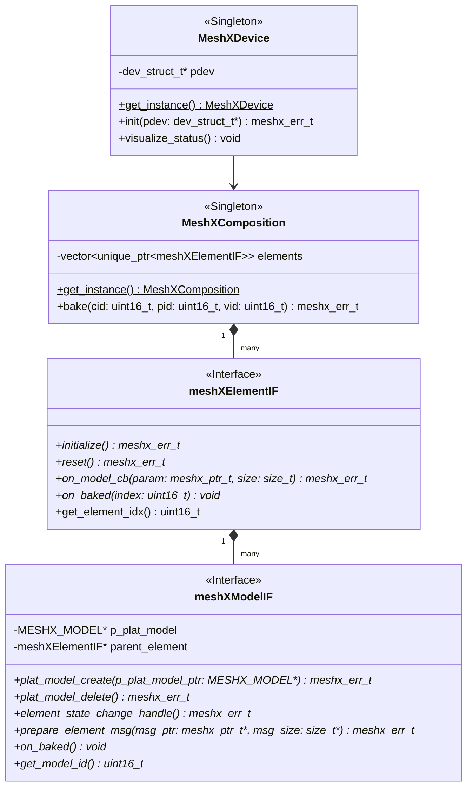
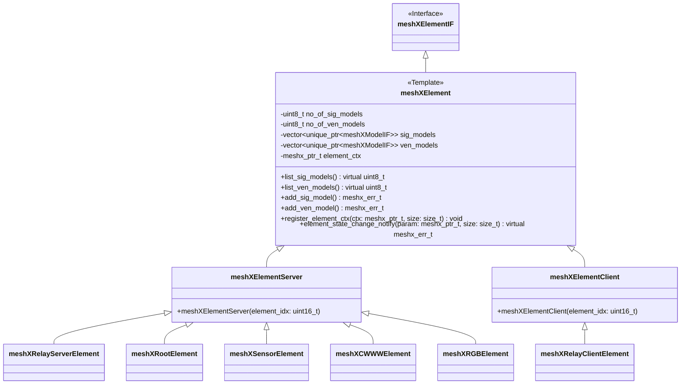
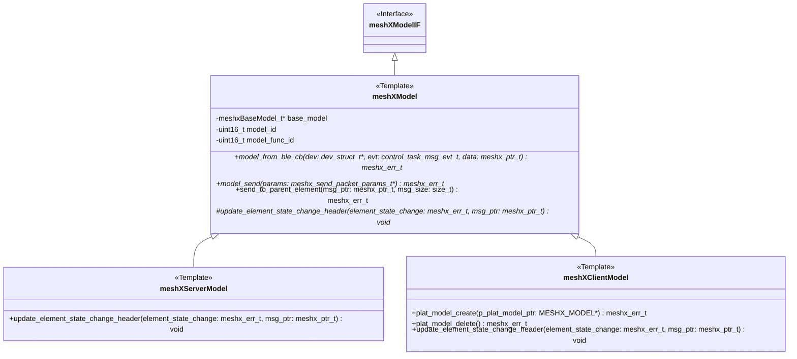
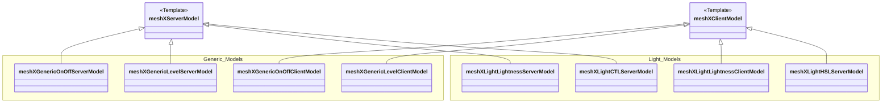

# MeshX Comprehensive Class Documentation

To ensure readability, the architecture is broken down into logical layers with detailed class members.

## 1. Core Architecture
This diagram shows the relationship between the Device, Composition, and the Base Interfaces.

## 2. Element Hierarchy
Detailed implementation of the Element base class and its specialized Server/Client variants.

## 3. Model Hierarchy
Detailed implementation of the Model base class and its specialized Server/Client templates.

## 4. Specialized SIG Models
Implementation examples of the standard Bluetooth SIG models.

