# MeshX MXCP & UVP Data Transport Flow

This document details the Unified Vendor Protocol (UVP) data transport path and local MeshX Command Protocol (MXCP) interface between the Host Console, the local Client Element, and the remote Server Element.

---

## 1. Architectural Components

| Component | File Path | Responsibility |
|-----------|-----------|----------------|
| **Host (Web Console / Backend)** | `tools/web_console/server/server.py` | Runs `AsyncSerialWorker` and `StreamDemultiplexer` to send commands and receive telemetry events over serial. |
| **Serial / UART Driver** | `port/platform/esp/esp_idf/...` | Low-level driver implementing `meshx_platform_serial_read()` and `meshx_platform_serial_write()`. |
| **UART RX State Machine** | `main/component/meshx/ble_mesh/common/src/meshx_serial.c` | Accumulates serial bytes into structured frames using a sliding-window state machine. |
| **MXCP Dispatcher** | `main/component/meshx/ble_mesh/common/src/meshx_mxcp.c` | Parses MXCP commands and executes their corresponding handler functions using a static dispatch table. |
| **MeshX API** | `main/component/meshx/ble_mesh/common/src/meshx_api.c` | Provides high-level entry points like `meshx_send_msg_to_element()` and `meshx_send_msg_to_app()`. |
| **Control Task** | `main/component/meshx/src/meshx_control_task.c` | A single-threaded FreeRTOS task sequencer managing the message queue and asynchronous callback dispatch. |
| **TXCM (Transmission Control Module)** | `main/component/meshx/ble_mesh/common/src/meshx_txcm.c` | Manages reliable transmission queueing, traffic pacing, and retry pacing when `CONFIG_TXCM_ENABLE` is enabled. |
| **Unified UVP Dispatcher** | `main/component/meshx/ble_mesh/common/src/meshx_uvp_dispatcher.cpp` | Listens to Control Task events, manages TID caching for duplicate suppression, and handles element variant mapping. |
| **UVP Element** | `main/component/meshx/ble_mesh/elements/src/variants/meshx_uvp_element.cpp` | C++ class executing model callbacks, enforcing dual-response rules (requester ACK + group publication), and writing state updates to NVS. |
| **UVP Model** | `main/component/meshx/ble_mesh/model/inc/meshx_uvp_model.hpp` | C++ wrapper containing opcode identifiers (`0x1337`) and wrapping low-level `meshx_uvp_send()` or `meshx_txcm_request_send()` invocations. |
| **Port Vendor Model** | `port/platform/esp/esp_idf/ble_mesh/server/esp_ven_srv_model.c` | Handles platform-specific packing/unpacking of the 4-byte UVP header and interfaces with the underlying BLE Mesh stack. |

---

## 2. End-to-End Sequence Diagram

```mermaid
sequenceDiagram
    autonumber
    
    %% Setup Participants
    participant Host as Host (Web Console)
    participant SerPlat as UART Driver
    participant SerSM as UART RX State Machine (meshx_serial.c)
    participant MXCP as MXCP Dispatcher (meshx_mxcp.c)
    participant API as MeshX API (meshx_api.c)
    participant CT as Control Task (meshx_control_task.c)
    participant Disp as UVP Dispatcher (meshx_uvp_dispatcher.cpp)
    participant ElCli as Client Element (meshXUVPElement)
    participant ModCli as Client Model (meshXUVPModel)
    participant TXCM as TXCM Layer (meshx_txcm.c)
    participant PortCli as Port Layer Client (esp_ven_srv_model.c)
    participant BLE as BLE Mesh Stack
    participant PortSrv as Port Layer Server (esp_ven_srv_model.c)
    participant ElSrv as Server Element (meshXUVPElement)
    participant NVS as NVS Layer (meshx_nvs.c)

    %% PHASE 1: Host to Local Client Element
    rect rgb(230, 240, 255)
        Note over Host, ElCli: Phase 1: Local Command Reception (Host -> Client Element)
        Host->>Host: send_cmd(msg_type, payload)
        Note over Host: Encapsulate into MXSP frame:<br/>[0xFE][LEN][TYPE][PAYLOAD...][CHK][0xEF]
        Host->>SerPlat: Write frame bytes over physical UART
        
        loop UART Byte Streaming
            SerPlat->>SerSM: meshx_serial_parse_byte(data)
            Note over SerSM: Process state transitions:<br/>STATE_SOF -> STATE_LEN -> STATE_TYPE -> STATE_PAYLOAD -> STATE_CHECKSUM -> STATE_EOF
        end
        
        Note over SerSM: Validation: Calculate XOR Checksum
        SerSM->>MXCP: mxcp_dispatch_frame(type, payload, len)
        Note over MXCP: Lookup handler function in mxcp_cmd_table
        MXCP->>MXCP: mxcp_cmd_fn_el_send(payload, len)
        MXCP->>API: meshx_send_msg_to_element(el_id, el_type, func_id, msg_len, msg)
        API->>API: Pack into meshx_app_api_msg_t
        API->>CT: control_task_msg_publish(CODE_TO_MESHX, EVT_DATA, msg_buff)
        
        Note over CT: Dequeue and process inside control_task_handler()
        CT->>Disp: Dispatch to uvp_app_command_cb()
        Disp->>Disp: Lookup Element in meshXElementRegistry
        Disp->>ElCli: element->on_model_cb(payload, len, &uvp_ctx)
        Note over ElCli: Translate parameter to UVP payload
    end

    %% PHASE 2: Client Element to Local BLE Mesh Send
    rect rgb(240, 240, 255)
        Note over ElCli, BLE: Phase 2: Radio Packet Preparation and Over-the-Air Transmission
        ElCli->>ModCli: uvp_model->send(dst_addr, type_id, payload, payload_len, ack_req)
        
        alt TXCM Enabled (CONFIG_TXCM_ENABLE) and fits payload limit
            ModCli->>TXCM: meshx_txcm_request_send(request_type, dst_addr, param, len, send_fn)
            Note over TXCM: Enqueue request in circular buffer.<br/>Pace and send when queue head is ready.
            TXCM->>ModCli: uvp_txcm_send_wrapper(param)
            ModCli->>PortCli: meshx_uvp_send(p_model, dst_addr, type_id, payload, payload_len, ack_req)
        else Direct Fallback / TXCM Disabled
            ModCli->>PortCli: meshx_uvp_send(p_model, dst_addr, type_id, payload, payload_len, ack_req)
        end
        
        PortCli->>PortCli: Allocate buffer & prep 4-byte UVP Header
        Note over PortCli: UVP Header:<br/>- tid: g_uvp_tid++ (Monotonic ID)<br/>- ack_req: 1 (if requested)<br/>- type_id: type_id
        PortCli->>PortCli: Retrieve NetKey and AppKey indices (net_idx & app_idx)
        PortCli->>BLE: esp_ble_mesh_server_model_send_msg(UVP_OPCODE, total_len, buffer)
        BLE->>BLE: Send BLE Mesh wireless packet (Opcode 0x1337)
    end

    %% PHASE 3: Remote Receive to Server Element
    rect rgb(230, 255, 230)
        Note over BLE, ElSrv: Phase 3: Remote Packet Processing and Dispatch (Server Element)
        BLE->>PortSrv: esp_ble_mesh_vendor_server_cb(MODEL_OPERATION_EVT, param)
        Note over PortSrv: Parse 4-byte UVP Header & extract rx_el_id
        PortSrv->>CT: control_task_msg_publish_uvp(CODE_FRM_BLE, MESHX_MODEL_ID_UVP, &meta, payload)
        
        Note over CT: Dequeue and process inside control_task_handler()
        CT->>Disp: Dispatch to uvp_unified_dispatcher_cb()
        
        opt TXCM Enabled (CONFIG_TXCM_ENABLE)
            Disp->>TXCM: meshx_txcm_request_send(MESHX_TXCM_SIG_ACK, src_addr, nullptr, 0, nullptr)
            Note over TXCM: Dequeue corresponding message from retry queue (clears queue / stops retries)
        end

        Disp->>Disp: Check TID cache for duplicate suppression
        Note over Disp: Drop if g_tid_cache[src] == tid
        Disp->>Disp: Lookup Element via meshXElementRegistry::find_element(rx_el_id)
        Disp->>ElSrv: element->on_model_cb(payload, len, &uvp_ctx)
        ElSrv->>ElSrv: element_state_change_notify(param, param_size, ctx)
    end

    %% PHASE 4: Local Telemetry and Persistence
    rect rgb(255, 240, 230)
        Note over ElSrv, Host: Phase 4: State Synchronization, Telemetry and Persistence
        ElSrv->>NVS: meshx_nvs_element_ctx_set(el_idx, variant, element_ctx)
        Note over ElSrv: Dual-Response Check
        
        alt Acknowledged Request (ctx->ack_req is true)
            ElSrv->>PortSrv: Unicast Status Response back to Client node
        end
        alt Registered Publish Address Valid
            ElSrv->>PortSrv: Publish Status Update to Group Address
        end

        ElSrv->>API: meshx_send_msg_to_app(el_idx, variant, func_id, len, param)
        API->>MXCP: mxcp_send_event(MXCP_EVT_EL_DATA_RX_NOTIFY, buf, size)
        MXCP->>MXCP: mxcp_send_frame(type, payload, len)
        MXCP->>SerPlat: meshx_platform_serial_write(frame_buff)
        
        SerPlat->>Host: Stream MXSP status frame over serial port
        Host->>Host: demux.feed(data) -> handle_mxsp()
        Note over Host: Parse data notify event & update Web Console UI state
    end

    %% PHASE 5: TXCM Timeout and Telemetry Propagation
    rect rgb(255, 230, 230)
        Note over TXCM, Host: Phase 5: TXCM Transmission Timeout and Telemetry (Host UI Notify)
        TXCM->>TXCM: Retry limit reached (No ACK received)
        TXCM->>CT: Publish CONTROL_TASK_MSG_EVT_TXCM_MSG_TIMEOUT
        CT->>Disp: uvp_txcm_timeout_cb(params)
        Disp->>Disp: Registry lookup element by model pointer
        Disp->>ElCli: element->on_model_cb(nullptr, 0, &uvp_ctx {src=MESHX_ADDR_UNASSIGNED})
        ElCli->>ElCli: element_state_change_notify(..., err=MESHX_TIMEOUT)
        ElCli->>API: meshx_send_msg_to_app(..., Error: 1)
        API->>MXCP: mxcp_send_event(MXCP_EVT_EL_DATA_RX_NOTIFY, buf, size)
        MXCP->>SerPlat: meshx_platform_serial_write(frame_buff)
        SerPlat->>Host: Stream MXSP status frame over serial port
        Host->>Host: Parse data notify event & log/report Error: 1 (Timeout)
    end
```



---

## 3. Protocol Frame Formats

### 3.1 MXCP/MXSP Serial Frame Structure
Every frame written to or read from the physical UART conforms to the following packet layout:

```
+------------+------------+-------------+---------------------+-------------+------------+
| SOF (0xFE) | Length (N) |  Type (1B)  |   Payload (N B)     | Checksum(1B)| EOF (0xEF) |
+------------+------------+-------------+---------------------+-------------+------------+
```
- **SOF (Start of Frame)**: Fixed byte `0xFE`.
- **Length**: 1-byte count representing the number of payload bytes.
- **Type**: 1-byte packet type containing direction and event/command flags.
- **Payload**: Variable payload carrying operation-specific headers and TLV tags.
- **Checksum**: 1-byte XOR checksum calculated as:
  $$\text{Checksum} = \text{Length} \oplus \text{Type} \oplus \left(\bigoplus_{i=0}^{N-1} \text{Payload}[i]\right)$$
- **EOF (End of Frame)**: Fixed byte `0xEF`.

### 3.2 BLE Mesh UVP Frame Structure
UVP payloads sent over-the-air through BLE Mesh are encapsulated under the `MESHX_UVP_OPCODE` (`0x1337`) and begin with a fixed 4-byte header:

```
 0                   1                   2                   3
 0 1 2 3 4 5 6 7 8 9 0 1 2 3 4 5 6 7 8 9 0 1 2 3 4 5 6 7 8 9 0 1
+-+-+-+-+-+-+-+-+-+-+-+-+-+-+-+-+-+-+-+-+-+-+-+-+-+-+-+-+-+-+-+-+
|      TID      |A|     RFU     |            Type ID            |
+-+-+-+-+-+-+-+-+-+-+-+-+-+-+-+-+-+-+-+-+-+-+-+-+-+-+-+-+-+-+-+-+
|                       TLV Payload ...                         |
+-+-+-+-+-+-+-+-+-+-+-+-+-+-+-+-+-+-+-+-+-+-+-+-+-+-+-+-+-+-+-+-+
```

- **TID (Transaction ID)**: 1-byte monotonic count used by the receiver for duplicate frame suppression.
- **A (ACK Required Flag)**: 1-bit flag indicating whether the receiver must return an un-acknowledged unicast status frame to the sender.
- **RFU**: Reserved for Future Use (7 bits, set to `0`).
- **Type ID**: 2-byte identifier specifying the element variant (e.g., `MESHX_ELEMENT_TYPE_RELAY_SERVER`).
- **TLV Payload**: Structured application data consisting of concatenated Type-Length-Value blocks.

---

## 4. Key Mechanism Highlights

1. **Transaction ID Caching (Duplicate Suppression)**
   To handle radio retransmissions without duplicate state executions, the receiving node maintains a cache (`g_tid_cache`) mapped by `src_addr`. If the incoming `tid` matches the cached `tid` for that source unicast address, the frame is silently dropped at the dispatcher layer.
   
2. **TXCM (Transmission Control Module) Integration**
   When `CONFIG_TXCM_ENABLE` is enabled and the payload fits inside the parameter bounds, outbound messages are routed via TXCM:
   - **Queueing & Pacing**: Commands are enqueued in a circular buffer to pace traffic and prevent packet collision/flooding.
   - **Retries**: If `ack_req` is true, the message uses `MESHX_TXCM_SIG_ENQ_SEND` and TXCM retries the transmission up to `MESHX_TXCM_MSG_RETRY_MAX` times.
   - **ACK Cancellation**: When the dispatcher receives a matching frame from the target address, it signals `MESHX_TXCM_SIG_ACK` back to TXCM, which removes the message from the queue and stops retries.
   - **Timeout Propagation**: If no ACK is received and retries are exhausted, TXCM fires `CONTROL_TASK_MSG_EVT_TXCM_MSG_TIMEOUT`. The dispatcher's `uvp_txcm_timeout_cb` routes this event to the target element's `on_model_cb` with a source address of `MESHX_ADDR_UNASSIGNED`. The element then triggers `element_state_change_notify` with `MESHX_TIMEOUT` error, dispatching it to the host application as telemetry (`Error: 1`).

3. **Dynamic Unicast & Publish Routing**
   Upon receiving a state-altering UVP command, `meshXUVPElement::element_state_change_notify()` performs a dual check:
   - It replies directly to the client if the `ack_req` header flag is set.
   - It publishes the updated state to the element's registered publication address (`pub_addr`) to sync other controllers, skipping the publication if the command source address matches `pub_addr` to avoid redundant transmissions.

4. **Control Task Asynchrony**
   The single-threaded `meshx_control_task` serializes execution to prevent resource races. Subscribing elements return control immediately after queuing callbacks, ensuring the event loop remains responsive and preventing deadlocks.
